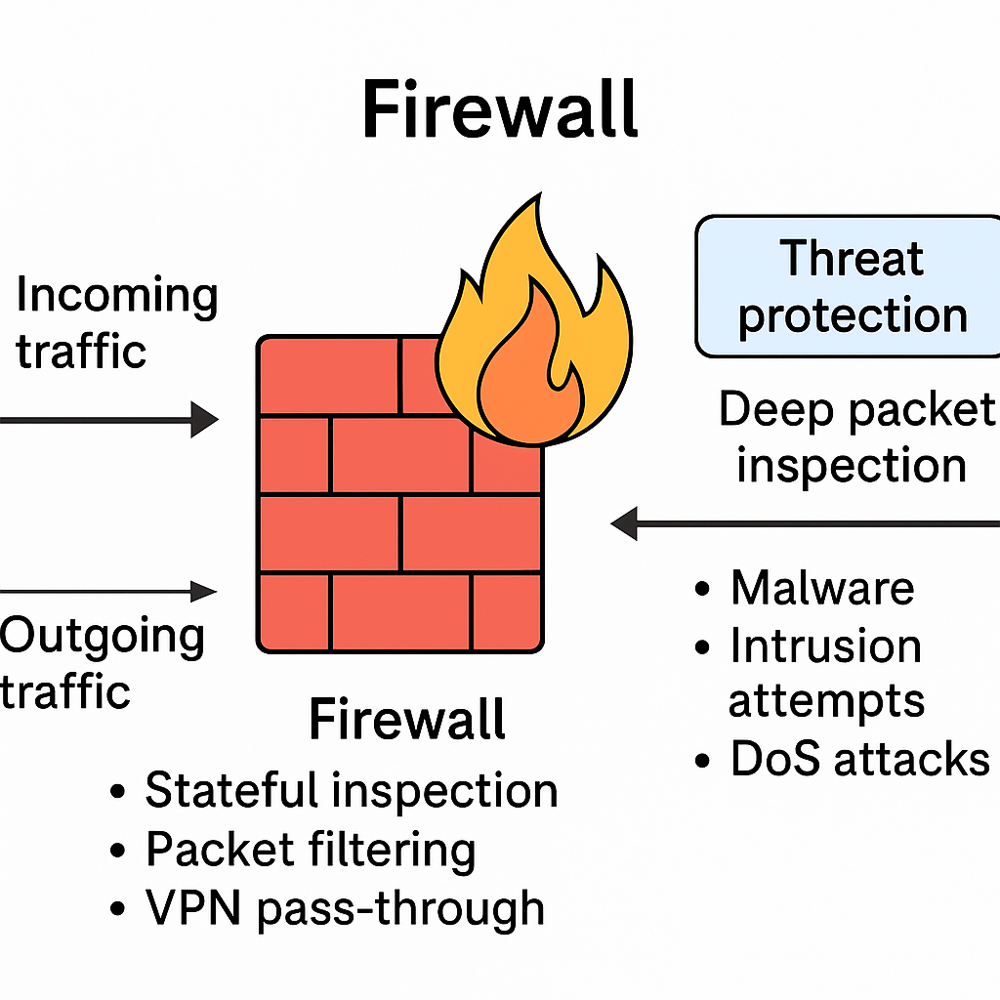
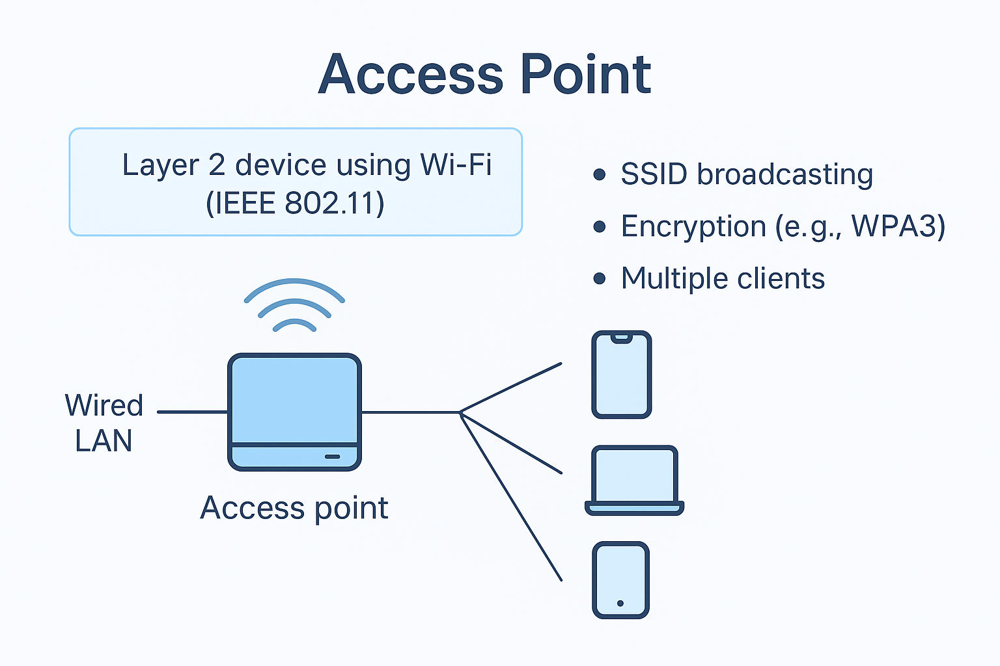
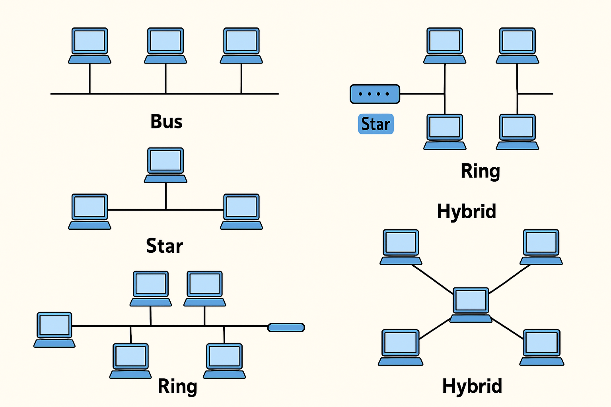
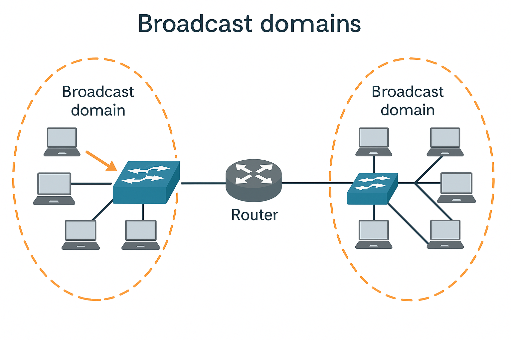

# บทที่ 1 — บทนำสู่เครือข่ายคอมพิวเตอร์ (Introduction to Networking)

## หัวข้อที่ 1: บทนำ (Introduction)  
- เครือข่ายคอมพิวเตอร์คืออะไร? (What is a Computer Network?)  
- ทำไมเราจึงต้องการเครือข่ายคอมพิวเตอร์? (Why do we need a Computer Network?)  
- ประเภทของเครือข่ายคอมพิวเตอร์ (Types of Computer Networks)  
- อินเทอร์เน็ต (Internet)  

## หัวข้อที่ 2: ผลลัพธ์การเรียนรู้รายวิชา (Course Learning Outcomes: LOs)

## หัวข้อที่ 3: เครือข่ายคอมพิวเตอร์คืออะไร? (What is a Computer Network?)  
- หน้าที่สำคัญของเครือข่าย (Key Functions of Networks)  
  - การใช้ทรัพยากรร่วมกัน (Resource Sharing)  
  - การสื่อสาร (Communication)  
  - การเข้าถึงข้อมูลแบบรวมศูนย์ (Centralized Data Access)  

## หัวข้อที่ 4: ทำไมเราจึงต้องการเครือข่ายคอมพิวเตอร์ (Why We Need Computer Networks)  
- การใช้ทรัพยากรอย่างคุ้มค่า (Cost-efficient Resource Utilization)  
- การเข้าถึงระยะไกลและการทำงานจากที่บ้าน (Remote Access and Telecommuting)  
- การประมวลผลแบบกระจายและบริการคลาวด์ (Distributed Computing and Cloud Services)  

## หัวข้อที่ 5: ประเภทของเครือข่ายคอมพิวเตอร์ (Types of Computer Networks)  
- เครือข่ายเฉพาะบุคคล (Personal Area Network: PAN)  
- เครือข่ายท้องถิ่น (Local Area Network: LAN)  
- เครือข่ายจัดเก็บข้อมูล (Storage Area Network: SAN)  
- เครือข่ายมหานคร (Metropolitan Area Network: MAN)  
- เครือข่ายบริเวณกว้าง (Wide Area Network: WAN)  
- เครือข่ายส่วนตัวเสมือน (Virtual Private Network: VPN)  
- เครือข่ายบริเวณวิทยาเขต (Campus Area Network: CAN)  

## หัวข้อที่ 6: อินเทอร์เน็ต (Internet)  
- ประวัติ (History)  
- เหตุการณ์สำคัญ (Milestones of Internet)  
- อินเทอร์เน็ตในประเทศไทย (Internet in Thailand)  

## หัวข้อที่ 7: บทนำสู่อุปกรณ์เครือข่าย (Introduction to Network Devices)  
- คอมพิวเตอร์ส่วนบุคคล (Personal Computers: PCs)  
- สวิตช์ (Switches)  
- เราเตอร์ (Routers)  
- เกตเวย์ (Gateways)  
- ไฟร์วอลล์ (Firewalls)  
- จุดเชื่อมต่อไร้สาย (Access Points: APs)  

## หัวข้อที่ 8: โทโพโลยีและสถาปัตยกรรมเครือข่าย (Network Topologies and Architecture)  
- โทโพโลยีทางกายภาพ (Physical Topologies)  
- โทโพโลยีเชิงตรรกะ (Logical Topologies)  
- สถาปัตยกรรมเครือข่าย (Network Architectures)  
- โดเมนบรอดคาสต์ (Broadcast Domains)  
- เครือข่ายท้องถิ่นเสมือน (Virtual LANs: VLANs)

## เครือข่ายคอมพิวเตอร์คืออะไร? (What is a Computer Network?)

เครือข่ายคอมพิวเตอร์ (Computer Network) คือ การรวมกันของอุปกรณ์หลายชนิดที่สามารถเชื่อมต่อถึงกันเพื่อแลกเปลี่ยนข้อมูลและแบ่งปันทรัพยากรได้ อุปกรณ์เหล่านี้ประกอบด้วย คอมพิวเตอร์ (Computers), เครื่องพิมพ์ (Printers), เซิร์ฟเวอร์ (Servers) และอุปกรณ์เครือข่าย (Networking Hardware) เช่น สวิตช์ (Switches) และเราเตอร์ (Routers) การมีเครือข่ายช่วยให้เกิดการสื่อสารและการทำงานร่วมกันในระยะไกล เพิ่มประสิทธิภาพและความคล่องตัวในการดำเนินงาน

### หน้าที่สำคัญของเครือข่าย (Key Functions of Networks)

* **การแบ่งปันทรัพยากร (Resource Sharing):**  
  การแบ่งปันทรัพยากรเป็นหนึ่งในแรงจูงใจหลักของการพัฒนาเครือข่ายคอมพิวเตอร์ ทั้งในองค์กรและที่พักอาศัย เครือข่ายช่วยให้อุปกรณ์หลายเครื่องสามารถใช้งานเครื่องพิมพ์ร่วมกัน เข้าถึงโฟลเดอร์ที่แชร์ไว้ หรือเชื่อมต่ออินเทอร์เน็ตผ่านเกตเวย์ (Gateway) เดียว ข้อมูลจาก CompTIA Network+ ระบุว่าการใช้ทรัพยากรร่วมกันช่วยลดต้นทุนและเพิ่มประสิทธิภาพ เนื่องจากไม่จำเป็นต้องทำซ้ำฮาร์ดแวร์หรือข้อมูล ตัวอย่างเช่น เซิร์ฟเวอร์ไฟล์ (File Server) บนเครือข่ายท้องถิ่น (LAN: Local Area Network) ช่วยเก็บข้อมูลสำรองแบบรวมศูนย์และจัดการสิทธิ์การเข้าถึงอย่างมีระบบ สิ่งนี้ช่วยลดความซ้ำซ้อน ทำให้การบำรุงรักษาง่ายขึ้น และสร้างความสอดคล้องในการเข้าถึงสำหรับผู้ใช้จำนวนมาก

* **การสื่อสาร (Communication):**  
  เครือข่ายสมัยใหม่ช่วยให้เกิดการสื่อสารระหว่างบุคคลและระบบได้อย่างราบรื่น ผ่านอีเมล (Email), ข้อความโต้ตอบแบบทันที (Instant Messaging), VoIP (Voice over IP) และการประชุมทางวิดีโอ (Video Conferencing) มาตรฐาน CCNA เน้นความสำคัญของโปรโตคอล TCP/IP ที่ช่วยกำหนดรูปแบบการแลกเปลี่ยนข้อมูลระหว่างอุปกรณ์โดยไม่ขึ้นกับฮาร์ดแวร์ใด ๆ การสื่อสารบนเครือข่ายประกอบด้วยกระบวนการหลายขั้นตอน เช่น การเข้ารหัสข้อมูล การแบ่งข้อมูลเป็นแพ็กเก็ต (Packets) การกำหนดเส้นทาง (Routing) และการประกอบข้อมูลกลับ ณ ปลายทาง โปรโตคอลที่น่าเชื่อถือ เช่น TCP (Transmission Control Protocol) รับประกันว่าข้อความจะถูกส่งถึงอย่างสมบูรณ์และตามลำดับที่ถูกต้อง การสื่อสารที่มีโครงสร้างและเชื่อถือได้นี้จึงมีบทบาทสำคัญในภาคธุรกิจ การศึกษา การแพทย์ และการใช้งานส่วนบุคคล

* **การเข้าถึงข้อมูลแบบรวมศูนย์ (Centralized Data Access):**  
  เครือข่ายคอมพิวเตอร์สนับสนุนการจัดเก็บและเข้าถึงข้อมูลในลักษณะรวมศูนย์ โดยใช้เซิร์ฟเวอร์ไฟล์ (File Servers) หรือฐานข้อมูล (Databases) ที่ผู้ใช้ที่ได้รับอนุญาตสามารถเข้าถึงได้ การออกแบบเช่นนี้ช่วยสร้างความสม่ำเสมอของข้อมูล เพิ่มความปลอดภัย และสนับสนุนการสำรองข้อมูลอย่างมีประสิทธิภาพ ตามแนวคิดในตำรา *Networking All-in-One* โดย Doug Lowe การที่ผู้ใช้เข้าถึงข้อมูลเวอร์ชันเดียวกันจากเซิร์ฟเวอร์ช่วยลดข้อผิดพลาดและการซ้ำซ้อน นอกจากนี้ ระบบตรวจสอบสิทธิ์แบบรวมศูนย์ เช่น Active Directory ยังช่วยให้มั่นใจได้ว่าผู้ใช้ต้องผ่านการยืนยันตัวตนก่อนเข้าถึงข้อมูล ซึ่งเสริมสร้างความถูกต้อง (Data Integrity) และความน่าเชื่อถือ (Accountability) โดยเฉพาะในอุตสาหกรรมที่มีกฎเกณฑ์เข้มงวด

## เหตุผลที่เราจำเป็นต้องมีเครือข่ายคอมพิวเตอร์ (Why We Need Computer Networks)

เครือข่ายคอมพิวเตอร์ (Computer Networks) มีบทบาทสำคัญในการสนับสนุนการดำเนินงานในยุคปัจจุบัน ทั้งด้านธุรกิจ การศึกษา ภาครัฐ การสาธารณสุข และการใช้ชีวิตประจำวันในทุกมิติ โดยประโยชน์หลัก ได้แก่:

### 1. การใช้ทรัพยากรอย่างคุ้มค่า (Cost-efficient Resource Utilization)

เครือข่ายคอมพิวเตอร์ช่วยให้องค์กรสามารถเพิ่มประสิทธิภาพการใช้ทรัพยากรทางด้านเทคโนโลยีสารสนเทศ (IT Resources) และลดค่าใช้จ่ายโดยรวมได้หลายวิธี ดังนี้:  

  
<!-- \label{fig:wan} -->

* **การแบ่งปันทรัพยากร (Resource Sharing):**  
  อุปกรณ์หลายเครื่องและผู้ใช้หลายคนสามารถใช้งานทรัพยากรราคาแพงร่วมกัน เช่น เครื่องพิมพ์ (Printers), เครื่องสแกน (Scanners) และการเชื่อมต่ออินเทอร์เน็ตความเร็วสูง (High-speed Internet) โดยไม่จำเป็นต้องจัดหาแยกให้แต่ละบุคคล  

* **การจัดการแบบรวมศูนย์ (Centralized Management):**  
  ระบบเครือข่ายช่วยให้องค์กรสามารถบริหารจัดการซอฟต์แวร์ (Software Management), การอัปเดต (Updates) และมาตรการความปลอดภัย (Security Protocols) ได้จากส่วนกลาง ซึ่งช่วยลดภาระงานในการดูแลแต่ละเครื่อง  

* **การใช้ฮาร์ดแวร์อย่างมีประสิทธิภาพ (Optimized Hardware Utilization):**  
  เทคโนโลยีเสมือนจริง (Virtualization) และระบบจัดเก็บข้อมูลบนเครือข่าย (Networked Storage) ช่วยให้องค์กรสามารถรวมเซิร์ฟเวอร์หลายเครื่องเข้ากับเครื่องจริงเพียงเครื่องเดียว หรือใช้พื้นที่จัดเก็บข้อมูลอย่างคุ้มค่า  

* **ลดค่าใช้จ่ายด้านการสื่อสาร (Reduced Communication Costs):**  
  เครื่องมือสื่อสารผ่านเครือข่าย เช่น อีเมล (Email), ข้อความโต้ตอบแบบทันที (Instant Messaging) และ VoIP (Voice over IP) ช่วยลดค่าใช้จ่ายในการสื่อสารแบบดั้งเดิม เช่น โทรศัพท์ โทรสาร และไปรษณีย์  

* **การปรับขยายและความยืดหยุ่น (Scalability and Flexibility):**  
  เครือข่ายช่วยให้องค์กรเพิ่มหรือลดจำนวนผู้ใช้และอุปกรณ์ได้อย่างยืดหยุ่น โดยไม่ต้องเปลี่ยนโครงสร้างพื้นฐานขนาดใหญ่ โดยเฉพาะบริการคลาวด์ (Cloud Services) ที่มีโมเดลการคิดค่าบริการแบบ “จ่ายตามการใช้งาน” (Pay-as-you-go)  

### 2. การเข้าถึงระยะไกลและการทำงานจากที่บ้าน (Remote Access and Telecommuting)

เครือข่ายคอมพิวเตอร์เป็นรากฐานสำคัญของการทำงานจากระยะไกล (Remote Work) และการทำงานจากที่บ้าน (Telecommuting) โดยมีข้อดี ดังนี้:  

* **เพิ่มความยืดหยุ่นและประสิทธิภาพ (Flexibility and Productivity):**  
  พนักงานสามารถเข้าถึงทรัพยากรเครือข่ายและทำงานได้จากทุกที่ที่มีการเชื่อมต่ออินเทอร์เน็ต ลดเวลาเดินทางและเพิ่มช่วงเวลาที่สามารถทำงานได้อย่างมีประสิทธิภาพ  

* **ขยายแหล่งบุคลากร (Wider Talent Pool):**  
  องค์กรสามารถสรรหาบุคลากรจากทั่วโลกโดยไม่ถูกจำกัดด้วยที่ตั้งของสำนักงาน  

* **ลดค่าใช้จ่ายขององค์กร (Reduced Overhead Costs):**  
  ช่วยลดค่าใช้จ่าย เช่น พื้นที่สำนักงาน ค่าสาธารณูปโภค และค่าใช้จ่ายที่เกี่ยวข้องกับออฟฟิศ  

* **เพิ่มความพึงพอใจและการรักษาพนักงาน (Employee Morale and Retention):**  
  การมีทางเลือกทำงานจากที่บ้านช่วยเพิ่มความสมดุลระหว่างชีวิตและการทำงาน ซึ่งส่งผลดีต่อความพึงพอใจและการอยู่กับองค์กรในระยะยาว  

* **ความต่อเนื่องของธุรกิจ (Business Continuity):**  
  ในกรณีฉุกเฉิน เช่น ภัยธรรมชาติ หรือโรคระบาด การทำงานจากระยะไกลช่วยให้องค์กรยังคงดำเนินการได้โดยไม่สะดุด  

* **การทำงานร่วมกันที่มีประสิทธิภาพ (Enhanced Collaboration):**  
  เครื่องมือเครือข่าย เช่น วิดีโอคอนเฟอเรนซ์ (Video Conferencing), เอกสารออนไลน์ (Shared Documents) และแพลตฟอร์มการจัดการโครงการ (Project Management Platforms) ทำให้ทีมที่อยู่ต่างสถานที่สามารถทำงานร่วมกันได้อย่างราบรื่น  

### 3. การประมวลผลแบบกระจายและบริการคลาวด์ (Distributed Computing and Cloud Services)

เครือข่ายคอมพิวเตอร์ยังเป็นรากฐานของการประมวลผลแบบกระจาย (Distributed Computing) และการให้บริการคลาวด์ (Cloud Services) ซึ่งช่วยเพิ่มขีดความสามารถในการคำนวณและความยืดหยุ่นสูง:  

* **พลังการประมวลผลที่เพิ่มขึ้น (Enhanced Processing Power):**  
  การแบ่งงานที่ซับซ้อนให้กับคอมพิวเตอร์หลายเครื่องเพื่อประมวลผลแบบขนาน (Parallel Processing) เหมาะสำหรับการจำลองเชิงวิทยาศาสตร์ (Scientific Simulations), การวิเคราะห์ข้อมูล (Data Analysis) และการฝึกโมเดล AI/ML  

* **ความสามารถในการปรับขยาย (Scalability and Elasticity):**  
  บริการคลาวด์ (Cloud Services) ใช้เซิร์ฟเวอร์ขนาดใหญ่ที่เชื่อมโยงกัน ทำให้สามารถเพิ่มหรือลดทรัพยากรได้ง่าย โดยคิดค่าบริการตามการใช้งานจริง  

* **ความพร้อมใช้งานสูงและความน่าเชื่อถือ (High Availability and Reliability):**  
  โครงสร้างพื้นฐานคลาวด์ออกแบบให้มีระบบสำรองและการป้องกันความผิดพลาด (Fault Tolerance) เพื่อลดการหยุดชะงักของบริการ  

* **การเข้าถึงและความสะดวก (Accessibility and Convenience):**  
  ผู้ใช้สามารถเข้าถึงทรัพยากรและแอปพลิเคชันต่าง ๆ ผ่านอินเทอร์เน็ตได้ทันที โดยไม่จำเป็นต้องลงทุนโครงสร้างพื้นฐานเอง  
  ตัวอย่างบริการ ได้แก่:  
  - **ซอฟต์แวร์เป็นบริการ (SaaS: Software as a Service):** เช่น Gmail, Salesforce, Dropbox  
  - **แพลตฟอร์มเป็นบริการ (PaaS: Platform as a Service):** เช่น AWS Elastic Beanstalk, Google App Engine  
  - **โครงสร้างพื้นฐานเป็นบริการ (IaaS: Infrastructure as a Service):** เช่น AWS EC2, Azure Virtual Machines  

* **นวัตกรรมและความคล่องตัว (Innovation and Agility):**  
  บริการคลาวด์เปิดโอกาสให้เข้าถึงเทคโนโลยีใหม่ ๆ เช่น ปัญญาประดิษฐ์ (AI), การเรียนรู้ของเครื่อง (Machine Learning), และการวิเคราะห์ข้อมูลขนาดใหญ่ (Big Data Analytics)  

### ประเด็นเพิ่มเติมที่ควรพิจารณา (Additional Considerations)

* **การสื่อสารและการทำงานร่วมกัน (Communication and Collaboration):** การสื่อสารแบบเรียลไทม์ผ่านอีเมล ข้อความทันที วิดีโอคอนเฟอเรนซ์ และแพลตฟอร์มทำงานร่วมกัน เป็นหัวใจสำคัญของโลกยุคดิจิทัล  
* **การแบ่งปันข้อมูล (Information Sharing):** การแลกเปลี่ยนไฟล์และความรู้ระหว่างอุปกรณ์และสถานที่ต่าง ๆ ทำได้สะดวกและรวดเร็ว  
* **การจัดการและความปลอดภัยแบบรวมศูนย์ (Centralized Management and Security):** การอัปเดตซอฟต์แวร์และนโยบายด้านความปลอดภัยจากศูนย์กลางช่วยเพิ่มความปลอดภัยและประสิทธิภาพ  
* **ความบันเทิงและการเข้าถึงข้อมูล (Entertainment and Information Access):** เครือข่ายทำให้ผู้ใช้เข้าถึงการสตรีม (Streaming), เกมออนไลน์ (Online Gaming) และแหล่งข้อมูลขนาดใหญ่บนอินเทอร์เน็ต  
* **ระบบอัตโนมัติและการควบคุม (Automation and Control):** เครือข่ายช่วยสนับสนุนการควบคุมระยะไกล (Remote Control) และระบบอัตโนมัติ (Automation) ในภาคอุตสาหกรรมและโครงสร้างพื้นฐาน  

## ประเภทของเครือข่ายคอมพิวเตอร์ (Types of Computer Networks)

เครือข่ายคอมพิวเตอร์สามารถจำแนกตามขอบเขตทางภูมิศาสตร์ วัตถุประสงค์ และขนาดได้ ดังนี้:  

### เครือข่ายพื้นที่บุคคล (Personal Area Network: PAN)

เครือข่ายพื้นที่บุคคล (PAN) คือเครือข่ายขนาดเล็กที่ออกแบบมาเพื่อเชื่อมต่ออุปกรณ์ส่วนบุคคลในระยะไม่กี่เมตร อุปกรณ์ที่เชื่อมต่อใน PAN ได้แก่ สมาร์ตโฟน (Smartphones), แล็ปท็อป (Laptops), แท็บเล็ต (Tablets), เครื่องพิมพ์ (Printers), ชุดหูฟัง (Headsets) และอุปกรณ์สวมใส่อิเล็กทรอนิกส์ (Wearable Electronics)  

PAN มักใช้เทคโนโลยีไร้สายระยะสั้น เช่น บลูทูธ (Bluetooth), อินฟราเรด (Infrared: IR) หรือ Wi-Fi Direct จุดเด่นคือ ติดตั้งง่าย ต้นทุนต่ำ และพกพาสะดวก  

แตกต่างจาก LAN ที่ออกแบบมาเพื่อผู้ใช้หลายคน PAN มุ่งเน้นไปที่อุปกรณ์ของบุคคลใดบุคคลหนึ่ง และมักเกิดขึ้นชั่วคราวแบบอะดฮอก (Ad Hoc)  

  
<!-- \label{fig:pan-example} -->

*ภาพที่ \~\ref{fig:pan-example}* แสดงการเชื่อมต่อแบบ PAN ที่แล็ปท็อปทำหน้าที่เป็นศูนย์กลางเชื่อมต่อไร้สายกับอุปกรณ์ส่วนบุคคล เช่น สมาร์ตโฟน หูฟัง เครื่องพิมพ์ เมาส์ไร้สาย และคอมพิวเตอร์อีกเครื่องหนึ่ง  

### เครือข่ายท้องถิ่น (Local Area Network: LAN)

เครือข่ายท้องถิ่น (LAN) ใช้เชื่อมต่ออุปกรณ์ภายในพื้นที่จำกัด เช่น บ้าน สำนักงาน หรืออาคารมหาวิทยาลัย LAN มักบริหารจัดการโดยองค์กรหรือบุคคลเดียว และรองรับอัตราการรับส่งข้อมูลสูงในระยะสั้น เทคโนโลยีที่ใช้กันมากได้แก่ อีเธอร์เน็ต (Ethernet – แบบใช้สาย) และไวไฟ (Wi-Fi – แบบไร้สาย)  

LAN มีต้นทุนต่ำเมื่อเทียบกับ WAN และเป็นพื้นฐานสำคัญของการสื่อสาร การแบ่งปันไฟล์ และการเข้าถึงทรัพยากรร่วมกัน  

  
<!-- \label{fig:lan-example} -->

*ภาพที่ \~\ref{fig:lan-example}* แสดงการใช้งาน LAN สองรูปแบบ ได้แก่ (ซ้าย) LAN ภายในบ้านที่เชื่อมต่อสมาร์ตโฟน แท็บเล็ต แล็ปท็อป และสมาร์ตทีวี ผ่านเราเตอร์ไร้สาย (Wireless Router) และ (ขวา) LAN แบบใช้สาย ที่คอมพิวเตอร์ตั้งโต๊ะเชื่อมต่อผ่านเราเตอร์หรือสวิตช์ และเชื่อมต่อกับโมเด็มเพื่อออกสู่อินเทอร์เน็ต  

### เครือข่ายพื้นที่จัดเก็บข้อมูล (Storage Area Network: SAN)

เครือข่ายพื้นที่จัดเก็บข้อมูล (SAN) เป็นเครือข่ายความเร็วสูงที่เชื่อมต่อเซิร์ฟเวอร์หลายเครื่องกับอุปกรณ์จัดเก็บข้อมูลแบบรวมศูนย์ เช่น ดิสก์อาเรย์ (Disk Arrays) หรือเทปไลบรารี (Tape Libraries) โดย SAN ทำงานในระดับบล็อก (Block-level Access) แตกต่างจาก NAS ที่ทำงานในระดับไฟล์  

SAN เหมาะกับศูนย์ข้อมูล (Data Centers) ที่ต้องการประสิทธิภาพ ความเสถียร และความสามารถในการขยายสูง โดยใช้เทคโนโลยี เช่น Fibre Channel, iSCSI และ NVMe over Fabrics  

  
<!-- \label{fig:san-compare} -->

*ภาพที่ \~\ref{fig:san-compare}* แสดงการเปรียบเทียบ DAS, NAS และ SAN โดยที่ SAN ช่วยให้หลายเซิร์ฟเวอร์สามารถเข้าถึงอุปกรณ์จัดเก็บข้อมูลได้โดยตรงผ่านโครงสร้างเครือข่ายเฉพาะ  

### เครือข่ายพื้นที่มหานคร (Metropolitan Area Network: MAN)

เครือข่ายพื้นที่มหานคร (MAN) ใช้เชื่อมต่อผู้ใช้และทรัพยากรภายในพื้นที่ขนาดเมืองหรือเขตเมืองขนาดใหญ่ ครอบคลุมพื้นที่กว้างกว่า LAN แต่เล็กกว่า WAN มักใช้โครงข่ายใยแก้วนำแสง (Fiber Optics) หรือคลื่นไมโครเวฟความเร็วสูง (High-bandwidth Microwave Links)  

MAN มักถูกใช้งานในระบบเครือข่ายของมหาวิทยาลัย หรือโครงการอินเทอร์เน็ตสาธารณะระดับเมือง  

### เครือข่ายพื้นที่กว้าง (Wide Area Network: WAN)

เครือข่ายพื้นที่กว้าง (WAN) ครอบคลุมพื้นที่กว้างขวาง ตั้งแต่หลายเมืองไปจนถึงหลายทวีป WAN มักต้องพึ่งพาโครงสร้างพื้นฐานของผู้ให้บริการเครือข่าย (Telecommunication Providers) และมีต้นทุนสูงกว่า LAN  

ตัวอย่างที่แพร่หลายที่สุดของ WAN คืออินเทอร์เน็ต (Internet)  

  
<!-- \label{fig:wan-diagram} -->

*ภาพที่ \~\ref{fig:wan-diagram}* แสดงโครงสร้าง WAN แบบสากล โดยมีโหนด (Nodes) หลายแห่ง เช่น เราเตอร์หรือศูนย์ข้อมูล ที่เชื่อมต่อกันข้ามทวีป  

### เครือข่ายเสมือนส่วนบุคคล (Virtual Private Network: VPN)

เครือข่ายเสมือนส่วนบุคคล (VPN) คือ วิธีการเชื่อมต่อที่ปลอดภัยผ่านเครือข่ายสาธารณะ เช่น อินเทอร์เน็ต โดยใช้การเข้ารหัส (Encryption) และการสร้างอุโมงค์ (Tunneling) เพื่อปกป้องข้อมูล  

VPN มักถูกใช้งานทั้งในลักษณะการเข้าถึงจากระยะไกล (Remote Access) และการเชื่อมต่อระหว่างสาขา (Site-to-Site)  

  
<!-- \label{fig:vpn-diagram} -->

*ภาพที่ \~\ref{fig:vpn-diagram}* แสดงการเชื่อมต่อ VPN แบบ Site-to-Site ที่สำนักงานสองแห่งเชื่อมต่อกันผ่านอุโมงค์ที่เข้ารหัสข้อมูล  

### เครือข่ายพื้นที่มหาวิทยาลัย (Campus Area Network: CAN)

เครือข่ายพื้นที่มหาวิทยาลัย (CAN) คือ เครือข่ายที่เชื่อมโยง LAN หลายเครือข่ายภายในพื้นที่จำกัด เช่น มหาวิทยาลัย (University Campus), สวนอุตสาหกรรม (Office Park) หรือฐานทัพ (Military Base)  

CAN มักใช้ใยแก้วนำแสง (Fiber Optics) เป็นโครงข่ายหลัก (Backbone) เพื่อเชื่อมต่ออาคารต่าง ๆ ภายในพื้นที่เดียวกัน  

  
<!-- \label{fig:can-diagram} -->

*ภาพที่ \~\ref{fig:can-diagram}* แสดง CAN ที่เชื่อมต่อ LAN หลายเครือข่าย เช่น ห้องปฏิบัติการ (Labs), สำนักงาน (Offices) และอาคารเรียน ให้กลายเป็นระบบเครือข่ายแบบรวมศูนย์ภายในพื้นที่เดียวกัน  

### สรุป

ประเภทของเครือข่ายคอมพิวเตอร์แตกต่างกันตามขอบเขตทางภูมิศาสตร์ วัตถุประสงค์ ความเป็นเจ้าของ อัตราการรับส่งข้อมูล และต้นทุน การทำความเข้าใจความแตกต่างเหล่านี้มีความสำคัญต่อการออกแบบและบริหารจัดการโครงสร้างพื้นฐานเครือข่ายที่มีประสิทธิภาพ

## อินเทอร์เน็ต (Internet)

### ประวัติ (History)

อินเทอร์เน็ต (Internet) ที่เราใช้งานในปัจจุบันมีต้นกำเนิดจากโครงการวิจัยของกระทรวงกลาโหมสหรัฐอเมริกา (U.S. Department of Defense) ที่ชื่อว่า ARPANET (Advanced Research Projects Agency Network) ในช่วงปลายทศวรรษ 1960 ซึ่งถือเป็นเครือข่ายแบบ *Packet-Switching* เชิงปฏิบัติการแรกของโลก  

ARPANET ถูกพัฒนาขึ้นเพื่ออำนวยความสะดวกในการสื่อสารระหว่างสถาบันการวิจัยและมหาวิทยาลัย โดยการเชื่อมโยงคอมพิวเตอร์เมนเฟรม (Mainframe Computers) เข้าด้วยกัน โหนดแรกทั้งสี่ในปี 1969 ได้แก่:  
- มหาวิทยาลัยแคลิฟอร์เนีย ลอสแองเจลิส (UCLA)  
- สถาบันวิจัยสแตนฟอร์ด (SRI)  
- มหาวิทยาลัยแคลิฟอร์เนีย ซานตาบาร์บารา (UCSB)  
- มหาวิทยาลัยยูทาห์ (University of Utah)  

การสื่อสารใน ARPANET อาศัยอุปกรณ์ที่เรียกว่า *Interface Message Processors (IMPs)* ซึ่งเป็นบรรพบุรุษของเราเตอร์ (Routers) สมัยใหม่  

  
<!-- \label{fig:internet-history} -->

*ภาพที่ \~\ref{fig:internet-history}* แสดงโครงสร้าง ARPANET ดั้งเดิม โดยคอมพิวเตอร์หลัก เช่น IBM 360/75 และ DEC PDP-10 เชื่อมต่อผ่าน IMPs การออกแบบเชิงนวัตกรรมนี้ได้วางรากฐานสำหรับการพัฒนาโปรโตคอล TCP/IP ในทศวรรษ 1970 และการเกิดขึ้นของอินเทอร์เน็ตในยุค 1980–1990  

### เหตุการณ์สำคัญของอินเทอร์เน็ต (Milestones of Internet)

อินเทอร์เน็ตเป็นระบบเครือข่ายสากลที่เกิดขึ้นจากนวัตกรรมหลายทศวรรษ ทั้งด้านการสื่อสารข้อมูล (Data Communication), โปรโตคอลเครือข่าย (Networking Protocols) และโครงสร้างพื้นฐานการประมวลผล (Computing Infrastructure)  

**เหตุการณ์สำคัญ (Notable Events):**  

* **1969:** ส่งข้อมูลครั้งแรกผ่านเครือข่าย Packet-Switched (ARPANET)  
* **1974:** เผยแพร่ข้อกำหนดของ TCP (Transmission Control Protocol) ซึ่งเป็นพื้นฐานของชุดโปรโตคอลอินเทอร์เน็ต  
* **1990:** ผู้ให้บริการอินเทอร์เน็ตเชิงพาณิชย์รายแรกเปิดตัว (Commercial ISP)  
* **1991:** การเปิดตัวเวิลด์ไวด์เว็บ (World Wide Web: WWW)  
* **1995:** โทรศัพท์อินเทอร์เน็ต (VoIP) เริ่มใช้งานเชิงพาณิชย์  
* **1999:** บริการอินเทอร์เน็ตบนมือถือ (Mobile Internet Services) เริ่มปรากฏ  
* **2001:** เครือข่าย 3G เปิดใช้งาน สนับสนุนการรับส่งข้อมูลความเร็วสูงบนมือถือ  
* **2005:** สมาร์ตโฟนเครื่องแรกที่รองรับ Wi-Fi เปิดตัว  

  
<!-- \label{fig:internet-timeline} -->

*ภาพที่ \~\ref{fig:internet-timeline}* สรุปเหตุการณ์สำคัญในการพัฒนาอินเทอร์เน็ต ตั้งแต่ ARPANET จนถึงการเกิดขึ้นของ Wi-Fi และ Mobile Internet  

### อินเทอร์เน็ตในประเทศไทย (Internet in Thailand)

ประวัติของอินเทอร์เน็ตในประเทศไทยเริ่มตั้งแต่ช่วงปลายทศวรรษ 1980 โดยสถาบันการศึกษาไทยเริ่มเชื่อมต่อกับเครือข่ายระหว่างประเทศเพื่อการวิจัย  

**วันที่ 2 มิถุนายน 1988** มีการส่งอีเมลจากมหาวิทยาลัยสงขลานครินทร์ (Prince of Songkla University: PSU) วิทยาเขตหาดใหญ่ ไปยังต่างประเทศสำเร็จ ถือเป็นการสื่อสารผ่านอินเทอร์เน็ตครั้งแรกของประเทศไทย  

  
<!-- \label{fig:th-email} -->

อีเมลนี้ส่งจากที่อยู่ `kre@sritrang.psu.th` ซึ่งกลายเป็นหมุดหมายสำคัญของการเข้าสู่สังคมดิจิ

## บทนำสู่อุปกรณ์เครือข่าย (Introduction to Network Devices)

ในระบบเครือข่ายคอมพิวเตอร์ (Computer Network) มีอุปกรณ์หลายชนิดที่ทำงานร่วมกันเพื่อให้การส่ง รับ และประมวลผลข้อมูลเป็นไปอย่างถูกต้อง การเข้าใจบทบาทและหน้าที่ของอุปกรณ์เหล่านี้จึงเป็นสิ่งสำคัญ อุปกรณ์เครือข่ายถือเป็นองค์ประกอบหลักที่กำหนดเส้นทางของข้อมูล (Data Transmission), การทำงานร่วมกันระหว่างส่วนต่าง ๆ ของเครือข่าย และการให้บริการด้านความปลอดภัย การกำหนดเส้นทาง และการควบคุมการเข้าถึง  

อุปกรณ์เครือข่ายพื้นฐานประกอบด้วย: **สวิตช์ (Switches), เราเตอร์ (Routers), คอมพิวเตอร์ส่วนบุคคล (PCs), เกตเวย์ (Gateways), จุดเชื่อมต่อไร้สาย (Access Points) และไฟร์วอลล์ (Firewalls)**

### คอมพิวเตอร์ส่วนบุคคล (Personal Computers: PCs)

คอมพิวเตอร์ส่วนบุคคล (PCs) ทำหน้าที่เป็นจุดปลายทาง (Endpoints) ของเครือข่าย ทั้งในการสร้าง (Generate) และการใช้งานข้อมูล (Consume) แต่ละเครื่องมีการ์ดเชื่อมต่อเครือข่าย (Network Interface Card: NIC) ซึ่งอาจเป็นแบบสาย (Ethernet) หรือไร้สาย (Wi-Fi)  

การตั้งค่าที่สำคัญ ได้แก่:  
- **ที่อยู่ IP (IP Address):** แบบกำหนดเอง (Static) หรือได้รับจาก DHCP (Dynamic Host Configuration Protocol)  
- **Subnet Mask, Default Gateway และ DNS Server**  

เครื่องมือพื้นฐานที่ใช้ตรวจสอบการเชื่อมต่อ เช่น `ping`, `ipconfig` (Windows), `ifconfig`/`ip a` (Linux) และ `tracert`/`traceroute`  

ในแง่สถาปัตยกรรม OSI Model:  
- **Physical Layer:** ฮาร์ดแวร์และสายสัญญาณ  
- **Data Link Layer:** ที่อยู่ MAC (MAC Addressing)  
- **Network Layer:** การกำหนดที่อยู่ IP (IP Addressing)  
- **Transport Layer:** โปรโตคอล TCP และ UDP  
- **Application Layer:** บริการต่าง ๆ เช่น HTTP, FTP, DNS  

**มาตรการรักษาความปลอดภัยของ PC:** เปิดใช้งานไฟร์วอลล์ (Firewall), ใช้ซอฟต์แวร์ป้องกันไวรัส (Antivirus Software) และอัปเดตระบบปฏิบัติการและแอปพลิเคชันอย่างสม่ำเสมอ  

  
<!-- \label{fig:pc-network-endpoint} -->

### สวิตช์ (Switches)

สวิตช์ (Switches) ทำงานหลักใน **ชั้นข้อมูล (Layer 2: Data Link Layer)** ของ OSI Model แม้ว่าสวิตช์บางรุ่นจะรองรับการทำงานใน **ชั้นเครือข่าย (Layer 3)** หรือที่เรียกว่า *Multilayer Switches*  

หน้าที่หลัก:  
- ใช้ที่อยู่ MAC (Media Access Control Address) เพื่อส่งต่อเฟรม (Frames) ไปยังพอร์ตที่ถูกต้อง  
- สร้างโดเมนการชนกัน (Collision Domain) แยกกันในแต่ละพอร์ต  
- สนับสนุนการสื่อสารแบบฟูลดูเพล็กซ์ (Full-Duplex Communication)  
- เก็บตารางที่อยู่ MAC (MAC Address Table หรือ CAM Table) เพื่อเรียนรู้ว่าอุปกรณ์ใดเชื่อมต่อกับพอร์ตใด  

คุณลักษณะขั้นสูง:  
- รองรับ VLANs (Virtual Local Area Networks)  
- ความปลอดภัยของพอร์ต (Port Security)  
- การรวมลิงก์ (Link Aggregation / EtherChannel)  
- โปรโตคอล STP (Spanning Tree Protocol) ป้องกันการเกิดลูป  

สวิตช์ที่มีการจัดการ (Managed Switches) สามารถตั้งค่าผ่าน CLI, SSH หรือ Web Interface ขณะที่สวิตช์ที่ไม่มีการจัดการ (Unmanaged Switches) จะทำงานแบบ Plug-and-Play  

  
<!-- \label{fig:network-switch} -->

### เราเตอร์ (Routers)

เราเตอร์ (Routers) ทำงานหลักใน **ชั้นเครือข่าย (Layer 3: Network Layer)** ของ OSI Model ทำหน้าที่เลือกเส้นทาง (Routing) สำหรับแพ็กเก็ต (Packets) ระหว่างเครือข่ายต่าง ๆ โดยใช้ที่อยู่ IP และข้อมูล Subnet  

ตารางการกำหนดเส้นทาง (Routing Table) อาจถูกกำหนดเอง (Static Routing) หรือเรียนรู้แบบไดนามิก (Dynamic Routing) ด้วยโปรโตคอล เช่น:  
- RIP (Routing Information Protocol) → แบบ Distance-Vector, จำกัด 15 Hops  
- OSPF (Open Shortest Path First) → แบบ Link-State ใช้อัลกอริทึม Dijkstra  
- EIGRP (Enhanced Interior Gateway Routing Protocol) → โปรโตคอลเฉพาะของ Cisco  

คุณสมบัติอื่น ๆ:  
- แยก Broadcast Domain  
- ทำ NAT (Network Address Translation) ให้หลายอุปกรณ์ใช้งาน IP สาธารณะร่วมกัน  
- ทำงานเป็น DHCP Relay  
- กำหนด ACLs (Access Control Lists)  
- รองรับ Firewall ขั้นพื้นฐาน  

  
<!-- \label{fig:router-functions} -->

### เกตเวย์ (Gateways)

เกตเวย์ (Gateway) คืออุปกรณ์หรือโหนดที่เป็นจุดเข้าและออกของเครือข่าย (Entry/Exit Point) ทำหน้าที่แปลงการสื่อสารระหว่างโปรโตคอลหรือสถาปัตยกรรมที่แตกต่างกัน ตัวอย่างเช่น Default Gateway บนเราเตอร์ที่ส่งต่อแพ็กเก็ตออกนอกเครือข่ายท้องถิ่น  

  
<!-- \label{fig:network-gateway} -->

### ไฟร์วอลล์ (Firewalls)

ไฟร์วอลล์ (Firewall) คืออุปกรณ์หรือซอฟต์แวร์ที่ใช้ควบคุมและตรวจสอบการรับ–ส่งข้อมูล (Traffic) ตามกฎด้านความปลอดภัยที่กำหนดไว้  

- ไฟร์วอลล์แบบพื้นฐานทำงานที่ **Layer 3 และ Layer 4 (Network และ Transport Layers)**  
- ไฟร์วอลล์รุ่นใหม่ (Next-Generation Firewalls) รองรับการตรวจสอบเชิงลึก (Deep Packet Inspection) ถึง **Layer 7 (Application Layer)**  

ความสามารถทั่วไป: Stateful Inspection, Packet Filtering, ACLs, Port Forwarding, VPN Pass-through  

  
<!-- \label{fig:firewall} -->

### จุดเชื่อมต่อไร้สาย (Access Points: APs)

จุดเชื่อมต่อไร้สาย (Access Points: APs) ช่วยให้อุปกรณ์ที่รองรับการสื่อสารแบบไร้สายเชื่อมต่อเข้าสู่เครือข่ายแบบใช้สาย (Wired LAN) โดยใช้มาตรฐาน Wi-Fi (IEEE 802.11)  

การใช้งาน:  
- เครือข่ายภายในบ้าน (Home Networks)  
- เครือข่ายไร้สายในองค์กร (Enterprise Wireless Networks)  
- จุดให้บริการสาธารณะ (Public Hotspots)  

คุณสมบัติสำคัญ: SSID Broadcasting, การเข้ารหัส WPA3, รองรับผู้ใช้หลายคน, ทำงานแบบ Standalone หรือควบคุมโดย Controller  

  
<!-- \label{fig:access-point} -->

## โทโพโลยีและสถาปัตยกรรมเครือข่าย (Network Topologies and Architecture)

ในระบบเครือข่ายคอมพิวเตอร์ (Computer Networking) การจัดเรียงอุปกรณ์และวิธีการสื่อสารระหว่างกันถูกกำหนดโดย **โทโพโลยีเครือข่าย (Network Topology)** และ **สถาปัตยกรรมเครือข่าย (Network Architecture)**  

* โทโพโลยีเครือข่าย (Network Topology): รูปแบบทางกายภาพ (Physical Layout) หรือเชิงตรรกะ (Logical Layout) ของการเชื่อมต่ออุปกรณ์ กำหนดเส้นทางของการไหลของข้อมูลและประสิทธิภาพของการสื่อสาร  
* สถาปัตยกรรมเครือข่าย (Network Architecture): หลักการออกแบบที่กำหนดการทำงานและการโต้ตอบขององค์ประกอบในเครือข่าย เช่น แบบ Peer-to-Peer หรือ Client-Server  

การเข้าใจแนวคิดทั้งสองนี้มีความสำคัญต่อการออกแบบเครือข่ายที่สามารถขยายได้ (Scalable), มีความทนทาน (Resilient) และจัดการได้ง่าย (Manageable)  

### โทโพโลยีทางกายภาพ (Physical Topologies)

* **บัส (Bus Topology):** ใช้สายหลัก (Backbone Cable) เพียงเส้นเดียวเชื่อมต่ออุปกรณ์ทั้งหมด ต้นทุนต่ำและติดตั้งง่าย แต่หากสายหลักเสียหายจะทำให้เครือข่ายล้มเหลวทั้งหมด  

* **สตาร์ (Star Topology):** อุปกรณ์ทั้งหมดเชื่อมต่อเข้ากับสวิตช์หรือฮับ (Switch/Hub) กลาง หากสายใดสายหนึ่งเสีย จะกระทบเฉพาะอุปกรณ์นั้น แต่หากอุปกรณ์ศูนย์กลางเสีย เครือข่ายทั้งหมดจะล่ม  

* **ริง (Ring Topology):** อุปกรณ์เชื่อมต่อเป็นวงกลม ข้อมูลเดินทางในทิศทางเดียว ลดโอกาสการชนกันของข้อมูล แต่หากมีอุปกรณ์ใดขัดข้องอาจกระทบทั้งวง  

* **เมช (Mesh Topology):** อุปกรณ์แต่ละเครื่องเชื่อมต่อกับทุกเครื่องอื่น ๆ มีความซ้ำซ้อนสูง (High Redundancy) และทนทาน แต่ติดตั้งยากและมีต้นทุนสูง  

* **ไฮบริด (Hybrid Topology):** ผสมผสานหลายโทโพโลยีเข้าด้วยกัน เช่น Star-Bus หรือ Star-Ring เพื่อให้เหมาะสมกับความต้องการเฉพาะ  

  
<!-- \label{fig:network-topologies} -->

### โทโพโลยีเชิงตรรกะ (Logical Topologies)

* **บรอดคาสต์ (Broadcast Topology):** ใช้กันทั่วไปใน Ethernet LAN ทุกอุปกรณ์จะได้รับข้อมูลที่ส่งออก แม้ไม่ใช่ผู้รับปลายทาง ส่งผลให้เกิดความไร้ประสิทธิภาพเมื่อมีปริมาณข้อมูลสูง  

* **การส่งต่อโทเคน (Token Passing Topology):** ใช้ในเครือข่ายวงแหวนรุ่นเก่า อุปกรณ์จะต้องได้รับโทเคน (Token) ก่อนจึงจะส่งข้อมูลได้ ลดการชนกันแต่เพิ่มความล่าช้า ปัจจุบันไม่ค่อยใช้แล้ว  

  
<!-- \label{fig:logical-topologies} -->

### สถาปัตยกรรมเครือข่าย (Network Architectures)

* **แบบเพียร์ทูเพียร์ (Peer-to-Peer: P2P):** ทุกอุปกรณ์มีสถานะเท่าเทียมกัน สามารถให้และใช้ทรัพยากรได้โดยตรง ไม่ต้องมีเซิร์ฟเวอร์กลาง เหมาะกับเครือข่ายขนาดเล็กหรือตามบ้าน แต่ขาดการควบคุมรวมศูนย์และขยายได้ยาก  

* **แบบไคลเอนต์–เซิร์ฟเวอร์ (Client-Server):** มีเซิร์ฟเวอร์กลางทำหน้าที่ให้บริการและบริหารจัดการทรัพยากร ส่วนอุปกรณ์ลูกข่าย (Clients) ขอใช้บริการ เหมาะกับองค์กร เน้นการบริหารรวมศูนย์ ความปลอดภัย และการขยายตัว แต่พึ่งพาเซิร์ฟเวอร์เป็นหลัก  

  
<!-- \label{fig:network-architectures} -->

* **แบบรวมศูนย์กับแบบกระจาย (Centralized vs. Distributed):**  
  - แบบรวมศูนย์ (Centralized): การควบคุมทั้งหมดอยู่ที่ศูนย์กลาง ง่ายต่อการจัดการและรักษาความปลอดภัย แต่มีจุดล้มเหลวเพียงจุดเดียว (Single Point of Failure)  
  - แบบกระจาย (Distributed): การควบคุมและทรัพยากรแบ่งกระจายไปยังโหนดหลายตัว ทำให้ทนทานและมี Fault Tolerance สูง แต่มีความซับซ้อนในการประสานงาน  

  
<!-- \label{fig:centralized-distributed} -->

### โดเมนบรอดคาสต์ (Broadcast Domains)

**Broadcast Domain** คือ กลุ่มอุปกรณ์ในเครือข่ายที่สามารถรับแพ็กเก็ตบรอดคาสต์จากกันและกัน  

* **สวิตช์ (Switches):** โดยค่าเริ่มต้น จะส่งต่อบรอดคาสต์ไปยังทุกพอร์ตใน VLAN เดียวกัน  
* **เราเตอร์ (Routers):** ทำหน้าที่เป็นขอบเขต (Boundary) ของ Broadcast Domain โดยไม่ส่งต่อแพ็กเก็ตบรอดคาสต์ข้ามอินเทอร์เฟซ  

  
<!-- \label{fig:broadcast-domains} -->

### เครือข่ายท้องถิ่นเสมือน (Virtual LANs: VLANs)

VLAN คือ การแบ่งเครือข่ายเชิงตรรกะ (Logical Segmentation) ภายในสวิตช์เดียวหรือหลายสวิตช์ เพื่อสร้าง Broadcast Domain แยกกัน แม้อุปกรณ์จะไม่ได้เชื่อมต่อสายตรงถึงกัน  

คุณสมบัติ:  
- แยกการจราจรเครือข่าย (Traffic Isolation)  
- เพิ่มความปลอดภัย (Security)  
- ลดปริมาณบรอดคาสต์  
- ยืดหยุ่นต่อการจัดการ (Manageability)  

VLAN ระบุด้วย **VLAN ID** และพอร์ตของสวิตช์สามารถกำหนด VLAN แบบ Static หรือ Dynamic ได้ การเชื่อมต่อหลาย VLAN ผ่านสายเดียวใช้ Trunk Port และมาตรฐาน IEEE 802.1Q  

  
<!-- \label{fig:vlan-segmentation} -->

