# บทที่ 3 – อุปกรณ์เครือข่าย (Network Devices)

## หัวข้อ (Topics)

* บทนำเกี่ยวกับอุปกรณ์เครือข่าย: สวิตช์ (Switches), เราเตอร์ (Routers), คอมพิวเตอร์ส่วนบุคคล (PCs)
* โทโพโลยีและสถาปัตยกรรมเครือข่าย (Network Topologies and Architecture)

## ผลลัพธ์การเรียนรู้ (Learning Outcomes)

* ระบุหน้าที่ของอุปกรณ์เครือข่ายทั่วไปได้ (Identify functions of common network devices)
* สร้างเครือข่ายพื้นฐานโดยใช้แพ็กเก็ตเทรเซอร์ (Build a basic network using Packet Tracer)
* ใช้คำสั่ง `ipconfig` และแผงควบคุม (Control Panel) ใน Windows 11 เพื่อตรวจสอบข้อมูลเครือข่าย (View network info)
 
## บทนำสู่อุปกรณ์เครือข่าย (Introduction to Network Devices)

ในระบบเครือข่ายคอมพิวเตอร์ อุปกรณ์ต่าง ๆ ทำงานร่วมกันเพื่อให้การส่ง การรับ และการประมวลผลข้อมูลเป็นไปอย่างมีประสิทธิภาพ การเข้าใจบทบาทและหน้าที่ของอุปกรณ์เหล่านี้ถือเป็นสิ่งสำคัญสำหรับผู้ที่เริ่มต้นศึกษาเครือข่าย อุปกรณ์เครือข่ายเป็นส่วนประกอบหลักที่กำหนดว่าข้อมูลจะเคลื่อนที่จากจุดหนึ่งไปยังอีกจุดหนึ่งอย่างไร แต่ละส่วนของเครือข่ายจะเชื่อมต่อกันอย่างไร และบริการต่าง ๆ เช่น ความปลอดภัย (Security), การกำหนดเส้นทาง (Routing), และการควบคุมการเข้าถึง (Access) จะถูกใช้งานอย่างไร

### คอมพิวเตอร์ส่วนบุคคล (PCs: Personal Computers)

คอมพิวเตอร์ส่วนบุคคลทำหน้าที่เป็น **ปลายทาง (Endpoints)** ของเครือข่าย มีบทบาททั้งในการสร้างและการใช้งานข้อมูล โดยจะมี **การ์ดเชื่อมต่อเครือข่าย (Network Interface Card – NIC)** ทั้งแบบใช้สาย (Ethernet) และไร้สาย (Wi-Fi)

การตั้งค่าเครือข่ายที่สำคัญ ได้แก่:

* ที่อยู่ไอพี (IP Address) – แบบกำหนดเอง (Static) หรือได้รับจาก DHCP
* มาสก์เครือข่ายย่อย (Subnet Mask)
* เกตเวย์เริ่มต้น (Default Gateway)
* เซิร์ฟเวอร์ DNS (DNS Server)

พีซีสื่อสารโดยใช้ **โมเดล TCP/IP** และอาศัยเครื่องมือวินิจฉัย เช่น:

* `ping` – ตรวจสอบการเชื่อมต่อพื้นฐาน
* `ipconfig` (Windows) หรือ `ifconfig` / `ip a` (Linux) – ตรวจสอบการตั้งค่าเครือข่าย
* `tracert` / `traceroute` – ตรวจสอบเส้นทางของแพ็กเก็ต

ชั้นของแบบจำลอง **OSI** ที่เกี่ยวข้องกับการทำงานของพีซี ได้แก่:

* ชั้นกายภาพ (Physical Layer) – ฮาร์ดแวร์และสายสัญญาณ
* ชั้นลิงก์ข้อมูล (Data Link Layer) – การกำหนดค่า MAC Address
* ชั้นเครือข่าย (Network Layer) – การกำหนดค่า IP Address
* ชั้นขนส่ง (Transport Layer) – โปรโตคอล TCP/UDP
* ชั้นประยุกต์ (Application Layer) – บริการ HTTP, FTP, DNS

แนวทางการรักษาความปลอดภัยที่สำคัญบนพีซี ได้แก่ การเปิดใช้งานไฟร์วอลล์ (Firewall), การใช้โปรแกรมป้องกันไวรัส (Antivirus), และการอัปเดตระบบปฏิบัติการ/แอปพลิเคชันอย่างสม่ำเสมอ

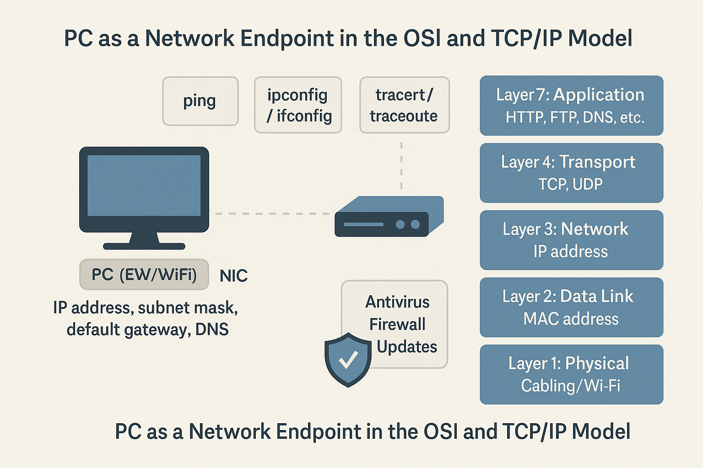

 
### สวิตช์ (Switches)

สวิตช์ทำงานหลักที่ **ชั้นลิงก์ข้อมูล (Data Link Layer – Layer 2)** ของแบบจำลอง OSI แต่สวิตช์ขั้นสูงบางชนิดสามารถทำงานที่ **ชั้นเครือข่าย (Layer 3)** ได้ เรียกว่า **มัลติเลเยอร์สวิตช์ (Multilayer Switches)**

คุณลักษณะและการทำงานที่สำคัญ:

* ใช้ **MAC Address** เพื่อส่งเฟรมไปยังพอร์ตปลายทาง
* แบ่งแต่ละอุปกรณ์ออกเป็น **โดเมนการชนกัน (Collision Domain)** แยกจากกัน
* สนับสนุนการสื่อสารแบบฟูลดูเพล็กซ์ (Full-duplex)
* ใช้ **MAC Address Table (หรือ CAM Table)** ในการเรียนรู้พอร์ตที่เชื่อมต่อกับอุปกรณ์ใด

คุณสมบัติขั้นสูง:

* การสนับสนุน VLAN (Virtual Local Area Network)
* ความปลอดภัยของพอร์ต (Port Security)
* การรวมลิงก์ (Link Aggregation / EtherChannel)
* โปรโตคอล Spanning Tree (STP) ป้องกันลูปในเครือข่าย

สวิตช์ที่สามารถจัดการได้ (Managed Switches) อนุญาตให้ผู้ดูแลกำหนดค่าได้ผ่าน **CLI, SSH หรือ Web Interface** ในขณะที่สวิตช์ที่ไม่สามารถจัดการได้ (Unmanaged Switches) จะทำงานแบบ Plug-and-Play

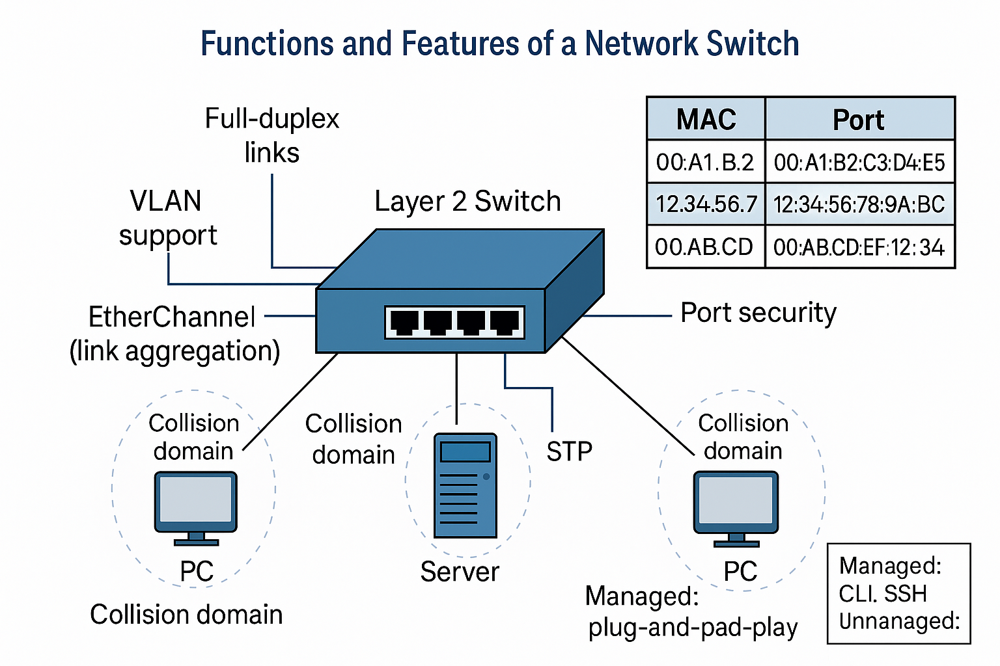

 
### เราเตอร์ (Routers)

เราเตอร์ทำงานที่ **ชั้นเครือข่าย (Network Layer – Layer 3)** ของแบบจำลอง OSI มีหน้าที่ในการกำหนดเส้นทาง (Routing) ของแพ็กเก็ตระหว่างเครือข่ายต่าง ๆ

**การทำงานหลักของเราเตอร์:**

* ใช้ที่อยู่ไอพี (IP Address) และข้อมูล Subnet ในการเลือกเส้นทาง
* ใช้ **ตารางกำหนดเส้นทาง (Routing Table)** ซึ่งอาจถูกกำหนดแบบคงที่ (Static Routing) หรือแบบไดนามิก (Dynamic Routing)

**โปรโตคอลการกำหนดเส้นทางไดนามิกที่สำคัญ:**

* **RIP (Routing Information Protocol):** โปรโตคอลแบบ Distance-vector จำกัดจำนวน hop ที่ 15
* **OSPF (Open Shortest Path First):** โปรโตคอลแบบ Link-state ใช้อัลกอริทึม Dijkstra
* **EIGRP (Enhanced Interior Gateway Routing Protocol):** โปรโตคอลของ Cisco ที่ผสมผสานข้อดีของ Distance-vector และ Link-state

นอกจากนี้เราเตอร์ยัง:

* แยกโดเมนการกระจายสัญญาณ (Broadcast Domains)
* ทำงานเป็น NAT (Network Address Translation) เพื่อให้หลายอุปกรณ์ใช้ Public IP เดียวกันได้
* ทำงานเป็น DHCP Relay, ACLs และไฟร์วอลล์ขั้นพื้นฐาน

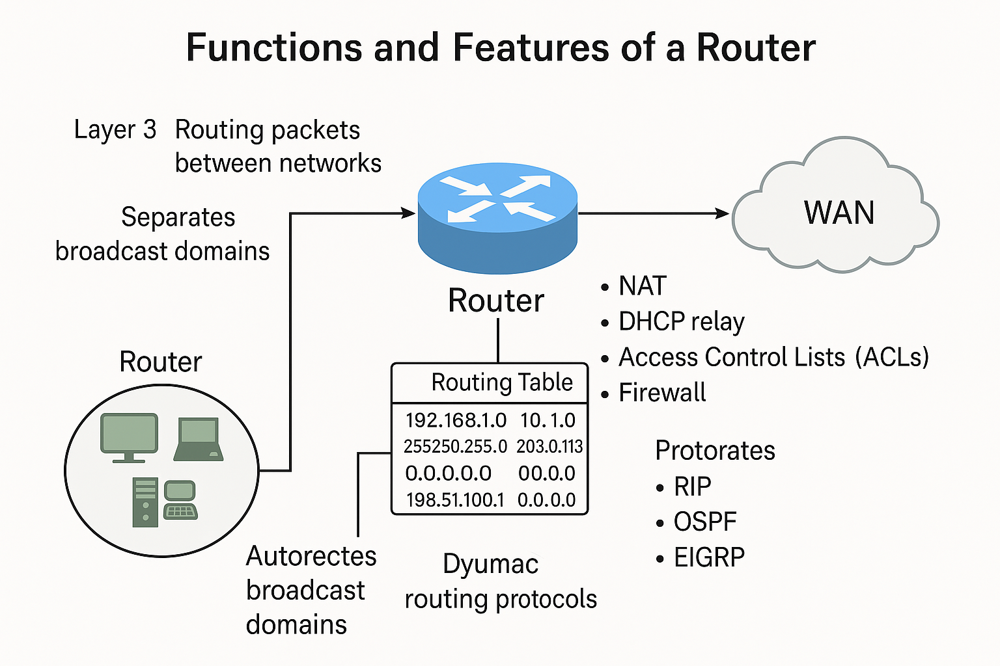

### เกตเวย์ (Gateways)

**เกตเวย์ (Gateway)** คืออุปกรณ์หรือโหนดที่ทำหน้าที่เป็น **จุดเข้าและออก (Entry/Exit Point)** ไปยังเครือข่ายอื่น มักใช้ในการแปลการสื่อสารระหว่าง **โปรโตคอลเครือข่ายที่แตกต่างกัน** เช่น การแปลงจาก **IP** ไปยังระบบแบบ Legacy หรือจากเครือข่ายภายในไปยังอินเทอร์เน็ต

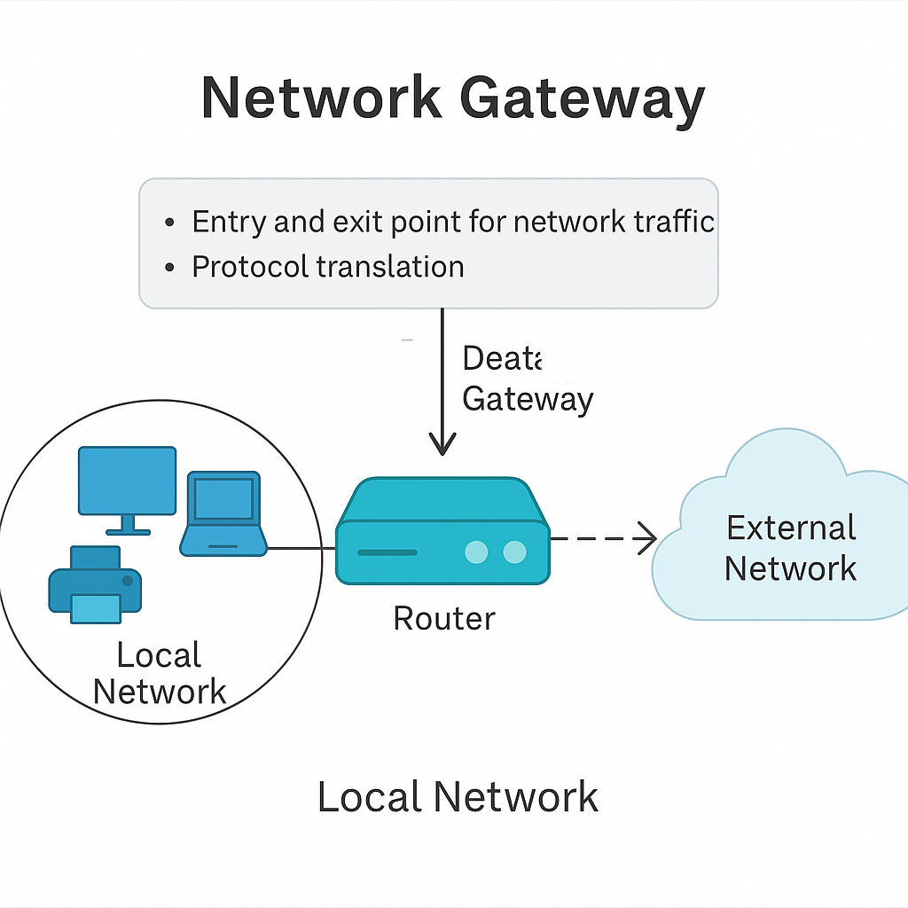

### ไฟร์วอลล์ (Firewalls)

**ไฟร์วอลล์ (Firewall)** คืออุปกรณ์รักษาความปลอดภัยที่ควบคุมและตรวจสอบการรับส่งข้อมูลเครือข่ายตาม **กฎที่กำหนดไว้ (Security Rules)**

* ทำงานหลักที่ **Layer 3 (Network Layer)** และ **Layer 4 (Transport Layer)**
* ไฟร์วอลล์รุ่นใหม่ (Next-Generation Firewall) ยังตรวจสอบแพ็กเก็ตใน **Layer 7 (Application Layer)**
* ป้องกันการเข้าถึงที่ไม่ได้รับอนุญาต และภัยคุกคาม เช่น มัลแวร์ การบุกรุก (Intrusion) และการโจมตีแบบ DoS

คุณสมบัติทั่วไป:

* Stateful Inspection
* Packet Filtering
* Access Control Lists (ACLs)
* Port Forwarding
* VPN Pass-through

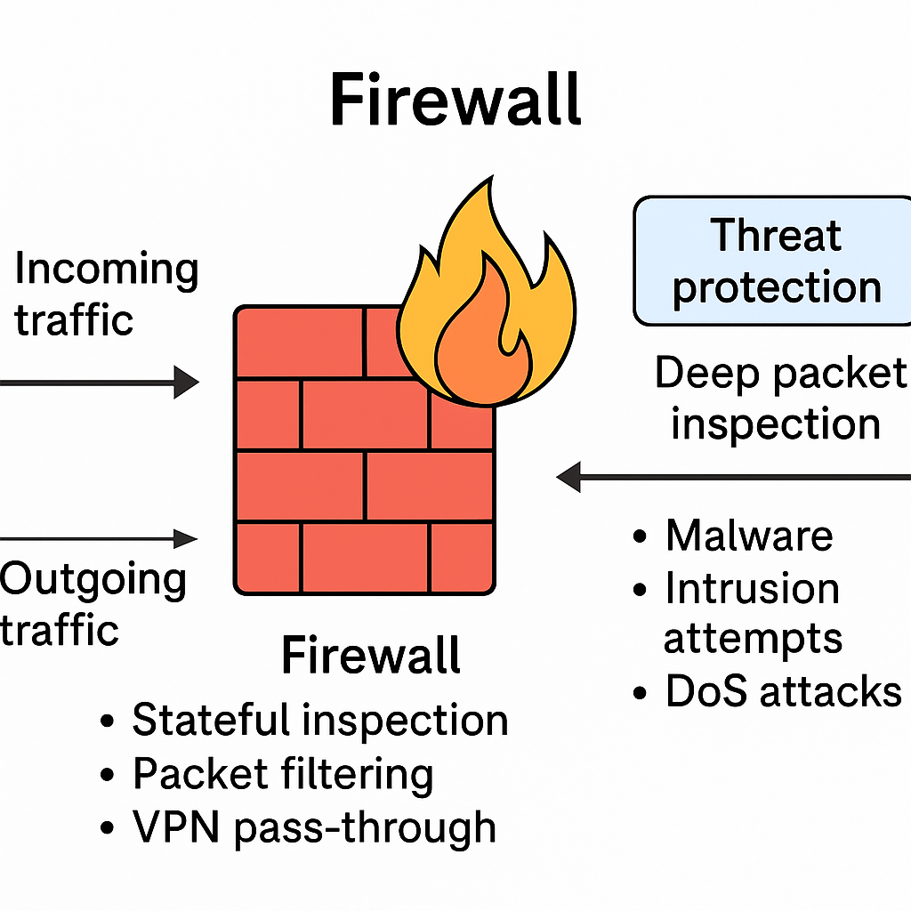

### แอคเซสพอยต์ (Access Points)

**แอคเซสพอยต์ (Access Point – AP)** เป็นอุปกรณ์ที่ช่วยให้อุปกรณ์ที่รองรับเครือข่ายไร้สายสามารถเชื่อมต่อกับ **LAN แบบใช้สาย** ได้

* ทำงานที่ **Layer 2 ของ OSI Model**
* ใช้มาตรฐาน **IEEE 802.11 (Wi-Fi)** ในการรับส่งข้อมูล
* ใช้ในเครือข่ายบ้าน องค์กร และฮอตสปอตสาธารณะ
* คุณสมบัติหลัก: การกระจาย SSID, การเข้ารหัส (เช่น WPA3), รองรับการเชื่อมต่อหลายผู้ใช้งาน

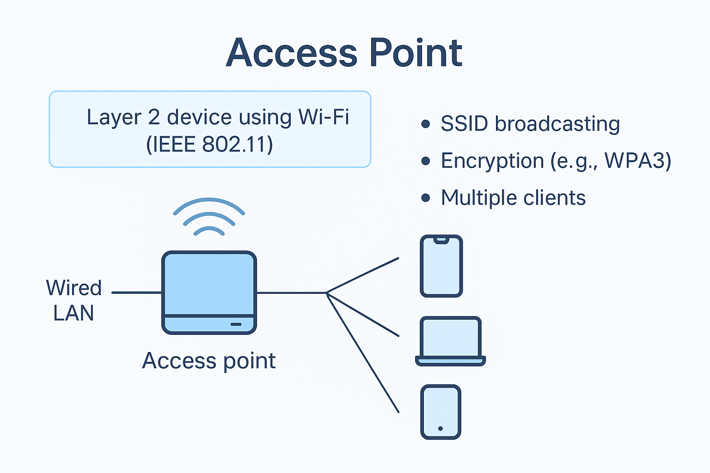

## โทโพโลยีและสถาปัตยกรรมเครือข่าย (Network Topologies and Architecture)

ในระบบเครือข่ายคอมพิวเตอร์ การจัดวางตำแหน่งของอุปกรณ์และรูปแบบการสื่อสารเรียกว่า **โทโพโลยีของเครือข่าย (Network Topology)** ซึ่งอาจอยู่ในรูปแบบกายภาพ (Physical) หรือแบบตรรกะ (Logical) โทโพโลยีมีผลต่อการไหลของข้อมูล ประสิทธิภาพ และความง่ายในการแก้ไขปัญหา

ในขณะเดียวกัน **สถาปัตยกรรมเครือข่าย (Network Architecture)** หมายถึงโครงสร้างและหลักการออกแบบที่กำหนดการทำงานและปฏิสัมพันธ์ขององค์ประกอบเครือข่าย เช่น แบบ **Peer-to-Peer (P2P)** และ **Client-Server** รวมถึงแนวคิดการควบคุมแบบ **Centralized** และ **Distributed**

โทโพโลยีและสถาปัตยกรรมจึงถือเป็น **พิมพ์เขียว (Blueprint)** สำหรับการทำงาน ความสามารถในการขยาย (Scalability) และความทนทานต่อความผิดพลาด (Resilience) ของเครือข่าย

### โทโพโลยีกายภาพ (Physical Topologies)

* **Bus Topology** – ใช้สาย Backbone เพียงเส้นเดียวเชื่อมต่ออุปกรณ์ทั้งหมด ต้นทุนต่ำและง่ายต่อการติดตั้ง แต่มีความเสี่ยงสูงต่อการชนกันของข้อมูล (Collision) และหากสาย Backbone เสีย เครือข่ายทั้งหมดจะล้มเหลว
* **Star Topology** – อุปกรณ์ทั้งหมดเชื่อมต่อเข้ากับสวิตช์หรือฮับกลาง เครือข่ายง่ายต่อการจัดการและขยาย หากสายของอุปกรณ์หนึ่งเสีย จะกระทบเฉพาะอุปกรณ์นั้น แต่หากอุปกรณ์ศูนย์กลางล้มเหลว เครือข่ายทั้งหมดจะหยุดทำงาน
* **Ring Topology** – เชื่อมอุปกรณ์ในรูปวงกลม ข้อมูลเคลื่อนที่แบบทิศทางเดียว ลดโอกาสการชนกันของข้อมูล แต่หากอุปกรณ์หรือสายเส้นใดล้มเหลว จะกระทบต่อวงทั้งหมด
* **Mesh Topology** – อุปกรณ์ทุกตัวเชื่อมถึงกันโดยตรง มีความซ้ำซ้อนสูง (Redundancy) และเชื่อถือได้ เหมาะสำหรับงานที่ต้องการความมั่นคงสูง แต่มีต้นทุนและความซับซ้อนในการติดตั้งสูง
* **Hybrid Topology** – การผสมผสานหลายโทโพโลยี เช่น Star-Bus หรือ Star-Ring ทำให้องค์กรสามารถปรับแต่งให้เหมาะสมกับความต้องการ

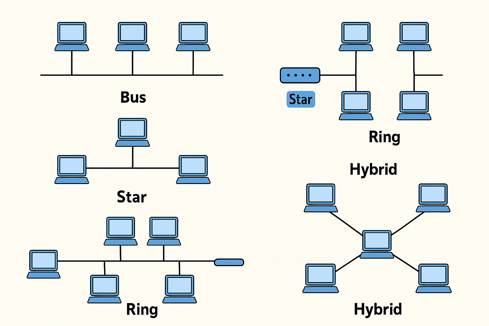

### โทโพโลยีตรรกะ (Logical Topologies)

* **Broadcast Topology** – พบได้ใน Ethernet LAN อุปกรณ์ทั้งหมดจะได้รับข้อมูลทุกแพ็กเก็ตที่ส่ง แม้จะไม่ใช่ผู้รับที่ตั้งใจไว้ ส่งผลให้เกิดความไม่มีประสิทธิภาพหากมีปริมาณการรับส่งข้อมูลสูง
* **Token Passing Topology** – ใช้ในเครือข่ายวงแหวนรุ่นเก่า อุปกรณ์ต้องถือ Token (แพ็กเก็ตเล็ก ๆ) ก่อนจึงจะส่งข้อมูลได้ ช่วยป้องกันการชนกันของข้อมูล แต่ทำให้เกิดความล่าช้าและปัจจุบันถือว่าล้าสมัยเมื่อเทียบกับ Ethernet

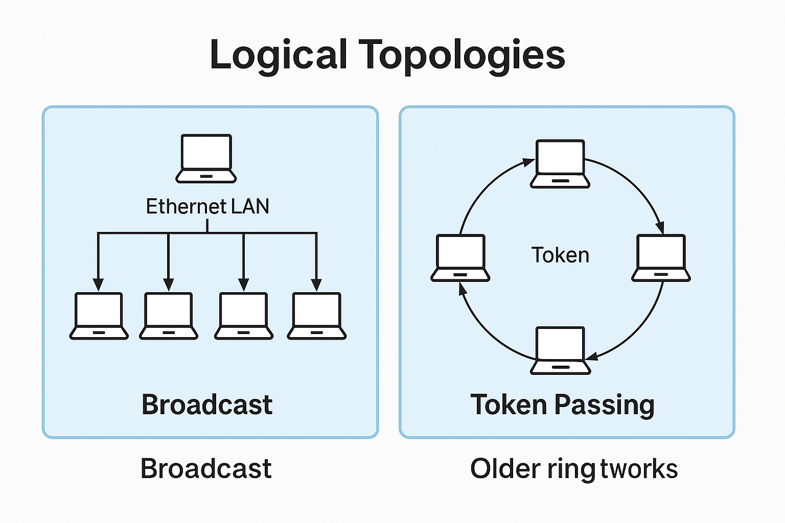

### สถาปัตยกรรมเครือข่าย (Network Architectures)

* **Peer-to-Peer (P2P)** – ทุกอุปกรณ์มีสิทธิเท่ากัน สามารถให้และใช้ทรัพยากรร่วมกันได้โดยไม่ต้องมีเซิร์ฟเวอร์กลาง เหมาะกับเครือข่ายเล็กหรือตามชั่วคราว แต่ขาดการควบคุมและความสามารถในการขยาย
* **Client-Server** – ใช้เซิร์ฟเวอร์กลางในการจัดการทรัพยากรและบริการแก่ไคลเอนต์ รองรับการบริหารจัดการ ความปลอดภัย และการขยายตัว เหมาะกับธุรกิจและองค์กร แต่พึ่งพาเซิร์ฟเวอร์และต้องการการดูแลรักษามากกว่า

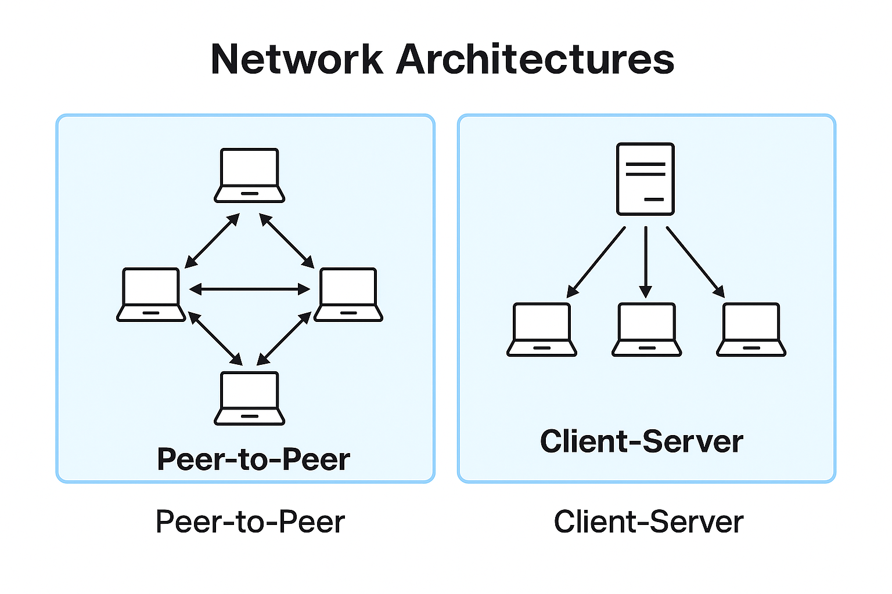

* **Centralized vs. Distributed** –

  * **Centralized Network:** จุดศูนย์กลางควบคุมการทำงานทั้งหมด ทำให้ง่ายต่อการควบคุมและการรักษาความปลอดภัย แต่มีความเสี่ยงจาก Single Point of Failure
  * **Distributed Network:** กระจายการทำงานไปยังหลายโหนด มีความทนทานสูงขึ้น แต่ซับซ้อนต่อการบริหารจัดการ

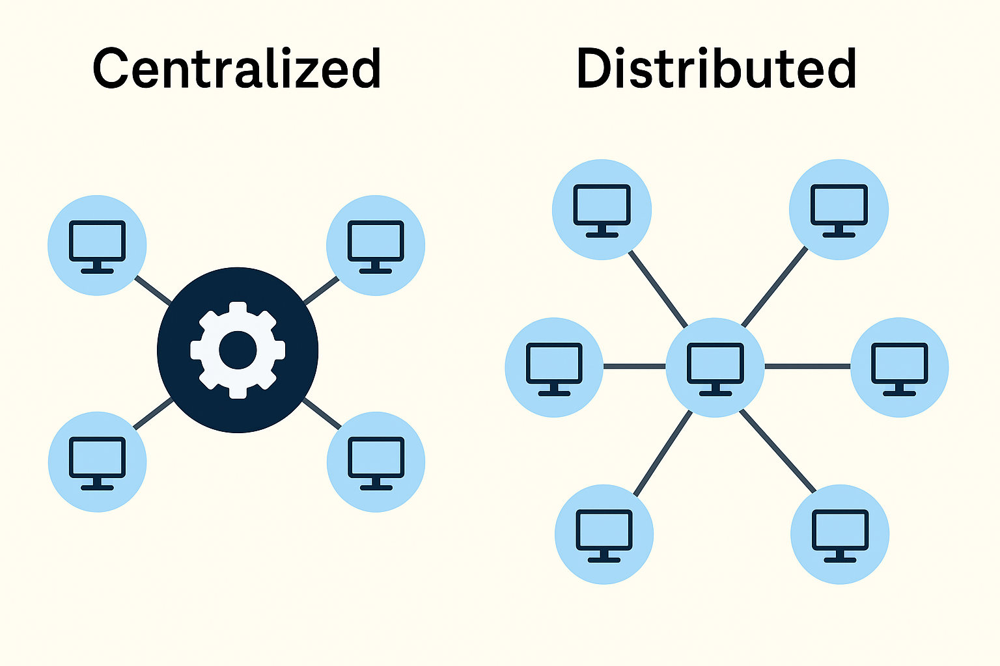

### โดเมนกระจายสัญญาณ (Broadcast Domains)

**Broadcast Domain** คือกลุ่มอุปกรณ์ในเครือข่ายที่สามารถรับข้อมูลแบบ Broadcast จากกันและกัน

* **Switches (Layer 2):** โดยค่าเริ่มต้นจะส่งต่อ Broadcast ไปยังทุกพอร์ตใน VLAN เดียวกัน
* **Routers (Layer 3):** ไม่ส่งต่อ Broadcast ระหว่างเครือข่าย ทำให้เป็นเส้นแบ่งธรรมชาติของ Broadcast Domain

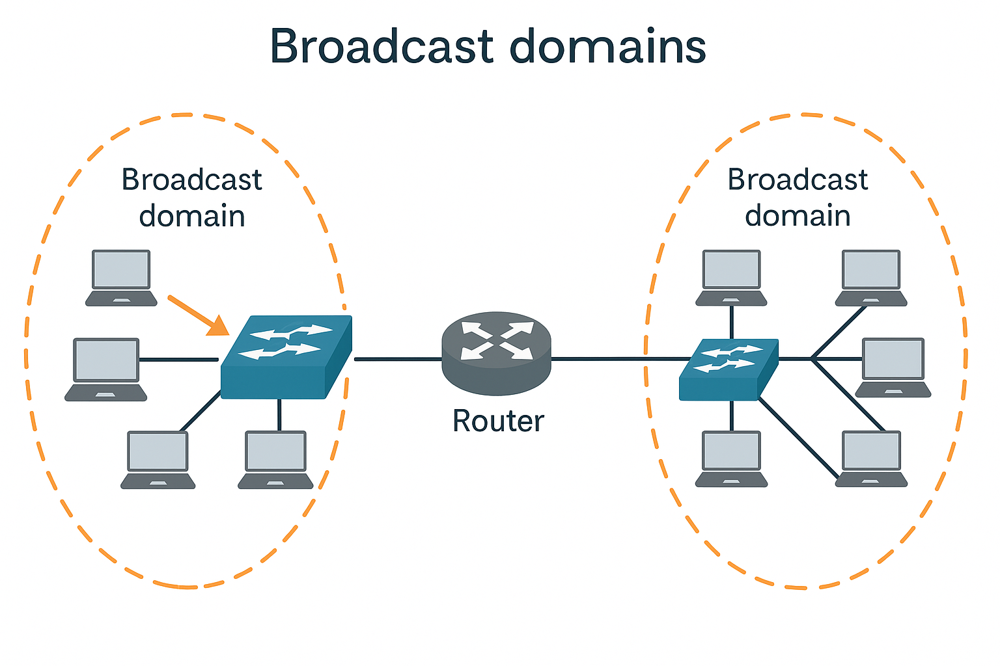

### เครือข่ายท้องถิ่นเสมือน (Virtual LANs: VLANs)

**VLAN (Virtual Local Area Network)** คือการแบ่งกลุ่มอุปกรณ์ในเชิงตรรกะให้เหมือนอยู่ใน LAN เดียวกัน แม้จะไม่ได้เชื่อมต่อกับสวิตช์หรือสายเดียวกัน

คุณสมบัติหลักของ VLAN:

* แบ่ง Broadcast Domain
* เพิ่มความปลอดภัยโดยแยกกลุ่มงานหรือแผนก
* ลดปริมาณการส่งข้อมูล Broadcast
* บริหารจัดการเครือข่ายได้ง่ายและยืดหยุ่นมากขึ้น

**การกำหนดค่า:**

* ใช้ **VLAN ID** สำหรับระบุเครือข่าย
* พอร์ตของสวิตช์สามารถกำหนดให้เป็น VLAN เดียว หรือหลาย VLAN ผ่าน **Trunk Port** โดยใช้มาตรฐาน **IEEE 802.1Q**

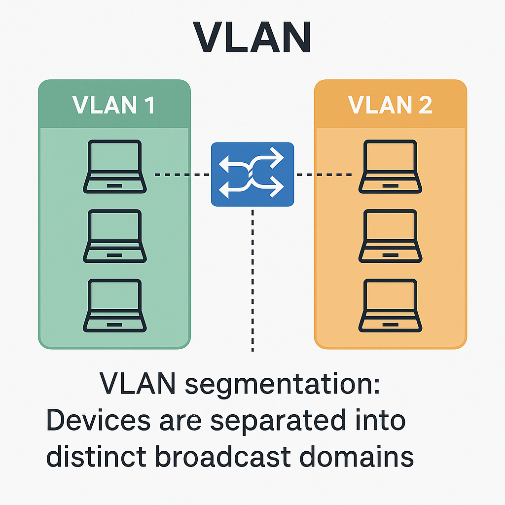

