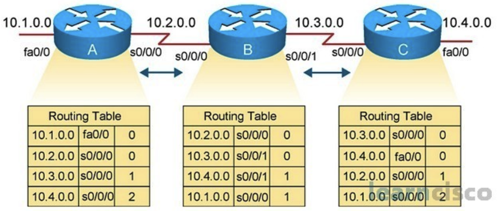

# Chapter 4 - Network Architecture

## Learning Outcomes

* Describe the layered architecture of computer networks, including the functions and interactions of each layer in the OSI and TCP/IP models.
* Explain the roles of network components—such as end devices, intermediary devices, media, services, and protocols—within a structured network architecture.
* Analyze how encapsulation, addressing, and protocol operations enable reliable end-to-end communication across diverse network systems.

# ภาพรวมของการสื่อสารเครือข่าย (Overview of Network Communication)

การสื่อสารในเครือข่าย (Network Communication) เริ่มต้นด้วยการส่ง **ข้อความ (Message)** ซึ่งเป็นหน่วยข้อมูลที่มีจุดประสงค์ในการเคลื่อนย้ายจากอุปกรณ์หรือบุคคลหนึ่งไปยังอีกฝ่ายหนึ่ง การสื่อสารทุกกระบวนการในเครือข่ายขึ้นอยู่กับองค์ประกอบหลัก 3 ส่วน ได้แก่

* **แหล่งกำเนิด (Source / Sender):** ผู้ส่งข้อความ ซึ่งอาจเป็นผู้ใช้งานหรืออุปกรณ์อิเล็กทรอนิกส์
* **ปลายทาง (Destination / Receiver):** ผู้รับข้อความ ซึ่งทำหน้าที่ตีความข้อมูลที่ถูกส่งมา
* **ช่องทาง (Channel / Transmission Medium):** สื่อกลางทางกายภาพหรือไร้สายที่ใช้ในการส่งข้อความ เช่น สายทองแดง (Copper Cables), ใยแก้วนำแสง (Fiber Optics), หรือสัญญาณไร้สาย (Wireless Signals)

เพื่อเพิ่ม **ประสิทธิภาพ (Efficiency)** และ **ความเชื่อถือได้ (Reliability)** ข้อความที่มีขนาดใหญ่จะถูกแบ่งออกเป็นหน่วยย่อยที่สามารถจัดการได้ง่ายขึ้น ผ่านกระบวนการที่เรียกว่า **การแบ่งส่วน (Segmentation)** โดยให้ประโยชน์สำคัญดังนี้:

* **การมัลติเพล็กซ์ (Multiplexing):** อนุญาตให้หลายการสื่อสารใช้สื่อกลางเดียวกันได้ โดยการจัดเรียงสลับกันของข้อความที่ถูกแบ่งเป็นส่วน ๆ
* **การเพิ่มความเชื่อถือได้ (Increased Reliability):** หากส่วนใดส่วนหนึ่งของข้อความสูญหายหรือเสียหาย จะต้องส่งใหม่เฉพาะส่วนนั้น ไม่จำเป็นต้องส่งทั้งข้อความซ้ำทั้งหมด

การจัดการแบบแบ่งส่วนและแบบชั้น (Layered Approach) นี้ถือเป็นรากฐานสำคัญของสถาปัตยกรรมเครือข่ายสมัยใหม่ ทำให้เกิดการแลกเปลี่ยนข้อมูลที่มีประสิทธิภาพ มีความสามารถในการขยาย (Scalability) และมีความทนทานต่อความผิดพลาด (Robustness)

## องค์ประกอบของเครือข่ายคอมพิวเตอร์ (Components of a Network)

เครือข่ายคอมพิวเตอร์ (Computer Network) ประกอบด้วยองค์ประกอบหลากหลายที่ทำงานร่วมกันเพื่อให้เกิดการสื่อสารระหว่างอุปกรณ์ได้สำเร็จ โดยองค์ประกอบเหล่านี้สามารถจำแนกได้ดังนี้

### 1. อุปกรณ์ (Devices)

* **อุปกรณ์ปลายทาง (End Devices):**
  เป็นอุปกรณ์ที่ผู้ใช้งานสามารถโต้ตอบได้โดยตรง ทำหน้าที่เป็นจุดเชื่อมต่อระหว่างผู้ใช้กับเครือข่าย ตัวอย่างเช่น คอมพิวเตอร์ตั้งโต๊ะ (Desktop Computers), แล็ปท็อป (Laptops), สมาร์ตโฟน (Smartphones), เครื่องพิมพ์เครือข่าย (Network Printers), โทรศัพท์ไอพี (IP Phones), และกล้องวงจรปิด (Surveillance Cameras)

* **อุปกรณ์สื่อกลาง (Intermediary Devices):**
  เป็นอุปกรณ์ที่ทำหน้าที่เชื่อมต่ออุปกรณ์ปลายทางเข้าสู่เครือข่าย หรือเชื่อมต่อระหว่างหลายเครือข่ายเข้าด้วยกัน ตัวอย่างได้แก่ สวิตช์ (Switches), เราเตอร์ (Routers), จุดเชื่อมต่อไร้สาย (Wireless Access Points), ไฟร์วอลล์ (Firewalls), โมเด็ม (Modems), และเซิร์ฟเวอร์สื่อสาร (Communication Servers)
  อุปกรณ์เหล่านี้มีหน้าที่จัดการการไหลของข้อมูล (Traffic Management), บังคับใช้นโยบายด้านความปลอดภัย (Security Policies), และตัดสินใจเกี่ยวกับการเส้นทาง (Routing Decisions)

### 2. สื่อกลางการส่งข้อมูล (Media)

* **สายทองแดง (Copper Cables):**
  ส่งข้อมูลผ่านสัญญาณไฟฟ้า ตัวอย่างที่ใช้บ่อยคือสายคู่บิดเกลียวแบบไม่มีฉนวนหุ้ม (Unshielded Twisted Pair – UTP) และสายโคแอกเชียล (Coaxial Cables)

* **สายใยแก้วนำแสง (Fiber-Optic Cables):**
  ใช้การส่งข้อมูลผ่านแสงพัลส์ (Pulses of Light) สามารถส่งข้อมูลได้ระยะทางไกล มีแบนด์วิธสูง และทนต่อสัญญาณรบกวนได้ดี

* **สื่อไร้สาย (Wireless Media):**
  ใช้คลื่นแม่เหล็กไฟฟ้า (Electromagnetic Waves) ในการส่งข้อมูล ตัวอย่างเช่น ไวไฟ (Wi-Fi), บลูทูธ (Bluetooth), และเครือข่ายโทรศัพท์เคลื่อนที่ (Cellular Networks)

### 3. บริการเครือข่าย (Services)

บริการเครือข่าย (Network Services) เป็นฟังก์ชันที่อิงซอฟต์แวร์ ทำหน้าที่สนับสนุนการสื่อสารและการแบ่งปันทรัพยากร ตัวอย่างที่พบบ่อยได้แก่ บริการอีเมล (Email), เว็บโฮสติ้ง (Web Hosting), การแบ่งปันไฟล์ (File Sharing), และการเข้าถึงจากระยะไกล (Remote Access)
บริการเหล่านี้มักจะทำงานบนเซิร์ฟเวอร์เครือข่าย (Network Servers) และถูกเข้าถึงโดยอุปกรณ์ลูกข่าย (Clients)

### 4. โปรโตคอล (Protocols)

โปรโตคอล (Protocols) หมายถึงกฎเกณฑ์มาตรฐานที่กำหนดวิธีการจัดรูปแบบ (Format), การส่ง (Transmit), และการรับ (Receive) ข้อมูลในเครือข่าย เพื่อให้มั่นใจว่าอุปกรณ์ต่าง ๆ สามารถทำงานร่วมกันได้และมีการส่งข้อมูลอย่างเชื่อถือได้ ตัวอย่างโปรโตคอลสำคัญ ได้แก่

* **Transmission Control Protocol (TCP)**
* **Internet Protocol (IP)**
* **Hypertext Transfer Protocol (HTTP)**
* **Domain Name System (DNS)**

✦ องค์ประกอบทั้ง 4 ส่วนนี้—อุปกรณ์ (Devices), สื่อกลาง (Media), บริการ (Services), และโปรโตคอล (Protocols)—เป็นพื้นฐานสำคัญที่ทำให้เครือข่ายคอมพิวเตอร์สามารถทำงานได้อย่างมีประสิทธิภาพ

## แบบจำลองเครือข่าย (Network Models)

เพื่อจัดการกับความซับซ้อนของเครือข่ายคอมพิวเตอร์สมัยใหม่ ได้มีการพัฒนา **แบบจำลองแบบชั้น (Layered Models)** เพื่อใช้ในการจัดโครงสร้างและทำให้กระบวนการสื่อสารเป็นมาตรฐาน โดยแบบจำลองเหล่านี้แบ่งฟังก์ชันการทำงานของเครือข่ายออกเป็นลำดับชั้น (Hierarchical Layers) ที่แต่ละชั้นมีบทบาทและโปรโตคอล (Protocols) ที่ชัดเจน

### จุดประสงค์ของแบบจำลองแบบชั้น (Purpose of Layered Models)

* ทำให้ง่ายต่อการออกแบบ (Design), การใช้งาน (Implementation), และการแก้ปัญหา (Troubleshooting) เครือข่าย
* ส่งเสริมการทำงานร่วมกัน (Interoperability) ระหว่างฮาร์ดแวร์และซอฟต์แวร์จากผู้ผลิตที่แตกต่างกัน
* สนับสนุนการพัฒนาแบบแยกส่วน (Modular Development) ที่การเปลี่ยนแปลงในชั้นหนึ่งจะไม่กระทบต่อชั้นอื่น
* จัดเตรียมกรอบการทำงานมาตรฐาน (Standardized Framework) สำหรับการอธิบายฟังก์ชันของเครือข่าย

### แบบจำลองที่ใช้บ่อย (Common Layered Models)

#### 1. แบบจำลอง OSI (Open Systems Interconnection)

แบบจำลอง OSI เป็นแบบจำลองเชิงแนวคิด (Conceptual Model) ที่แบ่งการสื่อสารเครือข่ายออกเป็น **7 ชั้น (7 Layers)** โดยแต่ละชั้นจะมีหน้าที่เฉพาะและสื่อสารกับชั้นที่อยู่ติดกัน

ลำดับชั้นตั้งแต่ล่างสุดจนถึงบนสุด ได้แก่:

* **Physical Layer** – ส่งบิตดิบ (Raw Bits) ผ่านสื่อกลางทางกายภาพ
* **Data Link Layer** – รับรองการส่งข้อมูลระหว่างโหนด (Node-to-Node) ให้ปราศจากข้อผิดพลาด
* **Network Layer** – จัดการการกำหนดที่อยู่แบบตรรกะ (Logical Addressing เช่น IP) และการกำหนดเส้นทาง (Routing)
* **Transport Layer** – จัดหาการส่งข้อมูลที่เชื่อถือได้หรือไม่เชื่อถือได้ระหว่างระบบปลายทาง
* **Session Layer** – สร้าง รักษา และยุติการเชื่อมต่อแบบเซสชัน (Sessions) ระหว่างแอปพลิเคชัน
* **Presentation Layer** – จัดการการแปลงรูปแบบข้อมูล (Data Formatting), การเข้ารหัส (Encoding), และการเข้ารหัสลับ (Encryption)
* **Application Layer** – เป็นอินเทอร์เฟซโดยตรงระหว่างแอปพลิเคชันผู้ใช้กับบริการเครือข่าย

#### 2. แบบจำลอง TCP/IP (Transmission Control Protocol / Internet Protocol)

แบบจำลอง TCP/IP เป็นแบบจำลองที่ใช้จริงในสถาปัตยกรรมของโปรโตคอลสมัยใหม่ และเป็นรากฐานของอินเทอร์เน็ต โดยประกอบด้วย **4 ชั้น** ได้แก่:

* **Application Layer**
* **Transport Layer**
* **Internet Layer**
* **Network Access Layer**

### การเปรียบเทียบการแมปชั้น (OSI vs TCP/IP Layer Mapping)

* **Application Layer (TCP/IP)** สอดคล้องกับชั้น Application, Presentation, และ Session ของ OSI
* **Transport Layer** ตรงกันทั้งสองแบบจำลอง
* **Internet Layer (TCP/IP)** สอดคล้องกับ Network Layer ของ OSI
* **Network Access Layer (TCP/IP)** ครอบคลุม Data Link และ Physical Layers ของ OSI

### ประโยชน์ของการออกแบบแบบชั้น (Benefits of Layered Design)

* สนับสนุนการเชี่ยวชาญเฉพาะด้านของโปรโตคอล (Protocol Specialization)
* รองรับการทำงานผ่านอินเทอร์เฟซมาตรฐานระหว่างชั้น (Standardized Interfaces)
* ช่วยให้การแก้ปัญหาทำได้ง่ายขึ้น (Troubleshooting) และส่งเสริมการขยายตัวของเครือข่าย (Scalability)

✦ แบบจำลอง OSI และ TCP/IP ทำหน้าที่เป็นกรอบอ้างอิงที่สำคัญ นักวิชาการและผู้ปฏิบัติการเครือข่ายใช้เพื่อทำความเข้าใจ วิเคราะห์ และออกแบบระบบสื่อสารข้อมูล

## การห่อหุ้มข้อมูลและหน่วยข้อมูลตามโปรโตคอล (Encapsulation and Protocol Data Units: PDUs)

ในการสื่อสารเครือข่าย **การห่อหุ้มข้อมูล (Encapsulation)** คือกระบวนการเพิ่มข้อมูลควบคุมของโปรโตคอล (Protocol Control Information) ลงในข้อมูล (Data) เมื่อมันไหลลงมาตามชั้นต่าง ๆ ของสแต็กเครือข่าย (Network Stack) แต่ละชั้นจะเพิ่ม *ส่วนหัว (Header)* และบางครั้งอาจมี *ส่วนท้าย (Trailer)* เพื่อเตรียมข้อมูลให้สามารถส่งผ่านระบบเครือข่ายที่แตกต่างกันได้อย่างถูกต้อง

### ความหมายของการห่อหุ้ม (What is Encapsulation?)

* การห่อหุ้มเกิดขึ้นเมื่อข้อมูลไหลจาก **Application Layer** ลงไปยัง **Physical Layer**
* แต่ละชั้นจะเพิ่ม **Protocol Header** ของตนเอง จนเกิดเป็นหน่วยข้อมูลที่เรียกว่า **Protocol Data Unit (PDU)**
* ที่ปลายทาง จะมีการทำงานในทางกลับกันคือ **การคลี่ห่อ (Decapsulation)** เพื่อถอดส่วนหัวและสร้างข้อมูลต้นฉบับกลับคืนมา

### วัตถุประสงค์ของการห่อหุ้ม (Purpose of Encapsulation)

* เตรียมข้อมูลให้สามารถส่งได้ผ่านเครือข่ายที่แตกต่างกัน (Heterogeneous Networks)
* เพิ่มข้อมูลจำเป็น เช่น **Addressing, Error Checking, Sequencing, Delivery Instructions**
* ช่วยให้โปรโตคอลแต่ละชั้นสามารถทำงานได้อย่างอิสระ (Independent Protocol Operation)

### หน่วยข้อมูลตามชั้น OSI (Protocol Data Units by OSI Layer)

* **Application Layer**: *Data* – ข้อมูลที่สร้างโดยแอปพลิเคชันผู้ใช้
* **Transport Layer**: *Segment (TCP)* หรือ *Datagram (UDP)* – มีข้อมูลพอร์ต (Port Numbers), หมายเลขลำดับ (Sequence Numbers), และการตรวจสอบข้อผิดพลาด (Error Checking)
* **Network Layer**: *Packet* – มีที่อยู่ IP และข้อมูลการกำหนดเส้นทาง (Routing Information)
* **Data Link Layer**: *Frame* – มีที่อยู่ MAC และข้อมูลตรวจสอบข้อผิดพลาด
* **Physical Layer**: *Bits* – การส่งข้อมูลจริงเป็นสัญญาณไฟฟ้า แสง หรือคลื่นวิทยุ

✨ การใช้ **Encapsulation** และ **PDU** ถือเป็นหัวใจของการสื่อสารแบบแยกชั้น (Layered Communication) ซึ่งช่วยให้ข้อมูลสามารถเดินทางได้อย่างน่าเชื่อถือและมีโครงสร้าง ผ่านเครือข่ายและระบบที่แตกต่างกัน

## การกำหนดที่อยู่เครือข่าย (Network Addressing)

เพื่อให้การสื่อสารข้อมูลในเครือข่ายสำเร็จได้ อุปกรณ์ทุกตัวต้องสามารถระบุตัวตนได้อย่างชัดเจน ซึ่งทำได้ผ่านการกำหนด **ที่อยู่ (Addressing)** ในแต่ละชั้นของแบบจำลองเครือข่าย การกำหนดที่อยู่นี้ทำให้ข้อมูลถูกส่งไปยังปลายทางที่ถูกต้อง ไม่ว่าจะเป็นเครือข่ายภายใน (LAN) หรือเครือข่ายกว้าง (WAN)

### วัตถุประสงค์ของการกำหนดที่อยู่ (Purpose of Network Addressing)

* ระบุอุปกรณ์และอินเทอร์เฟซเครือข่าย
* ทำให้ข้อมูลถูกส่งไปยังผู้รับที่ถูกต้อง
* สนับสนุนการกำหนดเส้นทาง (Routing) และการส่งต่อ (Forwarding) ข้ามเครือข่าย

### ประเภทของที่อยู่ในเครือข่าย (Types of Addresses)

* **Physical Address (Layer 2)**

  * เรียกว่า **MAC Address (Media Access Control)**
  * ถูกบันทึกถาวรใน **NIC (Network Interface Card)**
  * ใช้สำหรับการสื่อสารภายในเครือข่าย LAN

* **Network Address (Layer 3)**

  * มักอยู่ในรูป **IP Address (IPv4/IPv6)**
  * ใช้ในการระบุอุปกรณ์ข้ามเครือข่าย
  * สนับสนุน **Hierarchical Addressing** เพื่อความสามารถในการขยาย (Scalability)

* **Port Number (Layer 4)**

  * ใช้ระบุโปรเซสหรือบริการเฉพาะบนโฮสต์
  * อนุญาตให้หลายแอปพลิเคชันใช้เครือข่ายพร้อมกัน
  * ตัวอย่าง: **HTTP (port 80), SMTP (port 25), DNS (port 53)**

* **Socket**

  * คือการรวมกันระหว่าง **IP Address** และ **Port Number**
  * ใช้เพื่อระบุการสื่อสารระหว่างโปรเซสกับโปรเซสอย่างเฉพาะเจาะจง

### ประเภทของที่อยู่ IP (IPv4 Address Types)

* **Network Address** – ระบุทั้งเครือข่าย (host bits = 0)
* **Broadcast Address** – ส่งข้อมูลไปยังทุกอุปกรณ์ในเครือข่าย (host bits = 1)
* **Host Address** – ระบุโฮสต์เฉพาะ ต้องไม่ซ้ำกันในเครือข่ายเดียวกัน

### โหมดการสื่อสาร (Communication Modes)

* **Unicast** – การสื่อสารแบบหนึ่งต่อหนึ่ง
* **Multicast** – การสื่อสารแบบหนึ่งต่อกลุ่ม
* **Broadcast** – การสื่อสารแบบหนึ่งต่อทุกเครื่องในเครือข่ายย่อย

### การแบ่งเครือข่ายย่อย (Subnetting) และ Subnet Masks

* การแบ่งเครือข่ายย่อย (Subnetting) คือการแยกเครือข่ายใหญ่ให้เป็นเครือข่ายย่อยที่จัดการได้ง่าย
* **Subnet Mask** ใช้เพื่อแยกส่วนที่อยู่เครือข่ายออกจากส่วนที่อยู่โฮสต์
* การคำนวณ **ANDing** ใช้เพื่อหาที่อยู่เครือข่ายจาก IP Address และ Subnet Mask
* **VLSM (Variable Length Subnet Mask)** อนุญาตให้สร้างเครือข่ายย่อยหลายขนาดเพื่อการใช้งาน IP อย่างมีประสิทธิภาพ

✨ ความเข้าใจเรื่อง **Network Addressing** เป็นหัวใจสำคัญของการออกแบบและจัดการเครือข่าย IP เพราะช่วยให้การกำหนดเส้นทางมีประสิทธิภาพ การสื่อสารระหว่างอุปกรณ์ถูกต้อง และการจัดสรรทรัพยากรเครือข่ายเป็นไปอย่างเหมาะสม

## ชั้น Network (Network Layer)

ชั้น **Network (Network Layer)** ของแบบจำลอง OSI ทำหน้าที่สำคัญในการ **กำหนดที่อยู่เชิงตรรกะ (Logical Addressing)**, **การห่อหุ้มข้อมูล (Encapsulation)**, **การกำหนดเส้นทาง (Routing)** และ **การถอดห่อหุ้ม (Decapsulation)** เพื่อให้ข้อมูลสามารถเดินทางจากต้นทางไปยังปลายทางที่อยู่ต่างเครือข่ายได้อย่างถูกต้อง

### หน้าที่หลัก (Primary Responsibilities)

### 1. การกำหนดที่อยู่เชิงตรรกะ (Logical Addressing)

* ใช้ **IP Address** (เช่น IPv4 หรือ IPv6) เพื่อระบุอุปกรณ์ในเครือข่าย
* มีโครงสร้างแบบลำดับชั้น (Hierarchical) ทำให้สามารถ **Subnetting** และ **Routing** ได้อย่างมีประสิทธิภาพ
* สนับสนุนการจัดการด้าน **Security, QoS (Quality of Service), และ Network Segmentation**

### 2. การห่อหุ้มข้อมูล (Encapsulation)

* เมื่อรับข้อมูลจาก Transport Layer จะเพิ่ม **IP Header** เพื่อสร้าง **Packet**
* Header ประกอบด้วย **Source/Destination IP Address, TTL (Time-to-Live), Fragment Offset**
* ทำให้ Router สามารถเลือกเส้นทางได้ถูกต้อง

### 3. การกำหนดเส้นทาง (Routing)

* Router ใช้ **Routing Table** และ **Routing Protocols (OSPF, BGP, EIGRP)** เพื่อหาทางที่ดีที่สุด
* ปัจจัยที่พิจารณา ได้แก่ **Hop Count, Bandwidth, Cost**
* สนับสนุนการทำงานเช่น **Load Balancing, Redundancy, และ Failover**

### 4. การถอดห่อหุ้มข้อมูล (Decapsulation)

* ที่ปลายทาง Header ของ IP จะถูกตรวจสอบและนำออก
* Packet จะถูกส่งขึ้นไปยัง Transport Layer เพื่อประกอบข้อมูลกลับคืน

### การกำหนดที่อยู่ (Addressing: Internet Protocols)

### IPv4 (Internet Protocol version 4)

* ใช้ที่อยู่ขนาด **32-bit**
* Header ประกอบด้วย **Source/Destination IP, TTL, ToS (Type of Service), Fragment Offset, Checksum**
* เป็น **Connectionless Protocol** แบบ **Best-Effort Delivery**
* ข้อจำกัดหลักคือ **Address Exhaustion** (การหมดของที่อยู่ IP)

### IPv6 (Internet Protocol version 6)

* ใช้ที่อยู่ขนาด **128-bit** รองรับจำนวนโหนดมหาศาล
* Header มีโครงสร้างแบบ **Fixed Header + Extension Headers**
* คุณสมบัติเด่น:

  * รองรับ **IPsec** ในตัว
  * **SLAAC (Stateless Address Autoconfiguration)**
  * ไม่มี **Broadcast** → ใช้ **Multicast และ Anycast** แทน

### การทำงานของ Router และ Routing Table

### Router

* เป็นอุปกรณ์ Layer 3 ใช้ **Routing Table** เพื่อตัดสินใจส่งต่อ **Packet**
* รองรับ **Static Routing และ Dynamic Routing**
* ทำงานร่วมกับ **ARP, NAT, ACL, QoS** เพื่อเพิ่มประสิทธิภาพและความปลอดภัย

### Routing Table

* โครงสร้างข้อมูลที่เก็บ **Destination Network, Subnet Mask, Next-Hop, Metric**
* มีทั้งแบบ **Static** (กำหนดด้วยตนเอง) และ **Dynamic** (เรียนรู้จาก Routing Protocols)

### ประเภทของการกำหนดเส้นทาง (Routing Types)

| ประเภท (Routing Type) | คำอธิบาย (Description)                                                                    |
| --------------------- | ----------------------------------------------------------------------------------------- |
| **Static Routing**    | ผู้ดูแลระบบกำหนดเส้นทางด้วยตนเอง ไม่ปรับอัตโนมัติ เหมาะกับเครือข่ายเล็ก/คงที่             |
| **Dynamic Routing**   | ใช้ **Routing Protocols (RIP, EIGRP, OSPF, BGP)** เพื่อเรียนรู้และปรับเส้นทางโดยอัตโนมัติ |

### ตัวอย่าง Routing Table หลาย Router

* **Router A** → เชื่อมตรงกับเครือข่าย `10.1.0.0` และส่งต่อไปยังเครือข่ายอื่นผ่าน `s0/0/0`
* **Router B** → อยู่กึ่งกลาง มีเส้นทางตรงกับ `10.2.0.0, 10.3.0.0`
* **Router C** → เชื่อมตรงกับ `10.3.0.0, 10.4.0.0`

### เกตเวย์เริ่มต้น (Default Gateway)

* ใช้สำหรับโฮสต์ที่ต้องการส่งข้อมูลไปยังเครือข่ายภายนอก
* เป็น **First-Hop Router** ที่รับผิดชอบส่งต่อไปยังเส้นทางถัดไป
* ใช้กันทั่วไปใน LAN เพื่อออกไปยัง Internet

✦ สรุป: ชั้น Network (Network Layer) เป็นกลไกหลักที่ทำให้การสื่อสาร **ข้ามเครือข่าย (Internetworking)** เกิดขึ้นได้จริง โดยอาศัย IP Address, Routing, และ Router เป็นองค์ประกอบสำคัญ

## ชั้นข้อมูลลิงก์ (Data Link Layer)

ชั้น **Data Link (Data Link Layer)** ในแบบจำลอง OSI มีหน้าที่หลักในการทำให้การส่งข้อมูลระหว่างโหนด (Node-to-Node) ภายในเครือข่ายท้องถิ่น (LAN Segment) มีความถูกต้องและเชื่อถือได้ โดยทำการจัดเตรียมแพ็กเก็ต (Packet) จากชั้น Network ให้อยู่ในรูปแบบของ **Frame** เพื่อส่งต่อผ่านสื่อกลางจริง

### หน้าที่หลัก (Core Functions)

* **Framing (การจัดเฟรม):**
  ห่อหุ้ม (Encapsulate) แพ็กเก็ตจากชั้น Network ด้วยส่วนหัว (Header) และส่วนท้าย (Trailer) ของ Layer 2 เพื่อสร้าง **Frame** ที่มีข้อมูลควบคุมสำหรับการซิงโครไนซ์ การตรวจสอบข้อผิดพลาด และการระบุปลายทาง

* **Media Access Control (MAC):**
  กำหนดวิธีที่อุปกรณ์บนเครือข่ายเข้าถึงสื่อกลางและเริ่มการส่งข้อมูล รวมถึงการจัดการ **MAC Address** เพื่อระบุอุปกรณ์และควบคุมการชนกันของสัญญาณ (Collision)

### ชั้นย่อย (Sublayers)

ชั้น Data Link แบ่งออกเป็น 2 ชั้นย่อย ได้แก่:

1. **LLC (Logical Link Control):**
   ทำหน้าที่ติดต่อกับโปรโตคอลชั้น Network และจัดการการตรวจสอบข้อผิดพลาดและการซิงโครไนซ์ของเฟรม
2. **MAC (Media Access Control):**
   จัดการที่อยู่เชิงกายภาพ (Physical Address / MAC Address) และวิธีการเข้าถึงสื่อกลาง (Access Methods)

### วิธีการเข้าถึงสื่อ (Access Methods)

* **Controlled Access (การเข้าถึงแบบควบคุม):**
  อุปกรณ์จะเข้าถึงสื่อกลางตามลำดับที่กำหนด เช่น **Token Passing**

* **Contention-Based Access (การเข้าถึงแบบแข่งขัน):**
  อุปกรณ์แข่งขันกันเพื่อใช้สื่อกลาง แบ่งออกเป็น:

  * **CSMA/CD (Carrier Sense Multiple Access with Collision Detection):** ใช้ใน Ethernet แบบมีสาย
  * **CSMA/CA (Carrier Sense Multiple Access with Collision Avoidance):** ใช้ใน Wi-Fi (IEEE 802.11)

### โทโพโลยีเครือข่าย (Network Topologies)

* **Point-to-Point:** การเชื่อมตรงระหว่างสองโหนด
* **Multi-Access:** อุปกรณ์หลายตัวแชร์สื่อกลางเดียวกัน เช่น Ethernet LAN
* **Ring:** อุปกรณ์เชื่อมต่อเป็นวงกลม ข้อมูลไหลตามลำดับ

### โปรโตคอลที่ใช้ทั่วไปในชั้น Data Link (Common Protocols)

* **Ethernet (IEEE 802.2/802.3):** เทคโนโลยี LAN ที่แพร่หลายที่สุด รองรับทั้งแบบ Half-Duplex และ Full-Duplex
* **PPP (Point-to-Point Protocol):** ใช้บนลิงก์ WAN แบบ Serial รองรับการตรวจสอบสิทธิ์ (Authentication) การบีบอัด และการตรวจสอบข้อผิดพลาด
* **IEEE 802.11 (Wi-Fi):** มาตรฐาน LAN ไร้สาย ใช้คลื่นวิทยุและกลไก **CSMA/CA**

✦ สรุป: ชั้น **Data Link Layer** ทำหน้าที่สำคัญในการ **แปลง Packet ให้เป็น Frame**, จัดการ **MAC Address**, และควบคุมการเข้าถึงสื่อกลางเพื่อให้การสื่อสารในเครือข่ายท้องถิ่นมีความถูกต้องและเสถียร

## ชั้นกายภาพ (Physical Layer)

ชั้น **Physical Layer** เป็นชั้นล่างสุดของแบบจำลอง OSI ซึ่งรับผิดชอบในการส่งสัญญาณข้อมูลดิบ (Raw Bitstream) ผ่านสื่อกลางจริง เช่น สายทองแดง (Copper), ใยแก้วนำแสง (Fiber Optic), หรือคลื่นวิทยุ (Wireless). ชั้นนี้กำหนดองค์ประกอบทางกายภาพทั้งหมดของระบบเครือข่าย ไม่ว่าจะเป็นสายเคเบิล อุปกรณ์เครือข่าย การ์ดเชื่อมต่อเครือข่าย (NIC) และวิธีการเข้ารหัสสัญญาณ (Signaling).

### หน้าที่หลัก (Key Functions)

* **Signal Generation (การสร้างสัญญาณ):**
  แปลงข้อมูลไบนารี (1 และ 0) จาก **Data Link Layer** ให้เป็นสัญญาณทางกายภาพ เช่น ไฟฟ้า แสง หรือคลื่นวิทยุ เพื่อการส่งต่อ

* **Data Encoding (การเข้ารหัสข้อมูล):**
  จัดรูปแบบข้อมูลเพื่อให้สามารถตีความและซิงโครไนซ์ได้ระหว่างการส่ง ตัวอย่างเช่น **Manchester Encoding** และ **Non-Return to Zero (NRZ)**

* **Signaling Methods (วิธีการส่งสัญญาณ):**
  ระบุวิธีที่ค่าข้อมูลไบนารีแสดงออกทางกายภาพ เช่น ระดับแรงดันไฟฟ้า (Voltage Levels), แสงพัลส์ (Light Pulses), หรือความถี่คลื่นวิทยุ (Radio Frequencies)

### สื่อส่งข้อมูล (Transmission Media)

* **Copper Cables (สายทองแดง):** ใช้สัญญาณไฟฟ้า ตัวอย่างเช่น

  * **Unshielded Twisted Pair (UTP):** ใช้แพร่หลายที่สุดใน LAN พร้อมหัวต่อ RJ-45
  * **Shielded Twisted Pair (STP):** ป้องกันสัญญาณรบกวนได้ดีกว่า UTP
  * **Coaxial Cable:** ใช้สำหรับการสื่อสารบรอดแบนด์และเคเบิลทีวี

* **Fiber Optic Cables (ใยแก้วนำแสง):** ใช้พัลส์แสง ส่งข้อมูลได้ระยะไกล ความเร็วสูง และไม่ถูกรบกวนจากสัญญาณแม่เหล็กไฟฟ้า (EMI)

  * **Single-Mode Fiber:** ใช้เลเซอร์ รองรับการสื่อสารระยะไกลและความจุสูง
  * **Multimode Fiber:** ใช้ LED เหมาะสำหรับระยะสั้นแต่มีข้อจำกัดจาก **Modal Dispersion**

* **Wireless Media (สื่อไร้สาย):** ใช้คลื่นแม่เหล็กไฟฟ้า ตัวอย่างเช่น

  * **IEEE 802.11 (Wi-Fi)**
  * **IEEE 802.15 (Bluetooth)**
  * **IEEE 802.16 (WiMAX)**
  * **GSM (Global System for Mobile Communications)**

### ตัวชี้วัดการส่งข้อมูล (Data Transmission Metrics)

* **Bandwidth (แบนด์วิดท์):** ความสามารถสูงสุดเชิงทฤษฎีของสื่อกลาง วัดเป็น Mbps หรือ Gbps
* **Throughput (ทรูพุต):** อัตราที่ข้อมูลถูกส่งสำเร็จจริง มักได้รับผลกระทบจากสภาวะเครือข่าย
* **Goodput (กู้ดพุต):** ส่วนของ Throughput ที่มีประโยชน์จริงในชั้น Application ไม่รวม Overhead หรือการส่งซ้ำ

✦ สรุป: ชั้น **Physical Layer** เป็นรากฐานของระบบเครือข่ายทั้งหมด ทำหน้าที่กำหนดวิธีที่ **Bits** ถูกแปลงเป็นสัญญาณกายภาพ และกำหนดคุณภาพการสื่อสารผ่านสื่อกลางต่าง ๆ

