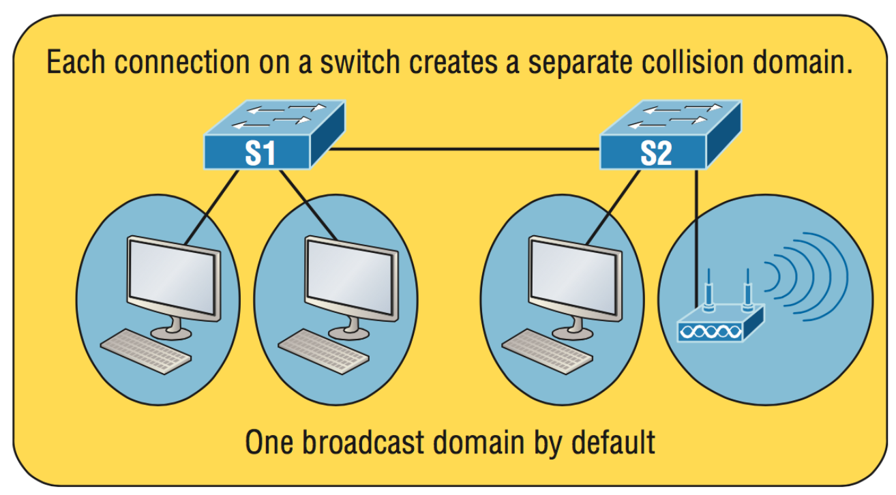
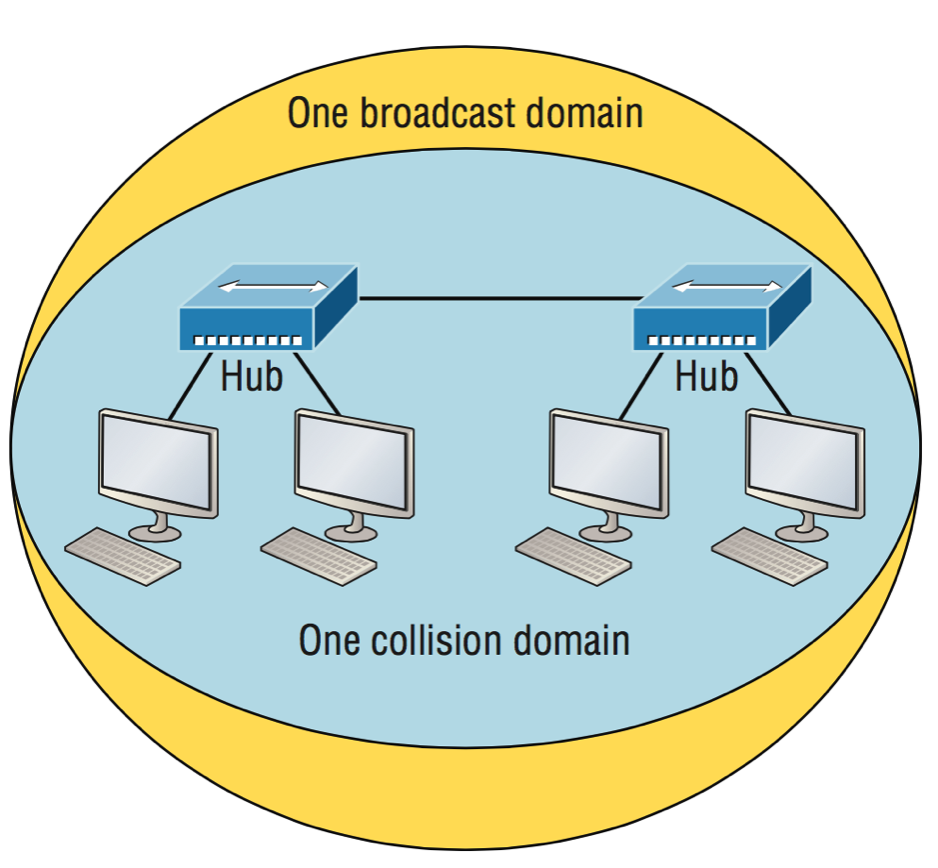
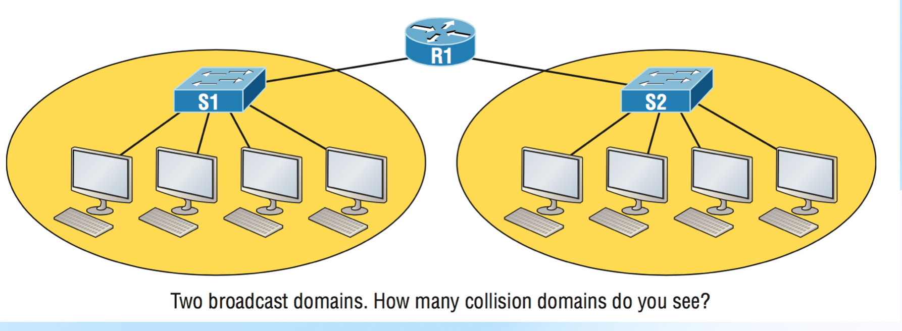
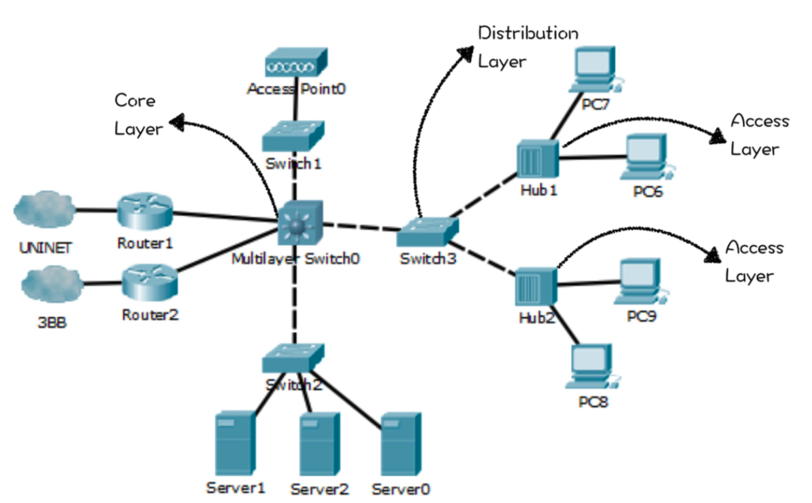
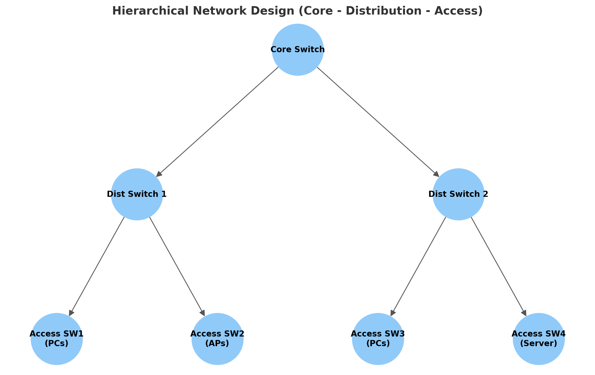
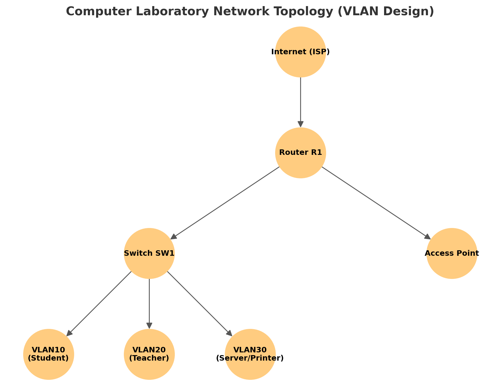

# Chapter 7 — Computer Network Design


## 7.1 บทนำ (Introduction)

**ความหมายของ Computer Network**
เครือข่ายคอมพิวเตอร์ (Computer Network) คือการเชื่อมโยงคอมพิวเตอร์ อุปกรณ์อิเล็กทรอนิกส์ และอุปกรณ์เครือข่ายต่าง ๆ เข้าด้วยกันผ่านสื่อกลางการสื่อสาร เช่น สายสัญญาณทองแดง สายใยแก้วนำแสง หรือคลื่นวิทยุ เพื่อให้สามารถแลกเปลี่ยนข้อมูลและใช้ทรัพยากรร่วมกันได้อย่างมีประสิทธิภาพ เครือข่ายอาจครอบคลุมตั้งแต่พื้นที่ขนาดเล็ก เช่น ห้องปฏิบัติการคอมพิวเตอร์ ไปจนถึงขนาดใหญ่ระดับโลก เช่น อินเทอร์เน็ต การมีเครือข่ายช่วยให้ผู้ใช้งานสามารถติดต่อสื่อสาร แบ่งปันไฟล์ หรือเข้าถึงทรัพยากรจากระยะไกลได้สะดวกและรวดเร็ว

**ประโยชน์ของการใช้งาน**

1. **การแชร์ทรัพยากร (Resource Sharing):** อุปกรณ์ต่าง ๆ เช่น เครื่องพิมพ์ (Printer) หรือเซิร์ฟเวอร์ไฟล์ สามารถใช้ร่วมกันได้โดยไม่จำเป็นต้องจัดหาให้ทุกคนแยกเป็นรายบุคคล ลดค่าใช้จ่ายและเพิ่มประสิทธิภาพการทำงาน
2. **การสื่อสาร (Communication):** ผู้ใช้งานสามารถติดต่อกันผ่านอีเมล แชท วิดีโอคอนเฟอเรนซ์ หรือระบบการเรียนการสอนออนไลน์ ซึ่งมีความสำคัญอย่างมากในสถาบันการศึกษา
3. **การจัดการแบบรวมศูนย์ (Centralized Management):** ผู้ดูแลระบบสามารถควบคุม จัดการ และบำรุงรักษาทุกอุปกรณ์ในเครือข่ายจากศูนย์กลาง เช่น การอัปเดตซอฟต์แวร์ การกำหนดสิทธิ์เข้าถึง และการรักษาความปลอดภัย


## 7.2 อุปกรณ์เครือข่าย (Network Devices)

**Switch**
Switch เป็นอุปกรณ์ Layer 2 ของโมเดล OSI ทำหน้าที่เชื่อมต่ออุปกรณ์ปลายทาง (End Devices) เช่น PC, Printer หรือ Server เข้าด้วยกันภายในเครือข่ายท้องถิ่น (LAN) Switch จะใช้ MAC Address เป็นตัวอ้างอิงเพื่อส่งข้อมูลไปยังพอร์ตที่ถูกต้อง ทำให้เกิดการสื่อสารแบบเฉพาะเจาะจง ลดการชนกันของข้อมูล (Collision) และเพิ่มประสิทธิภาพในห้องปฏิบัติการที่มีคอมพิวเตอร์จำนวนมาก

**Router**
Router เป็นอุปกรณ์ Layer 3 ใช้สำหรับเชื่อมต่อเครือข่ายที่แตกต่างกัน เช่น VLAN หลาย ๆ กลุ่ม หรือเชื่อม LAN ภายในห้องปฏิบัติการออกสู่อินเทอร์เน็ต Router มีหน้าที่กำหนดเส้นทาง (Routing) และทำงานร่วมกับโปรโตคอล เช่น OSPF, RIP หรือ Static Routing เพื่อเลือกเส้นทางที่เหมาะสม นอกจากนี้ยังสามารถทำ NAT (Network Address Translation) เพื่อให้เครื่องหลายเครื่องแชร์การใช้งาน Public IP ได้

**Access Point (AP)**
Access Point เป็นอุปกรณ์ไร้สายที่ให้ Notebook, Smartphone หรืออุปกรณ์ IoT เชื่อมต่อเข้าสู่เครือข่าย LAN ผ่านมาตรฐาน IEEE 802.11 (Wi-Fi) AP ทำหน้าที่เป็นสะพานเชื่อม (Bridge) ระหว่างเครือข่ายไร้สายและสาย ทำให้ผู้ใช้งานในห้องปฏิบัติการสามารถเข้าถึงเครือข่ายได้แม้ไม่ใช้สาย LAN


## 7.3 IP Addressing & Subnetting

**IPv4 Address**
ในเครือข่ายห้องปฏิบัติการ มักใช้ที่อยู่แบบ Private IP เช่น `192.168.x.x` ซึ่งไม่สามารถเข้าถึงได้โดยตรงจากอินเทอร์เน็ต แต่เหมาะสมสำหรับการใช้งานภายในองค์กร

**Subnet Mask และ CIDR**
Subnet Mask กำหนดส่วนของ Network และ Host ภายใน IP Address เช่น `255.255.255.0` หรือ `/24` จะมี 254 Host ที่ใช้งานได้ เหมาะสมกับห้องคอมพิวเตอร์ที่มีจำนวนเครื่องไม่เกิน 254 เครื่อง

**Default Gateway**
ในแต่ละ VLAN จะต้องมี Default Gateway ซึ่งโดยทั่วไปคือ IP ของ Router ที่เชื่อมต่อกับ VLAN นั้น ๆ เช่น VLAN 10 → `192.168.10.1`

**DNS (Domain Name System)**
DNS ช่วยแปลงชื่อโดเมน เช่น `www.google.com` ให้เป็น IP Address เช่น `142.250.190.14` เพื่อให้เครื่องลูกข่ายใช้งานอินเทอร์เน็ตได้สะดวก โดยใน Lab มักตั้งค่าใช้ Google DNS (`8.8.8.8`)

## 7.4 Simple Computer Network 
 
* **Switch S1 และ S2**: อุปกรณ์สวิตช์ที่เชื่อมต่ออุปกรณ์ปลายทาง (End Devices) เช่น คอมพิวเตอร์และเราเตอร์ไร้สาย




* **Collision Domain**:

  * แต่ละพอร์ตของสวิตช์จะเป็น **collision domain แยกกัน** → หมายความว่าการชนกันของเฟรม (frame collision) จะถูกจำกัดอยู่เฉพาะในพอร์ตนั้น ๆ ไม่แพร่ไปทั่วทั้งสวิตช์
  * ตัวอย่าง: ถ้าพีซีหนึ่งเครื่องส่งข้อมูลผิดพลาด จะไม่รบกวนพีซีที่ต่ออยู่อีกพอร์ตหนึ่งของสวิตช์เดียวกัน
* **Broadcast Domain**:


  * แม้ว่าจะมีหลายพอร์ต แต่ **สวิตช์โดยค่าเริ่มต้นจะส่ง broadcast ไปทุกพอร์ตใน VLAN เดียวกัน** → ดังนั้นทั้งเครือข่ายที่เชื่อมกันอยู่ในรูปนี้ (S1, S2 และอุปกรณ์ทั้งหมด) ถือว่าอยู่ใน **broadcast domain เดียวกัน**
  * เมื่อมีเครื่องหนึ่งส่ง ARP Request หรือ DHCP Discover ออกไป ทุกเครื่องใน domain นี้ก็จะได้รับด้วย

**สรุปแนวคิดเครือข่ายจากสไลด์**

1. **Collision Domain แยกตามพอร์ต**: เพิ่มประสิทธิภาพ ลดโอกาสเกิดการชนกันของเฟรม (ต่างจาก Hub ที่ทั้งเครือข่ายเป็น collision domain เดียว)
2. **Broadcast Domain ยังเป็นอันเดียว**: ทุกอุปกรณ์ที่ต่อในเครือข่ายเดียวกัน (VLAN เดียว) จะได้รับ broadcast ทั้งหมด
3. **ปัญหา**: เมื่อจำนวนอุปกรณ์มากขึ้น การส่ง broadcast จะทำให้เครือข่ายช้าลง → จึงเป็นเหตุผลที่ต้องใช้ **VLAN** หรือ **Router/Layer3 Switch** เพื่อแบ่ง Broadcast Domain

 
* **Hub** เป็นอุปกรณ์ Layer 1 (Physical Layer) ทำหน้าที่เพียงรับสัญญาณแล้วกระจายออกทุกพอร์ต → ไม่มีการ “แยก” การสื่อสารใด ๆ




* ดังนั้นคอมพิวเตอร์ทั้งหมดที่ต่อเข้ากับ Hub จะอยู่ใน **Collision Domain เดียวกัน**

  * ถ้ามีเครื่องใดเครื่องหนึ่งส่งข้อมูลพร้อมกันกับอีกเครื่อง → เกิด **collision** (การชนกันของสัญญาณ) → ต้องมีการ retransmit → ประสิทธิภาพลดลงมากเมื่อมีผู้ใช้งานเพิ่มขึ้น
* นอกจากนี้ทั้งเครือข่ายยังอยู่ใน **Broadcast Domain เดียวกัน**

  * หมายความว่าเมื่อมีเครื่องใดส่ง broadcast frame (เช่น ARP Request) ทุกเครื่องในเครือข่ายนี้จะได้รับเหมือนกันทั้งหมด

**สรุปแนวคิดเครือข่าย**

1. **Hub = 1 Collision Domain** → ทุกอุปกรณ์ที่เชื่อมต่อร่วมกันมีโอกาสชนกันทั้งหมด
2. **Hub = 1 Broadcast Domain** → การกระจายแพ็กเกจ broadcast ส่งถึงทุกเครื่องในวงเดียวกัน
3. **ปัญหา**: ยิ่งมีเครื่องมากขึ้น → Collision, Broadcast traffic จะทำให้เครือข่ายทำงานช้าลง
4. **วิวัฒนาการ**: จึงถูกแทนที่ด้วย **Switch** (แยก Collision Domain ต่อพอร์ต และบริหารจัดการ VLAN ได้)

 

โครงสร้างเครือข่ายเมื่อมี **Router (R1)** เชื่อมต่อ **สอง Switch (S1 และ S2)**




* **Broadcast Domain**

  * Router ทำหน้าที่ **ตัดการส่งต่อ Broadcast**
  * ดังนั้นเครือข่ายที่อยู่หลัง S1 และเครือข่ายที่อยู่หลัง S2 จะกลายเป็น **2 broadcast domains แยกกัน**
  * ตัวอย่าง: ถ้า PC1 (อยู่หลัง S1) ส่ง ARP Request → จะกระจายเฉพาะใน S1 เท่านั้น ไม่ส่งต่อไปยัง S2

* **Collision Domain**

  * Switch ทำงานที่ Layer 2 → แต่ละพอร์ตของ Switch คือ **1 Collision Domain**
  * ในรูป S1 มี 4 PC + 1 port ไปที่ Router → รวม **5 collision domains**
  * S2 มี 4 PC + 1 port ไปที่ Router → รวม **5 collision domains**
  * รวมทั้งหมด = **10 Collision Domains**

💡 **สรุปจากสไลด์**

1. **Broadcast Domains** = 2 (แบ่งตามฝั่งของ Router)
2. **Collision Domains** = 10 (แต่ละพอร์ตของ Switch = 1 domain)
3. การมี Router ช่วยลดการกระจาย Broadcast ทำให้เครือข่ายเสถียรขึ้น
4. การใช้ Switch แทน Hub ทำให้แต่ละพอร์ตเป็น collision domain แยกกัน → ลดปัญหาการชนกันของเฟรม

## 7.4  หลักการออกแบบเครือข่าย

### 1. Requirements Analysis (การวิเคราะห์ความต้องการ)

การวิเคราะห์ความต้องการ (Requirements Analysis) ถือเป็นขั้นตอนแรกและสำคัญที่สุดของการออกแบบเครือข่ายคอมพิวเตอร์ เพราะเป็นจุดเริ่มต้นที่ช่วยให้นักออกแบบเข้าใจบริบทการใช้งานจริงขององค์กร ก่อนที่จะเลือกเทคโนโลยีหรือตัดสินใจเชิงวิศวกรรม การละเลยขั้นตอนนี้มักทำให้โครงสร้างเครือข่ายไม่ตอบโจทย์หรือไม่สามารถรองรับการเติบโตในอนาคต

สิ่งที่ต้องพิจารณา ได้แก่

1. **จำนวนผู้ใช้งาน (Number of Users):** การประเมินจำนวนผู้ใช้ปัจจุบันและที่คาดการณ์ในอนาคตมีความสำคัญต่อการกำหนดขนาดของเครือข่าย (scalability) เช่น ขนาดของ switch, ความสามารถของ router, และ bandwidth ที่ต้องรองรับ หากมีผู้ใช้งานเพิ่มขึ้นโดยไม่มีการวางแผนล่วงหน้า อาจทำให้เครือข่ายเกิด bottleneck และ latency สูง

2. **ประเภทของแอปพลิเคชัน (Types of Applications):** แอปพลิเคชันแต่ละชนิดมีลักษณะการใช้งานเครือข่ายที่แตกต่างกัน เช่น แอปพลิเคชันแบบ real-time (VoIP, Video Conference) ต้องการ latency ต่ำและ jitter น้อย ในขณะที่ Database หรือ File Transfer ต้องการ throughput สูง การเลือกอุปกรณ์และเทคโนโลยีจึงต้องพิจารณาตาม workload เหล่านี้

3. **รูปแบบการไหลของข้อมูล (Data Flow Patterns):** ต้องทำการ mapping การสื่อสาร เช่น client-to-server, server-to-server, หรือ peer-to-peer เพื่อวาง topology ที่เหมาะสม หาก data flow กระจุกตัวที่ศูนย์กลาง ควรใช้ hierarchical design (Core–Distribution–Access) แต่ถ้าเป็น mesh communication อาจต้องใช้ backbone ที่ทนทานและมี bandwidth สูง

4. **ความต้องการด้านความปลอดภัย (Security Requirements):** องค์กรบางแห่ง เช่น สถาบันการเงิน หรือหน่วยงานรัฐ มีข้อกำหนดพิเศษ เช่น ต้องเข้ารหัสข้อมูล (encryption), ต้องมี firewall หลายชั้น, หรือใช้ระบบ IDS/IPS เพื่อป้องกันการบุกรุก การวิเคราะห์ตรงนี้จะกำหนด policy และอุปกรณ์ด้านความปลอดภัยที่จำเป็น

5. **ความต้องการพิเศษ (Special Needs):** เช่น high availability สำหรับโรงพยาบาลที่ระบบต้องออนไลน์ตลอดเวลา หรือ low-latency สำหรับระบบควบคุมอุตสาหกรรม (Industrial Control Systems) ความต้องการเหล่านี้จะกำหนดโครงสร้างการทำ redundancy, load balancing และ QoS

กล่าวโดยสรุป Requirements Analysis เป็นกระบวนการที่ผสมผสาน **วิศวกรรมเครือข่าย (Network Engineering)** เข้ากับ **การวางแผนเชิงธุรกิจ (Business Planning)** เพื่อให้เครือข่ายที่ออกแบบมามีความสมดุลระหว่าง **ประสิทธิภาพ (Performance)**, **ความปลอดภัย (Security)** และ **ความคุ้มค่า (Cost-effectiveness)**


ดีครับ 🙌 งั้นผมจะขยายความ **หัวข้อที่ 2: Network Architecture (สถาปัตยกรรมเครือข่าย)** ให้ละเอียดและเป็นเชิงวิชาการเช่นเดียวกับข้อ 1 ความยาวมากกว่า 200 คำ

 

### 2. Network Architecture (สถาปัตยกรรมเครือข่าย)

**Network Architecture** คือแบบแผนหรือโครงสร้าง (blueprint) ที่อธิบายการจัดวางองค์ประกอบของเครือข่าย ทั้งในแง่ของ **Topology, Hardware, Protocols และ Services** โดยมีเป้าหมายเพื่อให้การสื่อสารข้อมูลเป็นไปอย่างมีประสิทธิภาพ ปลอดภัย และรองรับการขยายตัวในอนาคตได้ ในเชิงวิชาการ สถาปัตยกรรมเครือข่ายมักจะอ้างอิงกับ **แบบจำลอง OSI (Open Systems Interconnection)** และ **TCP/IP Model** ซึ่งเป็นกรอบในการกำหนดบทบาทหน้าที่ของแต่ละชั้น (layer) และการทำงานร่วมกันของอุปกรณ์

### ประเด็นสำคัญในการออกแบบสถาปัตยกรรมเครือข่าย

1. **Topology (โครงสร้างการเชื่อมต่อ):**
   การเลือก topology มีผลต่อทั้งประสิทธิภาพและความน่าเชื่อถือของระบบ เช่น

   * **Star topology**: ง่ายต่อการจัดการและขยาย แต่ขึ้นกับอุปกรณ์ศูนย์กลาง (single point of failure)
   * **Mesh topology**: มีความทนทานสูง (redundancy) แต่ค่าใช้จ่ายและความซับซ้อนสูง
   * **Hybrid topology**: ผสมผสานเพื่อดึงข้อดีของแต่ละแบบมาใช้

2. **Hardware Selection (การเลือกอุปกรณ์):**
   การเลือกอุปกรณ์อย่าง router, switch, firewall, access point ต้องสอดคล้องกับ **throughput, latency, security features และ scalability** ตัวอย่างเช่น หากเครือข่ายมีการรับส่งข้อมูลแบบ real-time จำนวนมาก ควรเลือก switch ที่รองรับ QoS และ router ที่รองรับ dynamic routing protocol ที่มี convergence เร็ว เช่น OSPF หรือ EIGRP

3. **Component Arrangement (การจัดเรียงองค์ประกอบ):**
   แนวคิด **Hierarchical Network Design (Core–Distribution–Access)** มักถูกนำมาใช้เพื่อลดความซับซ้อนในการจัดการ เพิ่มความสามารถในการขยาย (scalability) และรองรับการทำงานที่เสถียร ตัวอย่างเช่น

   * **Access Layer**: เชื่อมต่อกับ end devices เช่น PC, printer, IP phone
   * **Distribution Layer**: จัดการ routing, policy, inter-VLAN routing
   * **Core Layer**: ทำหน้าที่ backbone ของเครือข่ายที่ต้องการความเร็วและความน่าเชื่อถือสูง

### เชิงวิชาการ

ในหลักการออกแบบ **Network Architecture** ต้องคำนึงถึงทั้ง **functional requirements** (เช่น ความเร็ว, latency, throughput) และ **non-functional requirements** (เช่น ความปลอดภัย, ความเชื่อถือได้, ความสามารถในการบำรุงรักษา) ซึ่งสัมพันธ์กับทฤษฎี **Systems Engineering** และ **Design Methodology** โดยตรง แนวคิดนี้สอดคล้องกับมาตรฐานสากล เช่น **Cisco Enterprise Architecture Model** และ **ISO/IEC 7498-1 (OSI Reference Model)** ที่ใช้เป็นกรอบทางวิชาการและการปฏิบัติจริง

กล่าวโดยสรุป Network Architecture ไม่ใช่เพียงแค่การเลือกอุปกรณ์หรือวาง topology แต่คือการกำหนด “สถาปัตยกรรม” ที่ผสมผสาน **ทฤษฎีเครือข่าย, หลักวิศวกรรมระบบ และข้อกำหนดธุรกิจ** เพื่อสร้างเครือข่ายที่ทั้งมี **ประสิทธิภาพ, ความมั่นคงปลอดภัย และการรองรับอนาคต**

 ดีครับ 🙌 งั้นผมจะอธิบายเชิงวิชาการใน **หัวข้อที่ 3: IP Addressing and Subnetting (การกำหนดหมายเลข IP และการแบ่งเครือข่ายย่อย)** ความยาวเกิน 200 คำ เพื่อใช้สนับสนุนการเรียนการสอนด้านการออกแบบเครือข่าย

 

### 3. IP Addressing and Subnetting (การกำหนดหมายเลข IP และการแบ่งเครือข่ายย่อย)

**IP Addressing** คือกระบวนการจัดสรรหมายเลขประจำตัว (identifier) ให้กับอุปกรณ์ในเครือข่ายคอมพิวเตอร์ โดยใช้มาตรฐาน Internet Protocol (IP) ทั้ง **IPv4** (32 บิต) และ **IPv6** (128 บิต) IP Address ทำหน้าที่เหมือน “ที่อยู่บ้าน” ที่ใช้ระบุอุปกรณ์ต้นทางและปลายทาง เพื่อให้การส่งต่อข้อมูล (packet forwarding) สามารถเกิดขึ้นได้อย่างถูกต้องและมีประสิทธิภาพ

การออกแบบ **IP Addressing Scheme** จึงเป็นหัวใจสำคัญของการวางแผนเครือข่าย เพราะมีผลต่อทั้ง **การสื่อสาร, การจัดการ, ความปลอดภัย และการขยายตัว (scalability)** เช่น การแยกเครือข่ายย่อยสำหรับแต่ละแผนกขององค์กร (HR, Finance, IT) ทำให้สามารถควบคุม traffic, เพิ่มความปลอดภัย และปรับใช้ policy ได้สะดวก

**Subnetting** เป็นเทคนิคการแบ่งเครือข่ายขนาดใหญ่ให้กลายเป็นเครือข่ายย่อย (subnet) โดยใช้ **Subnet Mask** หรือ **CIDR (Classless Inter-Domain Routing)** เพื่อกำหนดว่า “กี่บิตแรก” ของที่อยู่นั้นแทนส่วนของเครือข่าย และ “กี่บิตท้าย” แทนหมายเลขเครื่อง (host) การทำ subnetting มีวัตถุประสงค์หลักดังนี้:

1. **เพิ่มประสิทธิภาพการใช้ Address Space:** ช่วยลดการสูญเสีย IP Address จากการใช้โครงสร้างแบบ classful ในอดีต เช่น Class A, B, C
2. **ลด Broadcast Traffic:** การแบ่ง subnet จะจำกัด broadcast domain ทำให้เครือข่ายมีประสิทธิภาพมากขึ้นและลดการชนกันของข้อมูล (collision)
3. **เพิ่มความปลอดภัยและการควบคุม:** สามารถใช้ subnet แยกเครือข่ายตามหน้าที่ เช่น Guest Wi-Fi แยกจาก Corporate Network เพื่อลดความเสี่ยงด้านความปลอดภัย
4. **สนับสนุนการวางแผนเชิงโครงสร้าง:** ช่วยให้องค์กรสามารถจัดการ routing table อย่างมีประสิทธิภาพ และสามารถสรุปเส้นทาง (route summarization) เพื่อปรับปรุง scalability

เชิงทฤษฎีแล้ว Subnetting อาศัย **แนวคิดทางคณิตศาสตร์ของเลขฐานสอง** ในการกำหนดขอบเขตของเครือข่าย เช่น การคำนวณ usable host = \$2^h - 2\$ (โดยที่ *h* คือจำนวนบิตที่เหลือสำหรับ host) และการหาขอบเขต network/broadcast address ด้วยการ AND ระหว่าง IP กับ subnet mask

กล่าวโดยสรุป IP Addressing และ Subnetting ไม่ใช่เพียงแค่ทักษะเชิงเทคนิคในการกำหนดหมายเลขเครื่อง แต่ยังเป็นกระบวนการออกแบบเชิงกลยุทธ์ที่ช่วยให้องค์กรสามารถสร้างเครือข่ายที่ **ยืดหยุ่น, มีประสิทธิภาพ, ปลอดภัย และรองรับการเติบโตในอนาคต**

 

### 4. Routing and Switching (การกำหนดเส้นทางและการสวิตช์เครือข่าย)

**Routing และ Switching** เป็นกลไกหลักในการทำให้เครือข่ายสามารถทำงานได้อย่างมีประสิทธิภาพ โดยแม้ทั้งสองจะมีจุดร่วมในการกำหนดเส้นทางให้กับข้อมูล แต่ก็ทำงานในคนละระดับของโมเดล OSI

**Switching**

Switch ทำงานหลักใน **Layer 2 (Data Link Layer)** โดยพิจารณาจาก **MAC Address** เพื่อส่งต่อเฟรมภายในเครือข่ายท้องถิ่น (LAN) แต่ switch รุ่นใหม่บางรุ่น (Multilayer Switch) สามารถทำงานได้ถึง Layer 3 โดยรองรับการ Routing ด้วย การทำงานของ switch ช่วยสร้าง **collision domain แยกกันต่อพอร์ต** ทำให้ประสิทธิภาพสูงกว่า Hub มาก และสามารถกำหนด **VLAN (Virtual LAN)** เพื่อแบ่ง broadcast domain ย่อย ๆ ได้ การออกแบบ switching ที่ดีจะคำนึงถึง **redundancy** (เช่น Spanning Tree Protocol) และ **load balancing** (เช่น EtherChannel) เพื่อลด single point of failure

**Routing**

Router ทำงานใน **Layer 3 (Network Layer)** โดยใช้ **IP Address** และตารางเส้นทาง (Routing Table) เพื่อกำหนดเส้นทางที่เหมาะสมที่สุดสำหรับ packet การเลือกใช้ **Static Routing** หรือ **Dynamic Routing Protocols** (เช่น RIP, OSPF, EIGRP, BGP) ขึ้นอยู่กับขนาดและความซับซ้อนของเครือข่าย

* Static Routing: เหมาะกับเครือข่ายเล็กและเส้นทางคงที่
* OSPF (Link-state): ใช้อัลกอริทึม Dijkstra มีการ convergence เร็ว เหมาะกับองค์กรขนาดกลาง-ใหญ่
* BGP: ใช้ระหว่างผู้ให้บริการอินเทอร์เน็ต (ISP) มีความสำคัญต่อ Internet backbone

**Redundancy และ Failover**

เครือข่ายที่ดีต้องไม่พึ่งพาเส้นทางเดียว การออกแบบควรมี **multiple paths**, **HSRP/VRRP/GLBP** สำหรับ default gateway redundancy และ **equal-cost load balancing** เพื่อรองรับการทำงานต่อเนื่องแม้มี link หรืออุปกรณ์เสียหาย

**เชิงวิชาการ**

Routing และ Switching ถือเป็น “เส้นเลือดใหญ่” ของโครงสร้างเครือข่าย การออกแบบในมุมนี้ต้องผสมผสานทั้ง **ทฤษฎีเครือข่าย (graph theory, shortest path algorithms)** และ **มาตรฐานอุตสาหกรรม (เช่น IEEE 802.1Q, IETF RFCs)** เพื่อตอบโจทย์ด้าน **performance, scalability และ high availability** ในระบบองค์กร

สรุปแล้ว การออกแบบ Routing และ Switching ไม่ใช่แค่การเลือกเส้นทางหรือเชื่อมอุปกรณ์ แต่คือการวาง **กลยุทธ์เครือข่าย (network strategy)** ที่ทำให้ระบบมี **ประสิทธิภาพสูง (efficient), ทนทาน (resilient) และปรับตัวได้ตามความต้องการธุรกิจ (adaptive)**

 
ได้เลยครับ 🙌 มาต่อที่ **หัวข้อที่ 5: Security (ความมั่นคงปลอดภัยเครือข่าย)** โดยผมจะอธิบายเชิงทฤษฎีและวิชาการ ความยาวมากกว่า 200 คำ เพื่อเน้นบทบาทของ Security ต่อการออกแบบเครือข่าย


### 5. Security (ความมั่นคงปลอดภัยเครือข่าย)

**ความมั่นคงปลอดภัยเครือข่าย (Network Security)** เป็นองค์ประกอบสำคัญในการออกแบบเครือข่ายยุคใหม่ เนื่องจากภัยคุกคามทางไซเบอร์มีความซับซ้อนและหลากหลายมากขึ้น การออกแบบเครือข่ายที่ดีจึงไม่ควรคำนึงเพียงแค่ประสิทธิภาพในการรับ–ส่งข้อมูล แต่ต้องคำนึงถึงการป้องกัน การตรวจจับ และการตอบสนองต่อเหตุการณ์ที่ไม่พึงประสงค์ด้วย

ในเชิงทฤษฎี ความมั่นคงปลอดภัยของระบบเครือข่ายมักอ้างอิงตาม **CIA Triad (Confidentiality, Integrity, Availability)**:

1. **Confidentiality (การรักษาความลับ):** ต้องปกป้องข้อมูลจากการเข้าถึงโดยไม่ได้รับอนุญาต เช่น การเข้ารหัส (Encryption), VPN (Virtual Private Network), และการใช้ Access Control Lists (ACLs) เพื่อจำกัดสิทธิ์การเข้าถึง
2. **Integrity (ความถูกต้องครบถ้วน):** ต้องมั่นใจว่าข้อมูลไม่ถูกแก้ไขหรือบิดเบือนระหว่างการส่งผ่าน เช่น การใช้ Hashing, Digital Signatures และการตรวจสอบความถูกต้องของ packet
3. **Availability (ความพร้อมใช้งาน):** เครือข่ายต้องสามารถให้บริการได้ตลอดเวลา แม้มีการโจมตี เช่น Denial-of-Service (DoS/DDoS) จึงต้องมีการทำ Redundancy, Load Balancing และการตรวจจับการโจมตีแบบ Real-time

**มาตรการความปลอดภัยที่สำคัญในการออกแบบเครือข่าย ได้แก่:**

* **Firewalls:** อุปกรณ์หรือซอฟต์แวร์ที่ควบคุมการสื่อสารเข้า–ออกตาม policy ที่กำหนด ใช้ทั้งแบบ traditional และ next-generation firewall (NGFW)
* **Intrusion Detection/Prevention Systems (IDS/IPS):** ตรวจจับและหยุดยั้งการบุกรุกหรือพฤติกรรมผิดปกติในเครือข่าย
* **Virtual Private Networks (VPNs):** ใช้สำหรับการเชื่อมต่อระยะไกลอย่างปลอดภัย โดยสร้าง tunnel ที่เข้ารหัสระหว่างผู้ใช้กับเครือข่ายองค์กร
* **Authentication & Authorization:** ใช้ระบบ Single Sign-On (SSO), RADIUS, TACACS+ หรือ Active Directory เพื่อควบคุมการเข้าถึงอย่างเป็นระบบ
* **Security Policies:** การออกแบบเครือข่ายต้องมาพร้อมกับนโยบาย เช่น Password Policy, Patch Management และ Incident Response Plan

**เชิงวิชาการ** การออกแบบความมั่นคงปลอดภัยในเครือข่ายมักต้องผสานหลักการของ **Defence in Depth (การป้องกันหลายชั้น)** โดยจัดวางมาตรการความปลอดภัยในทุกระดับ ตั้งแต่ **Physical Security → Network Layer Security → Application Security → User Awareness** นอกจากนี้ยังอ้างอิงตามมาตรฐานสากล เช่น **ISO/IEC 27001**, **NIST Cybersecurity Framework**, และ **Zero Trust Architecture (ZTA)** เพื่อให้เครือข่ายมีทั้งความปลอดภัยและความสอดคล้องกับกฎหมาย/ข้อกำหนด (Compliance)

สรุปแล้ว การออกแบบด้าน Security ไม่ใช่แค่ “การติดตั้ง Firewall” แต่คือ **การผสมผสานมาตรการหลายระดับ** เพื่อทำให้เครือข่ายมีความ **ปลอดภัย (Secure)**, **ยืดหยุ่น (Resilient)** และ **พร้อมใช้งานต่อเนื่อง (Highly Available)** ตอบสนองทั้งความต้องการทางธุรกิจและความท้าทายทางไซเบอร์สมัยใหม่


ได้เลยครับ 🙌 ต่อเนื่องจากหัวข้อก่อนหน้านี้ มาถึง **ข้อที่ 6: Scalability and Performance (การขยายตัวและประสิทธิภาพเครือข่าย)** ผมจะอธิบายเชิงทฤษฎี–วิชาการ ความยาวมากกว่า 200 คำ


### 6. Scalability and Performance (การขยายตัวและประสิทธิภาพเครือข่าย)

**Scalability** และ **Performance** ถือเป็นคุณลักษณะหลักที่นักออกแบบเครือข่ายต้องคำนึงถึงตั้งแต่เริ่มวางแผน เนื่องจากเครือข่ายคอมพิวเตอร์ไม่ได้ถูกใช้งานเฉพาะในปัจจุบัน แต่ต้องรองรับการเติบโตและความต้องการใหม่ ๆ ในอนาคต หากเครือข่ายไม่สามารถปรับตัวได้ จะกลายเป็นข้อจำกัด (bottleneck) ต่อการดำเนินงานขององค์กร

### Scalability (การขยายตัว)

ในเชิงวิชาการ **Scalability** หมายถึงความสามารถในการรองรับจำนวนผู้ใช้ อุปกรณ์ และแอปพลิเคชันที่เพิ่มขึ้น โดยไม่กระทบต่อความเสถียรหรือคุณภาพของบริการ ตัวอย่างแนวทางคือ:

* **Modular Design:** ใช้สถาปัตยกรรมแบบ Core–Distribution–Access ซึ่งสามารถเพิ่มอุปกรณ์ใหม่เข้าไปได้โดยไม่รบกวนระบบหลัก
* **Addressing Plan:** ออกแบบ IP Addressing และ Subnetting ให้มีที่ว่าง (address space) สำหรับการเติบโต เช่น การเผื่อ subnet สำหรับแผนกใหม่
* **Virtualization & Cloud Integration:** ใช้ SDN (Software-Defined Networking) และ virtualization เพื่อขยายเครือข่ายได้แบบ on-demand โดยไม่ต้องลงทุน hardware จำนวนมาก

### Performance (ประสิทธิภาพ)

**Performance** หมายถึงความสามารถของเครือข่ายในการตอบสนองต่อการใช้งานได้อย่างราบรื่น ซึ่งวัดจากตัวชี้วัด (metrics) หลัก เช่น **bandwidth, throughput, latency, jitter และ packet loss** การออกแบบที่ดีต้องพิจารณา:

* **Bandwidth Management:** กำหนดปริมาณแบนด์วิธให้เหมาะสมกับปริมาณงาน เช่น การใช้ link aggregation เพื่อเพิ่ม capacity
* **Quality of Service (QoS):** จัดลำดับความสำคัญของทราฟฟิก เช่น VoIP หรือ Video Conference ต้องได้ priority สูงเพื่อป้องกันเสียงกระตุก
* **Load Balancing:** กระจายปริมาณงานไปยังหลายเส้นทางหรือหลายอุปกรณ์ เพื่อลดความเสี่ยงการ overload
* **Network Optimization:** ใช้ caching, compression และ traffic shaping เพื่อลดการใช้แบนด์วิธโดยไม่กระทบคุณภาพ

### เชิงวิชาการ

ในงานวิจัยด้านเครือข่าย แนวคิด Scalability และ Performance เชื่อมโยงกับ **Queuing Theory, Graph Theory และ Network Traffic Modeling** ที่ใช้วิเคราะห์ความหน่วงและปริมาณงานที่ระบบรองรับได้ อีกทั้งยังสัมพันธ์กับมาตรฐาน **IETF RFCs** เช่น DiffServ (RFC 2474) ที่กำหนดวิธีจัดการ QoS

กล่าวโดยสรุป การออกแบบเครือข่ายที่มี **Scalability** และ **Performance** ที่ดี คือการวางโครงสร้างให้ระบบ **เติบโตได้ (adaptive growth)** และยัง **ตอบสนองผู้ใช้ได้อย่างมีประสิทธิภาพ (efficient performance)** ทั้งในปัจจุบันและอนาคต


### 7. Redundancy and Reliability (ความซ้ำซ้อนและความน่าเชื่อถือของเครือข่าย)

**Redundancy** และ **Reliability** เป็นหลักการออกแบบที่สำคัญในเครือข่ายองค์กร เนื่องจากระบบเครือข่ายถือเป็นโครงสร้างพื้นฐานดิจิทัล (digital infrastructure) ที่ต้องทำงานต่อเนื่อง หากระบบหยุดชะงัก (downtime) จะส่งผลกระทบโดยตรงต่อการดำเนินธุรกิจ การเรียนการสอน หรือแม้กระทั่งความปลอดภัยของชีวิต (เช่น เครือข่ายในโรงพยาบาลหรือระบบควบคุมอุตสาหกรรม)

**Redundancy (ความซ้ำซ้อน):**
ในเชิงวิศวกรรม หมายถึงการมีองค์ประกอบสำรอง (backup) ที่พร้อมทำงานเมื่ออุปกรณ์หลักล้มเหลว ตัวอย่างได้แก่:

* **Redundant Links:** การทำเส้นทางเชื่อมต่อหลายเส้น เช่น การใช้ EtherChannel หรือ Link Aggregation Control Protocol (LACP) เพื่อรวม bandwidth และสร้างเส้นทางสำรอง
* **Redundant Devices:** ใช้ router หรือ switch ซ้ำ (เช่น HSRP, VRRP, GLBP) เพื่อให้ default gateway มีความต่อเนื่องแม้เครื่องหลักขัดข้อง
* **Redundant Power/Hardware:** การออกแบบ data center ให้มี UPS, dual power supplies และ hot-swappable modules

**Reliability (ความน่าเชื่อถือ):**
เป็นการประเมินว่าเครือข่ายมีความสามารถในการให้บริการโดยไม่ล้มเหลวเพียงใด มักวัดด้วยค่า **MTBF (Mean Time Between Failures)** และ **MTTR (Mean Time To Repair)** การออกแบบที่ดีต้องลด MTTR ให้น้อยที่สุดโดยใช้ automation, monitoring และการวางแผน recovery ล่วงหน้า

เชิงทฤษฎี Redundancy และ Reliability อ้างอิงแนวคิดจาก **Reliability Engineering** และ **High Availability (HA) Systems** ซึ่งใช้ทั้งในโทรคมนาคมและ IT Infrastructure เช่น “N+1 Design” หรือ “5 Nines (99.999%) Availability” ที่กลายเป็นมาตรฐานสากลในอุตสาหกรรมเครือข่าย

**สรุป:** การออกแบบที่มีความซ้ำซ้อนและน่าเชื่อถือจะทำให้เครือข่าย **พร้อมใช้งานตลอดเวลา (always available)**, **ทนทานต่อความผิดพลาด (fault-tolerant)** และ **ลดผลกระทบจากการหยุดทำงาน (downtime impact)** ได้อย่างมีประสิทธิภาพ

### 8. Documentation and Monitoring (การจัดทำเอกสารและการเฝ้าระวังเครือข่าย)

**Documentation** และ **Monitoring** ถือเป็นกระบวนการหลังการออกแบบและติดตั้งที่มักถูกมองข้าม แต่มีความสำคัญอย่างยิ่งในเชิงวิชาการและการปฏิบัติจริง เพราะช่วยให้การบริหารจัดการเครือข่ายมีความโปร่งใส ตรวจสอบย้อนกลับได้ และแก้ไขปัญหาได้อย่างมีระบบ

**Documentation (การจัดทำเอกสาร):**
หมายถึงการบันทึกข้อมูลที่เกี่ยวข้องกับเครือข่ายทั้งหมด เช่น

* **Network Diagrams:** แสดงโครงสร้างเชิงกายภาพ (Physical Topology) และเชิงตรรกะ (Logical Topology)
* **IP Addressing Plan:** แผนผังการแจกแจง subnet, VLAN, routing table
* **Device Configuration:** การบันทึกค่า config ของ router, switch, firewall เพื่อตรวจสอบและกู้คืนได้ง่าย
* **Security Policies:** เอกสารนโยบายการรักษาความปลอดภัย เช่น การกำหนดสิทธิ์, การเข้ารหัส, และ incident response plan

การมีเอกสารครบถ้วนทำให้ **การบำรุงรักษา, การฝึกอบรมบุคลากรใหม่ และการตรวจสอบด้าน compliance** มีประสิทธิภาพสูงขึ้น

**Monitoring (การเฝ้าระวัง):**
หมายถึงการใช้เครื่องมือ เช่น **SNMP (Simple Network Management Protocol), Syslog, NetFlow, Wireshark, Nagios, Zabbix** เพื่อติดตามสถานะและประสิทธิภาพของเครือข่ายในเชิงรุก ตัวชี้วัดหลักที่ใช้เฝ้าระวัง ได้แก่ **CPU/Memory utilization, Interface bandwidth usage, Latency, Packet loss และ Availability**

นอกจากนี้แนวคิด **Proactive Monitoring** และ **Network Automation** (เช่น Ansible, Python scripting) ถูกนำมาใช้เพื่อแก้ไขปัญหาก่อนที่จะส่งผลกระทบต่อผู้ใช้งาน อีกทั้งยังสอดคล้องกับมาตรฐาน **ITIL (Information Technology Infrastructure Library)** และ **NIST Monitoring Framework**

**สรุป:** Documentation และ Monitoring เป็น “กระบวนการเสริม” ที่ทำให้เครือข่ายไม่ใช่เพียงแค่ทำงานได้ แต่ยัง **บริหารจัดการได้อย่างเป็นระบบ, โปร่งใส, ปลอดภัย และพร้อมปรับปรุงต่อเนื่อง**


## 1.4  หลักการของ Hierarchical Design

การออกแบบเครือข่ายแบบ **Hierarchical Network Design** (การออกแบบเครือข่ายเชิงลำดับชั้น)
คือแนวคิดในการออกแบบโครงสร้างเครือข่ายให้เป็น “ชั้น ๆ” หรือ “ลำดับขั้น” ที่ชัดเจน โดยแต่ละชั้นมีหน้าที่แตกต่างกันไปและทำงานร่วมกัน เพื่อให้เครือข่ายมี **ประสิทธิภาพ (Performance)**, **ความง่ายในการบริหารจัดการ (Manageability)**, **ความยืดหยุ่น (Scalability)** และ **ความทนทานต่อความผิดพลาด (Resiliency)**





### 1. Core Layer

**Core Layer** ถือเป็นหัวใจหลักของสถาปัตยกรรมเครือข่ายแบบลำดับชั้น (Hierarchical Network Design) มีหน้าที่ทำงานเป็น **backbone** ของระบบเพื่อให้การส่งผ่านข้อมูลระหว่างส่วนต่าง ๆ ของเครือข่ายเป็นไปด้วยความเร็วสูงและมีเสถียรภาพ อุปกรณ์ที่ใช้ในชั้นนี้มักเป็น **Multilayer Switch** หรือ **High-performance Router** ซึ่งรองรับการทำงานที่ระดับ 10 Gbps ขึ้นไป โดยทั่วไป Core Layer ต้องออกแบบให้มี **Low Latency, High Availability และ High Throughput** เพื่อลดความหน่วงในการสื่อสาร ป้องกัน bottleneck และรองรับการเชื่อมต่อกับผู้ให้บริการอินเทอร์เน็ต (ISP) รวมถึงเครือข่ายภายนอก แนวคิดวิชาการในชั้นนี้เน้นความ **redundancy** เช่น การใช้ Equal-Cost Multi-Path (ECMP) หรือ Dynamic Routing Protocols (OSPF, BGP) เพื่อป้องกัน single point of failure การออกแบบที่ดีของ Core Layer จึงทำให้เครือข่ายสามารถรองรับผู้ใช้งานจำนวนมากและการขยายตัวในอนาคตได้อย่างมั่นคง


### 2. Distribution Layer

**Distribution Layer** ทำหน้าที่เป็นตัวกลางระหว่าง Core Layer และ Access Layer มีบทบาทสำคัญในการควบคุมการจราจรของข้อมูล (traffic control) และการบังคับใช้นโยบายเครือข่าย (policy enforcement) โดยอุปกรณ์หลักในชั้นนี้คือ **Layer 3 Switch** ซึ่งสามารถทำทั้ง switching และ routing ได้ในตัว Distribution Layer ยังเป็นจุดที่ทำ **inter-VLAN routing** เพื่อให้ VLAN ต่าง ๆ สามารถสื่อสารกัน รวมถึงสามารถใช้ **Access Control List (ACL)** เพื่อกรองแพ็กเกจตามแหล่งที่มา ปลายทาง หรือโปรโตคอล นอกจากนี้ยังเป็นตำแหน่งสำหรับการทำ **load balancing และ redundancy** เช่นการใช้ Spanning Tree Protocol (STP) ป้องกัน loop หรือ HSRP สำหรับ gateway redundancy งานวิจัยด้านเครือข่ายแนะนำให้ Distribution Layer ออกแบบแบบ **modular** และมีความสามารถในการปรับขยาย (scalable) เพราะเป็น choke point หากออกแบบไม่ดี การจราจรจาก Access Layer ทั้งหมดอาจทำให้เกิดคอขวด (bottleneck)


### 3. Access Layer

**Access Layer** คือชั้นที่อุปกรณ์ผู้ใช้งาน (end devices) เช่น PC, Laptop, Printer, IP Phone หรือ IoT เชื่อมเข้าสู่เครือข่าย จึงถือว่าเป็น **ชั้นที่ใกล้กับผู้ใช้ที่สุด** หน้าที่หลักของ Access Layer คือให้การเชื่อมต่อ (connectivity) และควบคุมการเข้าถึง (access control) โดยในเชิงวิชาการ มักต้องพิจารณาเรื่อง **Port Security, VLAN Assignment, QoS (Quality of Service)** และการจัดการ Broadcast Domain Access Layer สามารถใช้ทั้ง **Switch** และ **Wireless Access Point (AP)** เพื่อรองรับการเชื่อมต่อแบบมีสายและไร้สาย หากใช้ Hub อย่างในแผนภาพ จะทำให้ทุกอุปกรณ์อยู่ใน collision domain เดียว ซึ่งไม่เหมาะสมในยุคปัจจุบัน ดังนั้นการใช้ **Managed Switch** จะช่วยแยก collision domain ต่อพอร์ต เพิ่มประสิทธิภาพและความปลอดภัย Access Layer ยังสามารถบังคับใช้ **802.1X Authentication** เพื่อระบุตัวตนผู้ใช้งานก่อนเข้าสู่เครือข่าย ทำให้ชั้นนี้ไม่เพียงเป็นจุดเชื่อมต่อ แต่ยังเป็น **ด่านแรกของความมั่นคงปลอดภัยเครือข่าย**


### 4. Server Farm (Data Center Layer)

ในแผนภาพ ตัวอย่าง **Server Farm** ถูกเชื่อมกับ **Switch2** ซึ่งเชื่อมต่อกับ Core Layer เพื่อรองรับการเข้าถึงบริการต่าง ๆ เช่น Database Server, File Server, และ Web Server Server Farm ถือเป็นหัวใจของ **Data Center Network** ซึ่งต้องการทั้ง **high bandwidth และ high availability** เพื่อรองรับผู้ใช้งานจำนวนมากพร้อมกัน ในเชิงวิชาการการออกแบบ Server Farm มักต้องใช้ **segmentation** ผ่าน VLAN หรือ Subnet แยก เพื่อควบคุมการเข้าถึง (เช่น แยก server ภายในกับ public-facing server) และป้องกันการโจมตี นอกจากนี้ยังต้องพิจารณา **redundancy** เช่น การใช้ Load Balancer, Clustering และการทำ Replication ระหว่าง Server หลายตัว รวมถึงระบบสำรองข้อมูล (backup & disaster recovery) ตามมาตรฐานสากล เช่น **ISO/IEC 27001** และ **NIST SP 800-53** เพื่อเพิ่มความปลอดภัยและความต่อเนื่องทางธุรกิจ สุดท้ายการวาง monitoring tool (เช่น SNMP, NetFlow) เป็นสิ่งจำเป็น เพื่อประเมินประสิทธิภาพและความปลอดภัยของ Server Farm อย่างต่อเนื่อง


### ลักษณะสำคัญของการออกแบบแบบ Hierarchical

1. **แยกหน้าที่ชัดเจน** – แต่ละ Layer มีหน้าที่ของตนเอง เช่น Core เน้นความเร็ว, Distribution เน้นนโยบาย, Access เน้นการเข้าถึง
2. **การขยายระบบ (Scalability)** – สามารถเพิ่ม Switch หรือ Router ใน Access Layer ได้โดยไม่กระทบต่อ Core Layer
3. **การจัดการง่าย (Manageability)** – ผู้ดูแลระบบสามารถควบคุม Policy ได้จาก Distribution Layer โดยไม่ต้องแก้ที่ Access ทุกตัว
4. **ความเสถียรและสำรอง (Resiliency & Redundancy)** – สามารถทำ Redundant Link ระหว่าง Layer ได้ เพื่อป้องกันการล่มของระบบ



 
* **Core Switch**: รับผิดชอบ backbone ของเครือข่ายในมหาวิทยาลัยหรือศูนย์ข้อมูล
* **Distribution Switch**: ควบคุม VLAN, Routing และ Security Policy ของแต่ละกลุ่มห้องแลบ
* **Access Switch**: กระจายพอร์ตให้ PC นักศึกษา, เครื่องพิมพ์, Access Point


### ข้อดีของ Hierarchical Design

* เครือข่ายทำงานได้เร็วและมีประสิทธิภาพสูง
* ง่ายต่อการแก้ไขปัญหา (เพราะแยกเป็นชั้น)
* รองรับการขยายระบบในอนาคต
* สามารถกำหนดนโยบายความปลอดภัยในระดับกลาง (Distribution) ได้สะดวก


### โดยสรุป
**Hierarchical Network Design คือการออกแบบเครือข่ายแบบเป็นชั้น (Core–Distribution–Access) เพื่อให้เครือข่ายจัดการง่าย, ขยายได้, มีประสิทธิภาพ และมีความทนทานสูง เหมาะสำหรับองค์กร มหาวิทยาลัย หรือห้องปฏิบัติการคอมพิวเตอร์ที่มีผู้ใช้งานจำนวนมาก**

### 1.4 VLAN และ Broadcast Domain

VLAN (Virtual LAN) เป็นการแบ่งเครือข่ายท้องถิ่น (LAN) ออกเป็นกลุ่มย่อยทางตรรกะ (Logical Segmentation) โดยไม่จำเป็นต้องเปลี่ยนโครงสร้างสายจริง VLAN จะช่วยลดขนาดของ Broadcast Domain หมายความว่าการกระจายสัญญาณ (Broadcast) จะจำกัดอยู่แค่ภายใน VLAN เดียวกันเท่านั้น ส่งผลให้เครือข่ายทำงานได้มีประสิทธิภาพขึ้น และมีความปลอดภัยมากขึ้น

**การประยุกต์ใช้ VLAN ในห้องปฏิบัติการคอมพิวเตอร์**

* VLAN 10: สำหรับนักศึกษา เพื่อแยกการใช้งานออกจากบุคลากร
* VLAN 20: สำหรับอาจารย์หรือผู้ดูแล เพื่อเพิ่มความปลอดภัย
* VLAN 30: สำหรับเครื่อง Server และ Printer เพื่อการบริการส่วนกลาง

การแบ่ง VLAN ทำให้สามารถกำหนดสิทธิ์การเข้าถึง ป้องกันการ Broadcast ทั่วเครือข่าย และทำให้การบริหารจัดการเป็นระบบระเบียบมากขึ้น


# 🧾 Lab Sheet: การออกแบบเครือข่ายห้องปฏิบัติการคอมพิวเตอร์ (Cisco Packet Tracer/IOS)

 

## 1. Objective (วัตถุประสงค์)

1. เข้าใจหลักการแบ่งเครือข่ายย่อย (Subnetting และ VLAN Segmentation)
2. สามารถสร้างและกำหนดค่า VLAN บน Switch Cisco ได้
3. สามารถตั้งค่า Router-on-a-Stick เพื่อทำ Inter-VLAN Routing ได้
4. สามารถตั้งค่า DHCP บน Router เพื่อแจก IP Address อัตโนมัติได้
5. ตรวจสอบการเชื่อมต่อและการทำงานของเครือข่ายด้วยคำสั่งพื้นฐาน

 

## 2. Requirement (ความต้องการ)

* แบ่งผู้ใช้งานในห้องปฏิบัติการคอมพิวเตอร์ออกเป็น 3 VLAN:

  * VLAN10 → Student PCs
  * VLAN20 → Teacher PCs
  * VLAN30 → Server/Printer
* ทุกเครื่องได้รับ IP จาก DHCP Server โดยอัตโนมัติ
* ผู้ใช้งานข้าม VLAN สามารถสื่อสารกันได้ผ่าน Router
* อุปกรณ์เชื่อมต่อกับเครือข่าย Internet ผ่าน Router

 
## 3. Equipment (อุปกรณ์ที่ใช้)

* Cisco Router 1 เครื่อง (R1)
* Cisco Switch 1 เครื่อง (SW1)
* Access Point 1 ตัว (สำหรับอุปกรณ์ไร้สาย)
* PC อย่างน้อย 6 เครื่อง (แทน 30 เครื่องในห้องจริง)
* Software: Cisco Packet Tracer หรืออุปกรณ์จริง

 

## 4. Network Topology



## 5. IP Addressing Plan

* VLAN10 (Student): 192.168.10.0/24, GW 192.168.10.1
* VLAN20 (Teacher): 192.168.20.0/24, GW 192.168.20.1
* VLAN30 (Server): 192.168.30.0/24, GW 192.168.30.1
* DNS: 8.8.8.8

 

## 6. Step by Step

### 6.1 Switch Configuration

```cisco
Switch> enable
Switch# configure terminal
! สร้าง VLAN
Switch(config)# vlan 10
Switch(config-vlan)# name STUDENT
Switch(config)# vlan 20
Switch(config-vlan)# name TEACHER
Switch(config)# vlan 30
Switch(config-vlan)# name SERVER
! กำหนดพอร์ต
Switch(config)# interface range fa0/1-10
Switch(config-if)# switchport mode access
Switch(config-if)# switchport access vlan 10
Switch(config)# interface range fa0/11-20
Switch(config-if)# switchport mode access
Switch(config-if)# switchport access vlan 20
Switch(config)# interface range fa0/21-24
Switch(config-if)# switchport mode access
Switch(config-if)# switchport access vlan 30
! กำหนด trunk ไป Router
Switch(config)# interface fa0/24
Switch(config-if)# switchport mode trunk
```

 

### 6.2 Router-on-a-Stick

```cisco
Router> enable
Router# configure terminal
Router(config)# interface g0/0
Router(config-if)# no shutdown
Router(config)# interface g0/0.10
Router(config-subif)# encapsulation dot1Q 10
Router(config-subif)# ip address 192.168.10.1 255.255.255.0
Router(config)# interface g0/0.20
Router(config-subif)# encapsulation dot1Q 20
Router(config-subif)# ip address 192.168.20.1 255.255.255.0
Router(config)# interface g0/0.30
Router(config-subif)# encapsulation dot1Q 30
Router(config-subif)# ip address 192.168.30.1 255.255.255.0
```

 

### 6.3 DHCP Server

```cisco
Router(config)# ip dhcp pool STUDENT
Router(dhcp-config)# network 192.168.10.0 255.255.255.0
Router(dhcp-config)# default-router 192.168.10.1
Router(dhcp-config)# dns-server 8.8.8.8

Router(config)# ip dhcp pool TEACHER
Router(dhcp-config)# network 192.168.20.0 255.255.255.0
Router(dhcp-config)# default-router 192.168.20.1
Router(dhcp-config)# dns-server 8.8.8.8

Router(config)# ip dhcp pool SERVER
Router(dhcp-config)# network 192.168.30.0 255.255.255.0
Router(dhcp-config)# default-router 192.168.30.1
Router(dhcp-config)# dns-server 8.8.8.8
```

 

## 7. Verification (ตรวจสอบผลลัพธ์)

* บน Switch

  ```
  show vlan brief
  show interfaces trunk
  ```
* บน Router

  ```
  show ip route
  show ip dhcp binding
  ```
* บน PC

  ```
  ipconfig
  ping 192.168.20.10   (ทดสอบข้าม VLAN)
  ping 8.8.8.8         (ทดสอบออกอินเทอร์เน็ต)
  ```

 

✅ **ผลลัพธ์ที่คาดหวัง:**

* ทุก PC ได้รับ IP อัตโนมัติจาก DHCP
* VLAN ถูกแยกการสื่อสารตามกลุ่ม แต่สามารถติดต่อกันผ่าน Router ได้
* ทุกเครื่องสามารถออกอินเทอร์เน็ตได้
 

 
