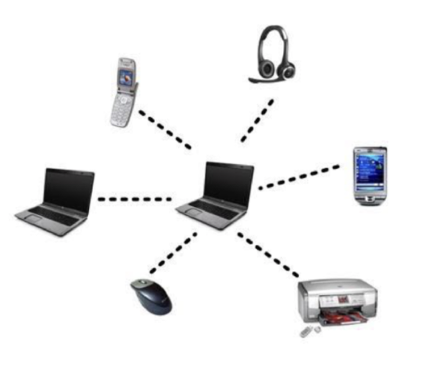
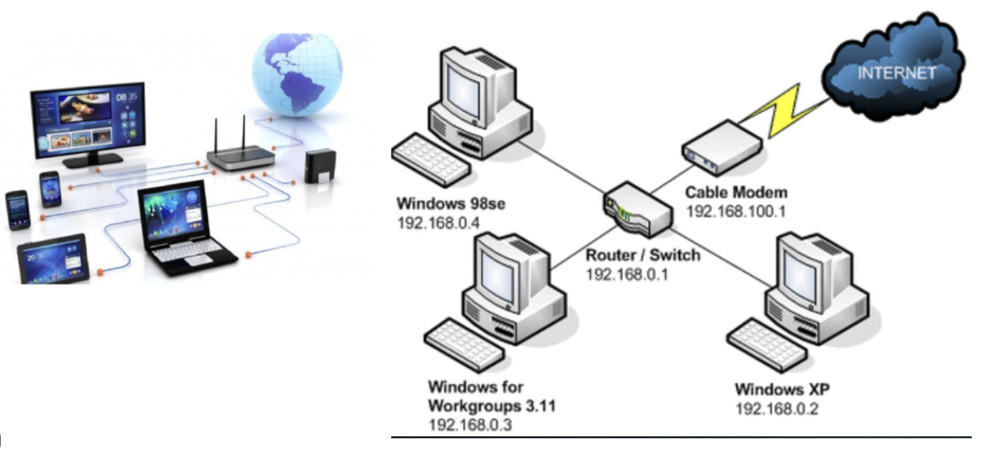
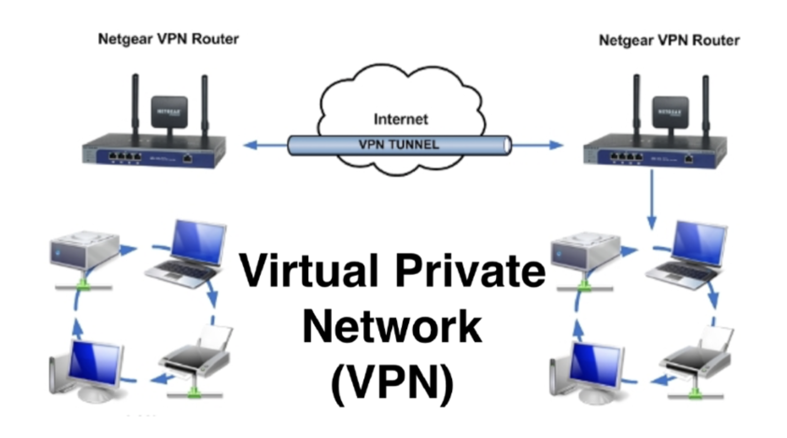
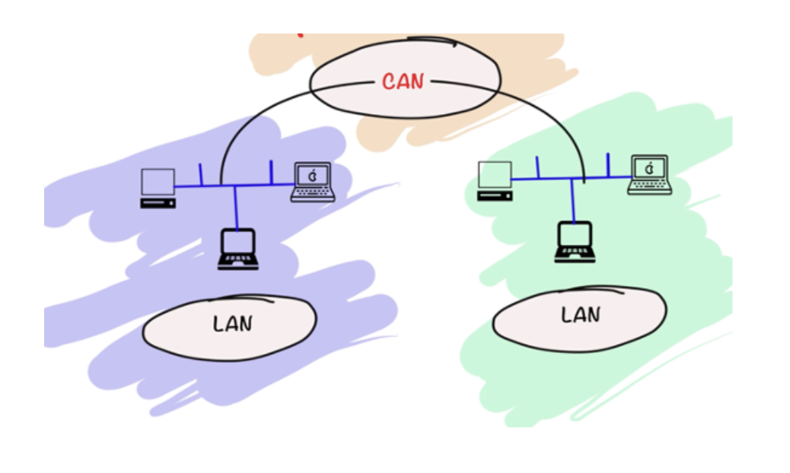
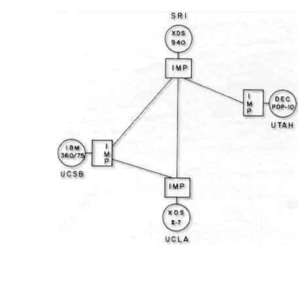
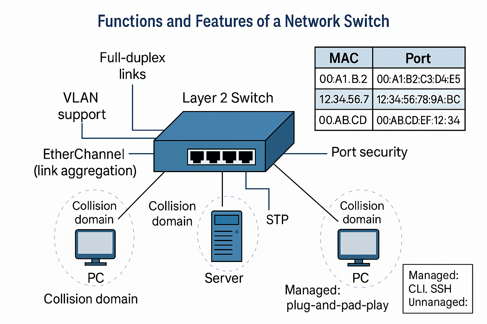
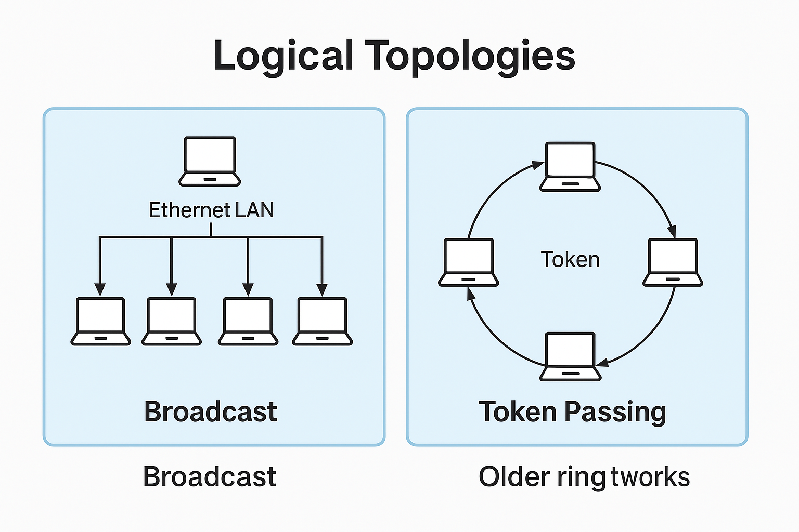
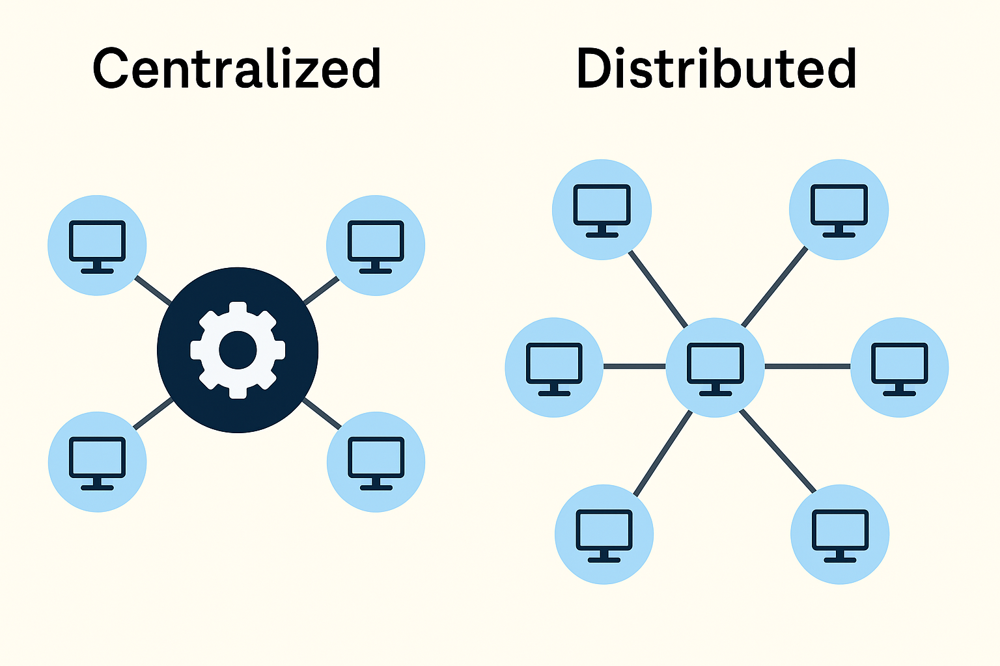

# Charpter 1 — Introduction to Networking

## Subtopics

* What is a computer network?
* Why do we need a computer network
* Types of Computer Networks
* Internet

## Course Learning Outcomes (LOs)

By the end of this week, students will be able to:

* **LO1:** Define the concept and essential functions of a computer network.
* **LO2:** Explain the importance of computer networks in supporting modern digital infrastructure and applications.
* **LO3:** Differentiate between various types of computer networks (PAN, LAN, MAN, WAN, CAN, SAN, VPN) based on their characteristics and use cases.
* **LO4:** Describe the historical development of the Internet, including key milestones and its impact on global connectivity.

## What is a Computer Network?

A computer network is a collection of interconnected devices that can share resources and information. This includes computers, printers, servers, and various types of networking hardware, such as switches and routers. Networks enable communication and collaboration across distances, enhancing efficiency and productivity.

#### Key Functions of Networks

* **Resource Sharing:** Resource sharing is one of the fundamental motivations for computer networks. In both enterprise and home settings, networking enables multiple devices to share a printer, access a shared folder, or connect to the internet through a single gateway. According to CompTIA Network+, shared resources reduce cost and improve efficiency because hardware and data do not need to be duplicated. For example, a file server on a local area network (LAN) enables centralized storage, backup, and management of permissions. This minimizes redundancy, simplifies maintenance, and ensures consistent access policies across users, especially in environments with many clients or devices.
* **Communication:** Modern networks enable seamless communication between people and systems through email, instant messaging, VoIP, and video conferencing. CCNA emphasizes the importance of protocols like TCP/IP, which standardize how devices exchange data regardless of the underlying hardware. Communication in networks involves structured message delivery — from encoding data to segmenting it into packets, routing it across the globe, and reassembling it at the destination. Reliable communication protocols, such as TCP, ensure that all messages are delivered intact and in the correct order. This structured and reliable communication has become essential for business, education, healthcare, and personal interaction.
* **Centralized Data Access:** Computer networks support centralized data management by storing data in dedicated file servers or databases accessible to all authorized users. This design promotes data consistency, security, and efficient backup practices. The theory behind centralized access, as discussed in textbooks like Doug Lowe’s *Networking All-in-One*, is that when users access a single version of data stored on the server, it reduces errors and duplication. Additionally, centralized authentication systems (e.g., Active Directory) ensure users are verified before they gain access. This model enhances data integrity and accountability, which are essential in regulated industries or environments that require audit trails.

## Why We Need Computer Networks

Computer networks support modern business operations, education, government, healthcare, and virtually all aspects of daily life. They enable:

* **Cost-efficient resource utilization:** Computer networks enable organizations to optimize their IT resources in several ways, leading to significant cost savings:

  

  <!-- \label{fig:wan} -->

  * **Resource Sharing:** Networks allow multiple users and devices to share expensive resources such as printers, scanners, and high-speed internet connections. This reduces the need for individual purchases for each user.
  * **Centralized Management:** Networked systems often support centralized software management, updates, and security protocols. This reduces the administrative overhead and the need for individual maintenance on each machine.
  * **Optimized Hardware Utilization:** Server virtualization and networked storage solutions allow organizations to consolidate their hardware, running multiple virtual servers on a single physical machine and efficiently utilizing storage capacity.
  * **Reduced Communication Costs:** Network-based communication tools like email, instant messaging, and VoIP (Voice over IP) can significantly reduce traditional communication costs associated with phone calls, faxes, and postal services.
  * **Scalability and Flexibility:** Networks allow organizations to scale their resources up or down as needed, adding or removing users and devices without significant infrastructure overhauls. Cloud services, in particular, offer pay-as-you-go models, ensuring you only pay for the resources you consume.

* **Remote access and telecommuting:** Computer networks are the backbone of remote access and telecommuting, offering numerous benefits for both employees and organizations:

  * **Increased Flexibility and Productivity:** Employees can access network resources and perform their work from anywhere with an internet connection, enhancing flexibility and potentially increasing productivity by eliminating commute times and allowing for work during peak personal productivity hours.
  * **Wider Talent Pool:** Organizations can hire talent from a geographically diverse pool, no longer limited by the location of their physical offices.
  * **Reduced Overhead Costs:** Telecommuting can lead to lower overhead costs for organizations, such as reduced office space, utilities, and other office-related expenses.
  * **Improved Employee Morale and Retention:** Offering remote work options can improve employee satisfaction, work-life balance, and loyalty, leading to higher retention rates.
  * **Business Continuity:** In emergencies or disruptions, remote access allows businesses to continue operations with minimal interruption.
  * **Enhanced Collaboration:** Networked tools facilitate seamless communication and collaboration among remote teams through video conferencing, shared documents, and project management platforms.

* **Distributed computing and cloud services:** Computer networks are essential for distributed computing and the delivery of cloud services, enabling powerful and scalable computing solutions:

  * **Enhanced Processing Power:** Distributed computing involves dividing complex tasks across interconnected computers, allowing for parallel processing and significantly increased computational power for demanding applications like scientific simulations, data analysis, and AI/ML training.
  * **Scalability and Elasticity:** Cloud services leverage vast networks of servers to offer highly scalable and elastic computing resources. Users can easily scale their computing power, storage, and other resources up or down based on their needs, paying only for what they use.
  * **High Availability and Reliability:** Cloud infrastructure is typically designed with redundancy and fault tolerance, ensuring high availability and minimizing downtime for applications and services.
  * **Accessibility and Convenience:** Cloud services provide on-demand access to a wide range of computing resources and applications over the internet, eliminating the need for organizations to invest in and manage their own extensive infrastructure. Examples include:

    * **Software as a Service (SaaS):** Applications accessed over the internet (e.g., Gmail, Salesforce, Dropbox).
    * **Platform as a Service (PaaS):** Platforms for developing, running, and managing applications without managing the underlying infrastructure (e.g., AWS Elastic Beanstalk, Google App Engine).
    * **Infrastructure as a Service (IaaS):** Access to fundamental computing resources like virtual machines, storage, and networks (e.g., AWS EC2, Azure Virtual Machines).
  * **Innovation and Agility:** Cloud services provide access to cutting-edge technologies like AI, machine learning, and big data analytics, fostering innovation and allowing organizations to respond more to market changes.

That’s a great start to explaining the importance of computer networks! You’ve hit on some key advantages. To make it even more comprehensive, you might consider adding these points as well:

* **Communication and Collaboration:** Networks are fundamental for instant communication through email, messaging apps, video conferencing, and collaborative platforms, breaking geographical barriers.
* **Information Sharing:** They allow for easy and efficient sharing of files, data, and knowledge across different devices and locations.
* **Centralized Management and Security:** Networks often enable centralized administration of resources, security protocols, and software updates, improving efficiency and control.
* **Entertainment and Information Access:** From streaming services and online gaming to accessing a wealth of information on the internet, networks are central to our leisure and learning.
* **Automation and Control:** In various industries, networks facilitate automation of processes, remote monitoring, and control of machinery and systems.

## Types of Computer Networks

Computer networks are categorized based on their geographical span, purpose, and scale. Here’s a breakdown of the differences between Local Area Network (LAN), Wide Area Network (WAN), Metropolitan Area Network (MAN), Storage Area Network (SAN), and Personal Area Network (PAN):

* **Personal Area Network (PAN)**
  A Personal Area Network (PAN) is a small-scale network organized around a person, typically within a range of a few meters. PANs are designed to connect personal devices such as smartphones, laptops, tablets, printers, headsets, and wearable electronics, enabling them to communicate directly without requiring larger network infrastructure. These networks are typically established using short-range wireless technologies such as Bluetooth, infrared (IR), or Wi-Fi Direct. Due to their limited scope and simplicity, PANs are generally easy to set up, inexpensive, and highly portable.

  Unlike LANs, which serve multiple users and devices in a shared space, PANs are focused on an individual’s devices, often forming spontaneously or ad hoc. Data transfer rates vary depending on the protocol used, with Bluetooth offering moderate speeds that are suitable for audio and peripheral devices. In contrast, Wi-Fi Direct may provide higher bandwidth for file sharing or screen casting.

  

  <!-- \label{fig:pan-example} -->

  Figure\~\ref{fig\:pan-example} illustrates a typical PAN setup in which a laptop serves as the central node, wirelessly connected to a range of personal devices including a smartphone, headset, printer, wireless mouse, and another computer. Such configurations are standard in home offices, mobile working environments, and IoT ecosystems where immediate device-to-device interaction is needed.

* **Local Area Network (LAN)**
  A Local Area Network (LAN) is a type of computer network that connects devices within a limited geographical area such as a home, office, or university building. LANs are typically owned and managed by a single organization or individual and are designed to support high data transfer rates over short distances. Standard technologies used in LANs include Ethernet (wired) and Wi-Fi (wireless). Due to their limited scope, LANs are cost-effective to install and maintain compared to wide-area networks (WANs).

  

  <!-- \label{fig:lan-example} -->

  Figure\~\ref{fig\:lan-example} illustrates two types of LAN configurations. On the left is a modern home LAN where devices such as smartphones, tablets, laptops, and smart TVs are connected via a wireless router. On the right is a traditional wired LAN topology, where desktop computers are assigned private IP addresses (e.g., 192.168.0.x) and interconnected through a router or switch, which in turn connects to a cable modem for Internet access. The router performs local traffic routing and Network Address Translation (NAT) to interface with external networks. These LANs serve as the foundation for communication, file sharing, and resource access within localized environments.

* **Storage Area Network (SAN)**
  A Storage Area Network (SAN) is a specialized, high-speed network that connects multiple servers to centralized storage devices, such as disk arrays or tape libraries. Unlike traditional network storage solutions that operate at the file level (e.g., NAS), a SAN provides block-level access, allowing servers to interact with storage devices as if they were locally attached drives. SANs are typically deployed in data centers where performance, scalability, and reliability are critical requirements.

  The architecture of a SAN is distinct in that it isolates storage traffic from general-purpose user networks, thereby reducing congestion and improving throughput. SAN technologies include Fibre Channel, iSCSI (Internet Small Computer System Interface), and emerging standards such as NVMe over Fabrics. SANs are commonly used in environments requiring fast data retrieval and transaction processing, such as enterprise databases, virtualization platforms, and high-performance computing (HPC) clusters.

  

  <!-- \label{fig:san-compare} -->

  Figure\~\ref{fig\:san-compare} illustrates a comparative view of Direct Attached Storage (DAS), Network Attached Storage (NAS), and SAN. In DAS, storage is directly connected to a single server. NAS introduces a shared file system accessible over a standard Ethernet network. SAN, on the other hand, bypasses the file system at the storage device and enables direct block-level communication between the storage and multiple servers through a dedicated switching fabric. This model provides enhanced scalability, redundancy, and performance to meet the demanding requirements of enterprise storage.

* **Metropolitan Area Network (MAN)**
  A Metropolitan Area Network (MAN) is a type of network designed to connect users and resources across a metropolitan area, such as a city or a large urban zone. It operates at a scale larger than a Local Area Network (LAN) but smaller than a Wide Area Network (WAN). MANs typically link multiple LANs through high-speed backbone infrastructure, often leveraging technologies such as fiber optics or high-bandwidth microwave links. The network may be owned and maintained by a single organization, such as a municipal authority or a university system, or it may be delivered as a service by one or more telecommunications providers.

  In terms of performance, MANs generally provide high data transfer rates, making them suitable for real-time services such as video conferencing, large data transfers, and public wireless Internet access. The cost of establishing and maintaining a MAN is higher than that of a LAN due to its broader coverage and more complex equipment. Still, it remains significantly more affordable than deploying and managing a full-scale wide-area network (WAN).

  Common examples of MANs include university campus networks that span multiple buildings within a city, city-wide broadband initiatives, and cable television infrastructure. These networks are essential for connecting public institutions, corporate branches, or service nodes efficiently across urban areas.

* **Wide Area Network (WAN)**
  A Wide Area Network (WAN) is a type of network that spans a large geographical area, ranging from cities and regions to countries and continents. Unlike LANs, which are typically owned and maintained by a single organization, WANs often rely on infrastructure provided by multiple external service providers such as ISPs and telecommunications companies. Data transfer speeds across WANs may be lower than those in LANs due to the long distances, shared infrastructure, and potential congestion. However, technologies like fiber optics, MPLS, and high-bandwidth satellite links are steadily improving performance. WANs are more expensive to establish and operate compared to LANs because they require leased lines, complex routing equipment, and redundancy for reliability.

  

  <!-- \label{fig:wan-diagram} -->

  The most pervasive example of a WAN is the Internet, which connects millions of individual networks worldwide. Other examples include corporate WANs that link branch offices located in various countries. Figure\~\ref{fig\:wan-diagram} depicts a conceptual view of a WAN topology, where multiple nodes (e.g., routers or data centers) across different continents are interconnected. This global structure facilitates long-distance communication, data exchange, and access to remote services and cloud infrastructure.

* **Virtual Private Network (VPN)**
  A Virtual Private Network (VPN) is a secure communication method that allows users or organizations to establish private, encrypted connections across public networks such as the Internet. VPNs are widely used to ensure confidentiality, data integrity, and authentication in remote access scenarios or to connect geographically separated office networks securely.

  VPNs operate by creating a secure “tunnel” between two endpoints, encrypting the data that traverses through this tunnel to protect it from eavesdropping and tampering. This allows for secure data transmission even over untrusted networks. VPNs can be implemented using various protocols, including PPTP, L2TP, IPSec, and OpenVPN, each offering different levels of security and performance.

  

  <!-- \label{fig:vpn-diagram} -->

  Figure\~\ref{fig\:vpn-diagram} illustrates a typical site-to-site VPN configuration. Two office networks, each connected to a Netgear VPN router, communicate securely over the Internet through an encrypted VPN tunnel. Devices within each network (such as PCs, servers, and printers) operate as if they are on the same local network, despite being in physically distant locations. This architecture is commonly used in enterprises to connect branch offices to central data centers without the need for dedicated leased lines.

* **Campus Area Network (CAN)**
  A Campus Area Network (CAN) is a network infrastructure that connects multiple Local Area Networks (LANs) within a limited geographic area, such as a university campus, corporate office park, or military base. It is larger than a Local Area Network (LAN) but smaller than a Metropolitan Area Network (MAN), offering localized high-speed connectivity between buildings, departments, or clusters of LANs within a single administrative domain.

  A CAN typically relies on high-bandwidth backbone technologies such as fiber optics to link academic buildings, dormitories, libraries, and administrative offices. It provides centralized network services, including authentication, file sharing, and Internet access, while maintaining cost-effectiveness through unified management and shared infrastructure.

  

  <!-- \label{fig:can-diagram} -->

  Figure\~\ref{fig\:can-diagram} illustrates a CAN topology in which multiple LANs (e.g., faculty labs, departmental offices) are interconnected to form a cohesive campus-wide network. Each LAN serves a localized group of users and devices, and the CAN aggregates them into a unified system that supports intra-campus communication and resource sharing.

These network types differ primarily in their geographical coverage, purpose, ownership, data transfer rates, and cost. Understanding these distinctions is crucial for designing and managing adequate network infrastructures.

## Internet

### History

The Internet, as we know it today, originated from a research project funded by the United States Department of Defense, known as ARPANET (Advanced Research Projects Agency Network). Initiated in the late 1960s, ARPANET was the first operational packet-switching network, serving as a pioneering platform for internetworking that allowed multiple independent networks to communicate over a shared infrastructure.

ARPANET was developed to enhance communication between research institutions and universities by linking their mainframe computers. The first four connected nodes in 1969 were the University of California, Los Angeles (UCLA); Stanford Research Institute (SRI); the University of California, Santa Barbara (UCSB); and the University of Utah. These institutions were connected through Interface Message Processors (IMPs), the precursors to modern-day routers. Communication relied on packet-switching principles, which broke down messages into smaller units (packets) for efficient delivery over shared lines.

<!-- \label{fig:internet-history} -->

Figure\~\ref{fig\:internet-history} shows the original ARPANET topology, demonstrating how early host computers, such as the IBM 360/75 and DEC PDP-10, were connected via IMPs. This simple but revolutionary design laid the foundation for the development of TCP/IP protocols in the 1970s and the eventual emergence of the global Internet in the 1980s and 1990s.

Today, the Internet connects billions of devices, enabling real-time communication, information sharing, and digital innovation on a global scale. Its architecture continues to evolve with advancements in IP addressing (e.g., IPv6), high-speed fiber optics, cloud computing, and edge networking.

### Milestone of Internet

The Internet is a vast, global system of interconnected networks that emerged from decades of innovation in data communication, networking protocols, and computing infrastructure. Its origins trace back to the ARPANET project in 1969, funded by the U.S. Department of Defense, which was the first operational packet-switched network.

The development of the Transmission Control Protocol (TCP) in the early 1970s (with its first paper published in 1974) enabled reliable end-to-end communication between computers, laying the groundwork for the modern Internet. Over the subsequent decades, milestones such as the launch of commercial Internet service providers, the release of the World Wide Web (WWW) in 1991, and the introduction of broadband, wireless local area networks (LANs), and mobile Internet access radically expanded Internet usage.

Figure\~\ref{fig\:internet-timeline} summarizes key milestones in the evolution of the Internet from its early development through the rise of wireless and mobile technologies.

<!-- \label{fig:internet-timeline} -->

**Notable events include:**

* **1969:** First data transmitted via packet-switched network (ARPANET).
* **1974:** TCP specification published, foundational to Internet protocol suite.
* **1990:** First commercial dial-up Internet provider launched.
* **1991:** The World Wide Web (WWW) was released to the public.
* **1995:** First Internet-based phone (VoIP); commercial use begins expanding.
* **1999:** First mobile Internet services appear.
* **2001:** 3G networks begin, supporting high-speed mobile data.
* **2005:** First mobile phone with built-in Wi-Fi capability released.

These developments collectively enabled the transition from research-only academic networks to a public infrastructure that supports education, commerce, communication, and innovation at a global scale.

### Internet in Thailand

The history of the Internet in Thailand dates back to the late 1980s, when Thai institutions began connecting to international networks for academic collaboration. The first successful Internet-based communication in Thailand occurred on **2 June 1988**, when an email was transmitted from Prince of Songkla University (PSU), Hat Yai campus, to an international destination. This marked the beginning of Thailand’s integration into the global Internet community.

Figure\~\ref{fig\:th-email} shows a copy of the first recorded email sent from Thailand, originating from the address `kre@sritrang.psu.th`. The message, although simple, symbolized a profound shift in academic communication and laid the groundwork for the country’s Internet infrastructure.

<!-- \label{fig:th-email} -->

This milestone was made possible through collaborative efforts between Thai academics and international experts. Two individuals are particularly recognized for their pioneering contributions:

* **Robert Elz** (left in Figure\~\ref{fig\:th-pioneers}) – A computer scientist from the University of Melbourne, Australia, who played a key role in facilitating Thailand’s early Internet connectivity.
* **Asst. Prof. Dr. Nittida Elz** (right in Figure\~\ref{fig\:th-pioneers}) – Then a computing expert at PSU, she was instrumental in implementing and coordinating the technical operations necessary to enable the country’s first international email exchange.

<!-- \label{fig:th-pioneers} -->

This early achievement at PSU represented the first step toward widespread digital connectivity in Thailand. Since then, the country has developed extensive academic, governmental, and commercial Internet infrastructure, contributing to Southeast Asia’s digital economy and knowledge society.

## Introduction to Network Devices

In any computer network, various devices work together to ensure the successful transmission, reception, and processing of data. Understanding the roles and functions of these devices is crucial for anyone entering the field of networking. Network devices are the building blocks that define how data travels from one point to another, how different segments of a network interact, and how services such as security, routing, and access are implemented. This section introduces the most common network devices, including switches, routers, personal computers (PCs), gateways, access points, and firewalls, providing a foundation for understanding both basic and intermediate networking concepts.

**PCs (Personal Computers)**
Personal computers serve as endpoints in a network, responsible for both generating and consuming data. Each PC is equipped with a Network Interface Card (NIC), which may be wired (Ethernet) or wireless (Wi-Fi). Network configuration settings include an IP address (either static or assigned via DHCP), subnet mask, default gateway, and DNS server information. PCs communicate using the TCP/IP model and rely on standard diagnostic tools such as `ping` for checking connectivity, `ipconfig` (on Windows) or `ifconfig`/`ip a` (on Linux) for viewing network configurations, and `tracert` or `traceroute` for examining packet travel paths. Multiple layers of the OSI model are relevant in PC networking: the physical layer for hardware and cabling, the data link layer for MAC addressing, the network layer for IP addressing, the transport layer for protocols like TCP and UDP, and the application layer for services like HTTP, FTP, and DNS. Security best practices on PCs include enabling firewalls, using antivirus software, and ensuring operating systems and applications are regularly updated with security patches.

<!-- \label{fig:pc-network-endpoint} -->

**Switches**
Switches primarily operate at Layer 2 (Data Link Layer) of the OSI model, although some advanced switches also function at Layer 3 (referred to as multilayer switches). They use MAC (Media Access Control) addresses to forward frames to specific destination ports. Each connected device is placed in a separate collision domain, significantly improving performance in LAN environments. Switches support full-duplex communication, eliminating collisions. They maintain a MAC address table (or CAM table) to learn which devices are connected to which ports. Advanced switch features include support for VLANs (Virtual Local Area Networks), port security, link aggregation (EtherChannel), and Spanning Tree Protocol (STP) to prevent network loops. Managed switches allow configuration via command-line interface (CLI), Secure Shell (SSH), or web interfaces, while unmanaged switches operate in a plug-and-play fashion.

<!-- \label{fig:network-switch} -->

**Routers**
Routers operate at Layer 3 (Network Layer) of the OSI model and are responsible for routing packets between different networks. They use IP addressing and subnet information to determine the best path for packet forwarding, based on a routing table. This table can be populated manually through static routing or dynamically using routing protocols. Standard dynamic routing protocols include RIP (Routing Information Protocol), a simple distance-vector protocol with a maximum hop count of 15; OSPF (Open Shortest Path First), a link-state protocol using Dijkstra’s algorithm to determine shortest paths; and EIGRP (Enhanced Interior Gateway Routing Protocol), a Cisco proprietary protocol that combines the best of distance-vector and link-state characteristics. Routers separate broadcast domains and often perform Network Address Translation (NAT), allowing multiple devices on a local area network (LAN) to share a single public IP address. They can also function as DHCP relays, apply Access Control Lists (ACLs), and support basic firewall configurations. Routers are commonly used to connect local area networks (LANs) to wide area networks (WANs), such as the Internet or other remote networks.

<!-- \label{fig:router-functions} -->

**Gateways**
A gateway is a device or node that acts as an entry and exit point to another network, often translating communication between different network protocols or architectures. A typical example is a default gateway, typically a router that forwards packets from a local subnet to destinations beyond the local network. Gateways are essential for communication between networks that use different communication protocols, for example, IP to legacy systems or internal networks to the Internet.

<!-- \label{fig:network-gateway} -->

**Firewalls**
A firewall is a network security device that monitors and controls incoming and outgoing traffic based on predefined security rules. Firewalls can be hardware-based, software-based, or a combination of both. They operate primarily at Layer 3 and Layer 4 (Network and Transport layers), but next-generation firewalls also provide deep packet inspection at Layer 7 (Application Layer). Firewalls are used to enforce policies that prevent unauthorized access and protect against threats such as malware, intrusion attempts, and denial-of-service (DoS) attacks. They support stateful inspection, packet filtering, and can be configured with access control lists (ACLs), port forwarding, and VPN pass-through settings.

<!-- \label{fig:firewall} -->

**Access Points**
An access point (AP) is a network device that enables wireless-capable devices to connect to a wired local area network (LAN). It operates at Layer 2 of the OSI model and uses Wi-Fi (IEEE 802.11) standards to transmit data over the air. Access points are commonly used in home networks, enterprise wireless networks, and public hotspots. They extend the range of a wireless network and can be either standalone or controller-managed. Essential features include SSID broadcasting, encryption (e.g., WPA3), and support for multiple clients.

<!-- \label{fig:access-point} -->

## Network Topologies and Architecture

In computer networking, the arrangement of devices and their communication are defined by network topologies and architectures. A **network topology** refers to the physical or logical layout of devices and connections in a network. It determines how data flows and how efficiently devices communicate with each other. Understanding different types of topologies is essential for designing, troubleshooting, and optimizing networks.

On the other hand, **network architecture** defines the structure and design principles behind how network components operate and interact. It includes models such as peer-to-peer and client-server, as well as concepts like centralized versus distributed control. Together, topologies and architectures form the blueprint for network functionality, scalability, and resilience.

The following sections explain both physical and logical topologies, as well as network architecture models, highlighting their advantages, limitations, and typical use cases.

#### Physical Topologies

A **bus topology** uses a single backbone cable to connect all devices in the network. It is inexpensive and straightforward to implement, especially in small environments. However, it is highly susceptible to collisions and network failure if the backbone cable is damaged, as all devices share the same communication line.

In a **star topology**, all devices are connected to a central switch or hub. This makes the network easy to manage and expand. If one cable fails, only the device it is connected to is affected. However, if the central device fails, the entire network goes down.

A **ring topology** forms a closed loop in which data travels in one direction from one device to the next until it reaches its destination. This design reduces the chances of collision, but can be disrupted if any device or connection in the ring fails.

<!-- \label{fig:network-topologies} -->

A **mesh topology** connects every device to every other device in the network. This provides high redundancy and reliability, as multiple paths exist for data to travel. It is often used in mission-critical environments, but is more complex and expensive to implement due to the number of connections required.

A **hybrid topology** combines two or more different types of topologies, such as star-bus or star-ring. It allows organizations to tailor the network design to their specific needs, offering flexibility and scalability while inheriting the strengths and weaknesses of the topologies it combines.

#### Logical Topologies

A **broadcast topology** is commonly used in Ethernet LANs. In this topology, every device receives all network data, regardless of whether it is the intended recipient. Devices must filter out irrelevant data, which can lead to network inefficiency if traffic volume is high.

**Token passing topology** is typically used in older ring networks. In this logical layout, a token — a small data packet — is passed around the network. A device must possess the token to transmit data, which helps avoid collisions. However, it may introduce delays and is considered outdated compared to modern Ethernet switching.

<!-- \label{fig:logical-topologies} -->

#### Network Architectures

In a **peer-to-peer (P2P)** network architecture, each device has equal status and can both provide and consume resources without the need for a central server. This setup is simple and cost-effective, suitable for minor or temporary networks, but it lacks centralized control and scalability.

A **client-server** architecture uses one or more central servers to manage resources and services for client devices. This model supports centralized administration, scalability, and security, making it ideal for business and enterprise networks. However, it depends on server availability and typically requires more maintenance and setup.

<!-- \label{fig:network-architectures} -->

The **centralized vs. distributed** model compares two broader approaches. In a **centralized network**, one central point manages all operations, making control and security easier but also creating a single point of failure. In a **distributed network**, power and resources are spread across multiple nodes, increasing resilience and fault tolerance, but often requiring more complex coordination.

<!-- \label{fig:centralized-distributed} -->

#### Broadcast Domains

A broadcast domain is a logical segment of a network in which all other devices receive any broadcast packet sent by a device within the same segment. In simpler terms, it is the set of all devices that will receive a broadcast frame originating from any one of them. Broadcast domains play a crucial role in network traffic management and performance, as broadcast messages can lead to congestion if they are not properly segmented.

Switches operate at Layer 2 of the OSI model and, by default, forward broadcast traffic to all ports within the same VLAN, except the port that originated the broadcast. This means that all devices connected to the switch will receive the broadcast unless specific configurations, such as VLANs or access control mechanisms, are applied.

<!-- \label{fig:broadcast-domains} -->

Routers, on the other hand, function at Layer 3 and do not forward broadcast traffic across different interfaces. This makes routers natural boundaries for broadcast domains. When a broadcast frame reaches a router, it is dropped unless the router is specifically configured to relay it (e.g., in DHCP relay scenarios).

#### Virtual LANs (VLANs)

A Virtual Local Area Network (VLAN) is a logical grouping of devices within a network that appear to be on the same local area network (LAN), even if they are not physically connected to the same switch or segment. VLANs are used to segment broadcast domains at the data link layer (Layer 2) of the OSI model. This allows network administrators to partition a single physical switch into multiple logical networks, improving performance, security, and manageability.

When devices are assigned to different VLANs, they cannot directly communicate with each other unless routing is enabled between the VLANs, typically through a router or a Layer 3 switch. This segmentation ensures that broadcast traffic remains within the VLAN, preventing it from flooding the entire switch and affecting unrelated devices.

VLANs are configured using VLAN IDs, and network ports on switches can be statically assigned to specific VLANs or dynamically assigned through protocols such as VLAN Management Policy Server (VMPS). Trunk ports are used to carry traffic for multiple VLANs between switches, utilizing tagging protocols such as IEEE 802.1Q.

<!-- \label{fig:vlan-segmentation} -->

**Key benefits of VLANs include:**

* Enhanced network segmentation and traffic isolation
* Improved security by separating sensitive departments or systems
* Simplified network management and flexibility
* Reduced broadcast traffic within each VLAN

Overall, VLANs are a foundational tool in modern network design, particularly in enterprise environments, enabling efficient and scalable network segmentation without the need for physical device separation.
