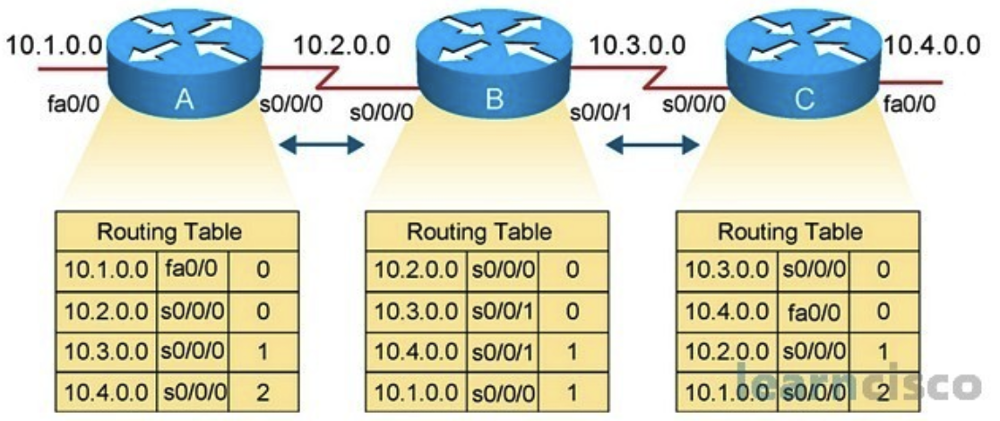

# Charpter 4 - Network Architecture

## Learning Outcomes

* Describe the layered architecture of computer networks, including the functions and interactions of each layer in the OSI and TCP/IP models.
* Explain the roles of network components—such as end devices, intermediary devices, media, services, and protocols—within a structured network architecture.
* Analyze how encapsulation, addressing, and protocol operations enable reliable end-to-end communication across diverse network systems.

## Overview of Network Communication

Network communication begins with the transmission of a **message**—a unit of data intended to travel from one device or individual to another. Every communication process within a network relies on three fundamental components:

* **Source (Sender):** The originator of the message, which may be a person or an electronic device.
* **Destination (Receiver):** The intended recipient that receives and interprets the transmitted message.
* **Channel (Transmission Medium):** The physical or wireless medium through which the message travels from source to destination (e.g., copper cables, fiber optics, or wireless signals).

To enhance both **efficiency** and **reliability**, large messages are often divided into smaller, more manageable units through a process known as **segmentation**. Segmentation provides two key benefits:

* **Multiplexing:** Allows multiple communication sessions to share the same network medium by interleaving message segments, improving overall resource utilization.
* **Increased Reliability:** If a segment is lost or corrupted during transmission, only that specific segment needs to be retransmitted, rather than the entire message.

This segmented, layered approach to communication is foundational to modern network architecture, enabling scalable, robust, and efficient data exchange across diverse network environments.

## Components of a Network

A computer network consists of various components that work together to enable communication between devices. These components can be categorized as follows:

* **Devices:**

  * **End Devices:** These are devices that users interact with directly. They serve as the interface between the user and the network. Examples include desktop computers, laptops, smartphones, network printers, IP phones, and surveillance cameras.
  * **Intermediary Devices:** These devices connect end devices to the network or connect multiple networks together. Examples include switches, routers, wireless access points, firewalls, modems, and communication servers. They manage data traffic, enforce security policies, and perform routing decisions.

* **Media:**

  * **Copper Cables:** Transmit data using electrical signals. Common types include unshielded twisted pair (UTP) and coaxial cables.
  * **Fiber-Optic Cables:** Use pulses of light to transmit data over long distances with high bandwidth and low interference.
  * **Wireless Media:** Transmit data using electromagnetic waves. Examples include Wi-Fi, Bluetooth, and cellular networks.

* **Services:**

  * Network services are software-based functionalities that support communication and resource sharing. Common services include email, web hosting, file sharing, and remote access. These typically run on network servers and are accessed by clients.

* **Protocols:**

  * Protocols are standardized rules that define how data is formatted, transmitted, and received across the network. They ensure interoperability between devices and reliable data delivery. Examples include:

    * Transmission Control Protocol (TCP)
    * Internet Protocol (IP)
    * Hypertext Transfer Protocol (HTTP)
    * Domain Name System (DNS)

## Network Models

To manage the complexity of modern computer networks, layered models are used to structure and standardize communication processes. These models divide network functionality into hierarchical layers, each with defined roles and protocols.

* **Purpose of Layered Models:**

  * Simplify the design, implementation, and troubleshooting of networks.
  * Enable interoperability between different hardware and software vendors.
  * Allow modular development, where changes in one layer do not affect others.
  * Provide a standardized framework for describing network functions.

* **Common Layered Models:**

  * **OSI Model (Open Systems Interconnection):**

    * A conceptual 7-layer model used for understanding and teaching network operations.
    * Each layer serves a specific function and communicates with adjacent layers.
    * The layers, from lowest to highest, are:

      * **Physical Layer** – Transmits raw bits over the physical medium.
      * **Data Link Layer** – Ensures error-free node-to-node delivery.
      * **Network Layer** – Manages logical addressing (e.g., IP) and routing.
      * **Transport Layer** – Provides reliable or unreliable data delivery between end systems.
      * **Session Layer** – Establishes, maintains, and terminates sessions between applications.
      * **Presentation Layer** – Handles data formatting, encoding, and encryption.
      * **Application Layer** – Interfaces directly with end-user applications and services.

```latex
% Original LaTeX (TikZ) for OSI model diagram
\begin{tikzpicture}[node distance=0cm, every node/.style={font=\sffamily}, text height=1.5ex, text depth=.25ex]

% OSI Layers with Descriptions
\node[draw, minimum width=5cm, minimum height=1cm, fill=blue!10, anchor=north west] (app) at (0,0) {Layer 7: Application};
\node[anchor=west] at (5.5, -0.5) {Interfaces with end-user applications};

\node[draw, minimum width=5cm, minimum height=1cm, fill=blue!15, anchor=north west] (pres) at (0,-1) {Layer 6: Presentation};
\node[anchor=west] at (5.5, -1.5) {Handles data encoding and encryption};

\node[draw, minimum width=5cm, minimum height=1cm, fill=blue!10, anchor=north west] (sess) at (0,-2) {Layer 5: Session};
\node[anchor=west] at (5.5, -2.5) {Manages dialog control};

\node[draw, minimum width=5cm, minimum height=1cm, fill=blue!15, anchor=north west] (trans) at (0,-3) {Layer 4: Transport};
\node[anchor=west] at (5.5, -3.5) {Provides reliable or unreliable data delivery};

\node[draw, minimum width=5cm, minimum height=1cm, fill=blue!10, anchor=north west] (net) at (0,-4) {Layer 3: Network};
\node[anchor=west] at (5.5, -4.5) {Manages IP addressing and routing};

\node[draw, minimum width=5cm, minimum height=1cm, fill=blue!15, anchor=north west] (data) at (0,-5) {Layer 2: Data Link};
\node[anchor=west] at (5.5, -5.5) {Ensures error-free node-to-node delivery};

\node[draw, minimum width=5cm, minimum height=1cm, fill=blue!10, anchor=north west] (phys) at (0,-6) {Layer 1: Physical};
\node[anchor=west] at (5.5, -6.5) {Transmits raw bits over physical medium};

\end{tikzpicture}
% \caption{OSI Reference Model with Layer Descriptions}
% \label{fig:osi-model-description}
```

* **TCP/IP Model (Transmission Control Protocol/Internet Protocol):**

  * A 4-layer model that reflects practical protocol architecture.
  * Widely used in real-world networks and the foundation of the Internet.
  * Layers include:

    * **Application Layer**
    * **Transport Layer**
    * **Internet Layer**
    * **Network Access Layer**

* **OSI and TCP/IP Layer Mapping:**

  * **Application Layer (TCP/IP)** corresponds to the OSI Application, Presentation, and Session Layers.
  * **Transport Layer** maps directly between both models.
  * **Internet Layer (TCP/IP)** corresponds to the OSI Network Layer.
  * **Network Access Layer (TCP/IP)** encompasses the Data Link and Physical Layers of the OSI model.

* **Benefits of Layered Design:**

  * Promotes protocol specialization and flexibility.
  * Supports standardized interfaces between layers.
  * Facilitates easier troubleshooting and network scalability.

## Encapsulation and Protocol Data Units (PDUs)

In network communication, **encapsulation** is the process of adding protocol-specific control information to data as it passes through the layers of the network stack. Each layer appends a header (and sometimes a trailer) to the data unit it receives from the layer above. This prepares the data for proper delivery across diverse network systems.

* **What is Encapsulation?**

  * Encapsulation occurs as data moves from the Application Layer down to the Physical Layer.
  * Each layer adds its own protocol header, forming a *Protocol Data Unit (PDU)* specific to that layer.
  * At the destination, the process is reversed through *decapsulation*, where headers are removed to reconstruct the original message.

* **Purpose of Encapsulation:**

  * Prepares data for transmission across heterogeneous network environments.
  * Adds necessary information such as addressing, error checking, sequencing, and delivery instructions.
  * Enables independent protocol operation at each layer of the model.

* **Protocol Data Units by OSI Layer:**

  * **Application Layer:** *Data* – Information generated by user applications.
  * **Transport Layer:** *Segment* (TCP) or *Datagram* (UDP) – Contains source and destination port numbers, sequence numbers, and error-checking information.
  * **Network Layer:** *Packet* – Includes IP addresses and routing information.
  * **Data Link Layer:** *Frame* – Contains MAC addresses and error detection data.
  * **Physical Layer:** *Bits* – The actual transmission of binary data as electrical, optical, or radio signals.

Encapsulation and the use of PDUs are essential for modular communication, enabling data to travel reliably across different types of networks and systems.

## Network Addressing

For data communication to be successful across a network, each device must be uniquely identifiable. This is achieved through a system of addressing at various layers of the network model. Addressing enables data to be correctly routed from source to destination, across local or wide-area networks.

* **Purpose of Network Addressing:**

  * Identify devices and network interfaces.
  * Ensure data is delivered to the correct recipient.
  * Support routing and forwarding across different networks.

* **Types of Addresses Used in Network Communication:**

  * **Physical Address (Layer 2):**

    * Also known as the MAC (Media Access Control) address.
    * Burned into the network interface card (NIC) of a device.
    * Used for communication within the same local area network (LAN).
  * **Network Address (Layer 3):**

    * Typically an IP address (IPv4 or IPv6).
    * Used to identify devices across different networks.
    * Supports hierarchical addressing for scalable routing.
  * **Port Number (Layer 4):**

    * Identifies specific processes or services on a host.
    * Enables multiple applications to use the network simultaneously.
    * Examples: HTTP (port 80), SMTP (port 25), DNS (port 53).
  * **Socket:**

    * Combination of an IP address and port number.
    * Uniquely identifies a specific process-to-process communication flow.

* **Special IP Address Types (IPv4):**

  * **Network Address:** Identifies the entire network; all host bits are set to 0.
  * **Broadcast Address:** Used to send data to all devices on a network; all host bits are set to 1.
  * **Host Address:** Assigned to individual end devices; must be unique within a network.

* **Communication Modes:**

  * **Unicast:** One-to-one communication between a single sender and receiver.
  * **Multicast:** One-to-many communication targeting a group of hosts.
  * **Broadcast:** One-to-all communication within a local network segment.

* **Subnetting and Subnet Masks:**

  * Subnetting divides a larger network into smaller, more manageable sub-networks.
  * A **subnet mask** distinguishes the network portion from the host portion of an IP address.
  * **ANDing** is used to calculate the network address from a given IP address and subnet mask.
  * **VLSM (Variable Length Subnet Mask)** allows subnetworks of varying sizes for efficient IP address allocation.

Understanding network addressing is critical for designing and managing IP-based networks. It enables efficient routing, resource allocation, and communication between devices across local and global networks.

## OSI Model

### Application Layer

The **Application Layer** is the topmost layer in both the OSI and TCP/IP models and serves as the direct interface between user-facing software applications and the underlying network services. It plays a critical role in enabling network-aware applications—such as web browsers, email clients, and file-sharing tools—to initiate and manage communication over a network or the Internet.

One of the primary responsibilities of the Application Layer is to provide a platform for user interaction with the network. This is achieved through the *application-user interface*, where services such as web browsing, email exchange, file transfers, and remote access are delivered directly to end-users. To facilitate this communication, the layer relies on a set of *application layer protocols* that define the rules and formats for exchanging data between programs running on different hosts. Examples include HTTP for web traffic, SMTP for sending email, and DNS for resolving domain names into IP addresses.

In addition to protocols, the Application Layer includes various *application services* that support end-to-end communication. These services perform background operations such as file transfers (FTP), name resolution (DNS), and dynamic addressing (DHCP), allowing applications to function seamlessly over diverse networks.

Communication at the Application Layer can follow two fundamental models: the **client–server model** and the **peer-to-peer (P2P) model**. In the client–server architecture, clients initiate service requests, while servers respond to these requests, often by running background daemon processes that continuously listen for incoming connections. This model supports centralized management and scalability, making it ideal for web services and enterprise applications. In contrast, the peer-to-peer model allows devices to act simultaneously as clients and servers. In this decentralized architecture, each node can initiate communication and provide resources such as files or processing power without relying on a central server. This model is commonly used in file-sharing networks and collaborative applications.

Overall, the Application Layer is crucial for delivering user-level services and defining the protocols and interaction patterns that govern networked application behavior.

### Presentation Layer

The **Presentation Layer** (Layer 6 of the OSI model) functions as a translator between the Application Layer and the lower layers of the OSI stack. Its main responsibility is to ensure that data generated by user applications is presented in a format that can be understood by the receiving system, regardless of any differences in system architecture, encoding, or file format.

As illustrated in Figure \ref{fig\:presentation-layer}, the Presentation Layer performs two major functions: *translation* and *encryption*.

**Translation** involves the standardization of application data for network transmission. This includes:

* **Text encoding** — converting characters between formats such as ASCII and Unicode.
* **Byte and bit order conversion** — ensuring the proper endianness and bit-level structure for the receiving system.
* **File syntax adaptation** — formatting data types such as images (JPG), videos (MP4), or text documents into a standardized representation.

**Encryption** ensures data confidentiality during transmission by:

* Converting *plain text* into *cipher text*, making it unreadable to unauthorized entities.
* Managing the use of *public and private keys* for secure encryption and decryption operations.

Together, these functions ensure that the data transmitted between systems is both compatible and secure, enabling reliable communication across diverse platforms.


<!-- \label{fig:presentation-layer} -->

### Session Layer

The **Session Layer** (Layer 5 of the OSI model) is responsible for managing and maintaining multiple communication sessions between application processes running on networked devices. A session represents a logical connection that allows data exchange between endpoints in a synchronized and organized manner.

In the diagram shown below, a single host with IP address `100.1.1.1` is running multiple client applications: `Internet Explorer (IE)`, `Chrome`, and `Mail`. Each application establishes its own session with a remote server using a unique source port:

* `IE` uses source port 49999 to communicate with a web server at TCP port 80.
* `Chrome` uses source port 50000 to initiate a separate HTTP session on port 80.
* `Mail` uses source port 50001 to connect with a mail server at TCP port 25.

Although multiple applications use the same destination services (e.g., HTTP), the Session Layer ensures that each session remains distinct and properly routed. It manages dialog control by opening, maintaining, and closing sessions and ensures data from one session does not interfere with another.

This layer enables **concurrent application communication**, session tracking, and coordination across diverse services, forming a foundation for complex and interactive networked systems.


<!-- \label{fig:session-layer} -->

### Transport Layer

The **Transport Layer** (Layer 4 of the OSI model) provides logical communication between application processes running on different hosts. It ensures data is transferred reliably or efficiently depending on the protocol used (TCP or UDP), manages segmentation and reassembly, and assigns unique port numbers to identify specific services and sessions.

* **Core Functions:**

  * Segmentation and reassembly
  * End-to-end communication between processes
  * Port addressing for multiplexing
  * Error detection and flow control
  * Congestion avoidance

* **Main Transport Layer Protocols:**

  * **Transmission Control Protocol (TCP):**

    * Connection-oriented, reliable delivery (RFC 793)
    * Features:

      * Three-way handshake (SYN, SYN-ACK, ACK)
      * Sequencing, ACKs, retransmissions
      * Flow control (window size)
      * Congestion control
      * Graceful termination via FIN-ACK
  * **User Datagram Protocol (UDP):**

    * Connectionless, best-effort delivery
    * No guarantees for ordering or reliability
    * Useful for streaming, DNS, and real-time apps

* **Port Numbers and Socket Identification:**

  * Each transport-layer segment includes a source and destination port number.
  * A socket is identified by: `<IP address, Port number>`
  * Port ranges are categorized as follows:

**Port Number Ranges Used in the Transport Layer**

| **Type**              | **Range**     | **Examples**             |
| --------------------- | ------------- | ------------------------ |
| Well-Known Ports      | 0 — 1023      | HTTP (80), SMTP (25)     |
| Registered Ports      | 1024 — 49151  | Assigned to applications |
| Dynamic/Private Ports | 49152 — 65535 | Temporary client ports   |

#### TCP Three-Way Handshake

To establish a reliable connection, the **Transmission Control Protocol (TCP)** uses a three-step process called the *three-way handshake*. This process synchronizes sequence numbers and confirms that both the client and server are ready to transmit data.

1. **SYN:** The client initiates the connection by sending a TCP segment with the SYN (synchronize) flag set. It includes an initial sequence number (e.g., 1000).
2. **SYN-ACK:** The server responds with a segment that has both SYN and ACK flags set. It includes its own sequence number (e.g., 3000) and acknowledges the client's sequence by sending an ACK number (1001), which is the client's sequence number plus one.
3. **ACK:** The client completes the handshake by sending an ACK segment acknowledging the server's sequence number (e.g., 3001).

After this exchange, the connection is considered established, and data transfer can begin. When the communication ends, TCP uses a similar exchange of FIN and ACK flags to terminate the session gracefully.


<!-- \label{fig:tcp-handshake} -->

The diagram below illustrates how TCP tracks and updates sequence and acknowledgment numbers during the three-way handshake, data transfer, and connection termination.

In the handshake phase, the client sends a `SYN` segment with an initial sequence number of 1000. The server responds with a `SYN-ACK` segment, choosing a starting sequence number of 3000 and acknowledging the client's sequence with an ACK of 1001. The client finalizes the handshake with a third segment carrying sequence number 1001 and acknowledgment number 3001.

Data transfer then begins, with the client sending 200 bytes of data starting at sequence number 1001. The server acknowledges this segment with ACK 1201. These numbers represent the byte-level offset for reassembling data correctly at the receiving end.

Connection termination is performed using the `FIN` flag. The client sends a `FIN` at sequence number 1201. The server acknowledges it with ACK 1202 and sends its own `FIN` with sequence number 3002. The client replies with the final ACK 3003.

This handshake mechanism ensures a reliable, synchronized start to communication and is critical for connection-oriented protocols like TCP.

#### User Datagram Protocol (UDP)

The **User Datagram Protocol (UDP)**, defined in **RFC 768**, is a connectionless transport layer protocol that offers *best-effort* data delivery without establishing a formal connection between sender and receiver. Unlike TCP, UDP does not implement handshakes, acknowledgments, sequencing, or retransmission, resulting in minimal protocol overhead. This makes UDP highly efficient and faster, though less reliable, as it cannot guarantee data delivery or order. Despite its limitations, UDP is ideal for *time-sensitive applications* where speed is prioritized over reliability. Examples include **Voice over IP (VoIP)**, **live video streaming**, **online gaming**, and **Domain Name System (DNS)** lookups, where minor data loss is acceptable if overall responsiveness is maintained.

### Network Layer

#### Primary Responsibilities

* **Logical Addressing:** Logical addressing is the mechanism by which each device or host in a network is assigned a unique identifier—commonly an IP address. Unlike MAC addresses, which are tied to hardware, logical addresses are hierarchical and can change depending on network configuration. They enable end-to-end routing across disparate networks by allowing routers and switches to recognize and forward data correctly. Logical addressing is essential for enabling internetwork communication, facilitating subnetting, and supporting scalable growth. Additionally, network administrators use logical addresses to implement access control, quality of service policies, and network segmentation, ensuring that traffic is routed accurately and securely across complex infrastructures.

* **Encapsulation:** Encapsulation at the Network Layer involves adding an IP header to the Transport Layer segment to create a packet. This header contains critical information such as source and destination IP addresses, TTL (Time-to-Live), and fragment offset. Encapsulation bridges the gap between the transport layer’s data-oriented view and the network layer’s routing responsibilities. It ensures that routers, which operate at Layer 3, can properly forward packets across multiple network segments. This process isolates higher layers from network-specific details and supports functions such as fragmentation and path MTU discovery. Upon arrival, decapsulation removes the header, passing the original segment up for further processing.

* **Routing:** Routing is the process by which packets are directed from their origin to their destination across one or more intermediate networks. Routers maintain routing tables, which contain information on reachable networks and associated metrics, to determine the optimal path for each packet. This process involves interpreting routing protocols such as OSPF, BGP, and EIGRP, which dynamically exchange network topology information. By analyzing destination IP addresses, routers select the next-hop interface and forward the packet accordingly. Effective routing ensures resilience, load balancing, and redundancy in large-scale networks. Administrative metrics such as cost, hop count, and bandwidth also influence route selection to optimize performance and reliability.

* **Decapsulation:** Decapsulation is the reverse of encapsulation and occurs at the final destination host. Once a packet traverses its path and arrives at the target device, the Network Layer examines its header, verifies integrity, and removes it. This process extracts the original Transport Layer segment—complete with its segment header and payload—and passes it to the appropriate socket or process based on port addressing. The Network Layer also interprets special conditions such as TTL expiration, fragmentation needs, or error flags. Decapsulation ensures that data delivered to applications is accurate, intact, and correctly reconstructed, maintaining the integrity of the layered communication model.

#### Addressing: Internet Protocols

* **IPv4 (Internet Protocol version 4):** IPv4 is a 32-bit, connectionless protocol that provides best-effort delivery services irrespective of the underlying physical medium. Each IPv4 packet begins with a header featuring several essential fields: source and destination addresses (each 32 bits), TTL to prevent routing loops, ToS for quality of service, and a fragment offset field for managing packet fragmentation and reassembly. The header also includes checksum information for validation. IPv4 underpins the majority of current internet communication. Despite its limitations—chiefly address exhaustion—it remains critical due to established infrastructure and wide compatibility with existing hardware and software.

* **IPv6 (Internet Protocol version 6):** IPv6, the successor to IPv4, uses 128-bit addresses to support an exponentially larger address space—enabling virtually infinite unique endpoints. Its redesigned header streamlines processing by organizing fields into a fixed header and optional extension headers. IPv6 includes improved features such as built-in IPsec support for enhanced security, stateless address autoconfiguration (SLAAC), and hierarchical addressing that simplifies aggregation and routing. The protocol eliminates IPv4’s broadcast concept and includes a larger multicast address space. It addresses scalability, performance, and security needs of modern networks, and is rapidly being adopted to alleviate IPv4 exhaustion.

#### Routing

* **Router:** A router is a Layer 3 network device that forwards packets between different IP networks. Routers maintain and update routing tables representing the network topology. Based on destination IP addresses, they decide the most efficient route and forward packets accordingly. Routers adhere to routing protocols (e.g., OSPF, BGP) that allow them to dynamically learn paths, share information with neighbor routers, and adapt to network changes. A router typically connects networks with different prefix ranges and uses supplemental protocols (e.g., ARP) to resolve next-hop MAC addresses. By implementing access control, NAT, and QoS policies, routers also enhance network security and performance.

* **Routing Table:** A routing table is a data structure within a router or host that stores information about how to reach destination networks. Each entry typically includes a destination prefix, subnet mask, next-hop IP, and metric (cost). The router selects the most appropriate path based on these metrics. Dynamic routes are learned through routing protocols and automatically updated, while static routes are manually configured. Routing tables also handle default routes for forwarding traffic to external networks. Properly configured tables are essential for correct packet forwarding, network segmentation, and redundancy, supporting failover and load balancing mechanisms.

##### Routing Types: Static vs. Dynamic

Routing in IP networks can be categorized into two primary types: **Static Routing** and **Dynamic Routing**.

**Static Routing** involves manually configuring routes on a router by an administrator. These routes do not change unless manually updated, making them suitable for small or stable networks where traffic paths are predictable. Static routing is simple and has minimal overhead, but lacks the ability to adapt to network failures or topology changes.

**Dynamic Routing**, in contrast, enables routers to automatically share and update routing information through protocols. These protocols adjust to changes in network topology, reroute traffic dynamically, and improve scalability and fault tolerance. Dynamic routing is essential for larger or more complex networks.

**Comparison of Static and Dynamic Routing**

| **Routing Type**    | **Description**                                                                                                                             |
| ------------------- | ------------------------------------------------------------------------------------------------------------------------------------------- |
| **Static Routing**  | Manually configured routes by an administrator; does not adjust automatically to network changes; best suited for small or stable networks. |
| **Dynamic Routing** | Routers share route information and adapt to topology changes using dynamic protocols such as RIP, EIGRP, and OSPF.                         |

##### Common Dynamic Routing Protocols

* **RIP (Routing Information Protocol)** – A distance-vector protocol that determines path selection based on hop count. It updates routing tables every 30 seconds and supports a maximum of 15 hops, making it suitable only for smaller networks. RIP is simple but converges slowly and is less scalable.
* **EIGRP (Enhanced Interior Gateway Routing Protocol)** – A Cisco proprietary protocol that combines features of distance-vector and link-state routing. It uses the DUAL (Diffusing Update Algorithm) for rapid convergence and supports load balancing on equal and unequal-cost paths. EIGRP is efficient and responsive, particularly in Cisco-based environments.
* **OSPF (Open Shortest Path First)** – A link-state protocol that builds a complete map of the network and calculates the shortest path using Dijkstra's algorithm. OSPF is open-standard and widely used in enterprise networks due to its scalability, hierarchical area design, and fast convergence.

##### Routing Table Example Across Multiple Routers

The figure below demonstrates a basic routing scenario involving three routers—**Router A**, **Router B**, and **Router C**—connected in a serial chain. Each router maintains a routing table with entries for known networks, the interface used to reach those networks, and the corresponding metric (or hop count).



<!-- \label{fig:routing-tables} -->

* **Router A** is directly connected to the `10.1.0.0` network via `fa0/0`, and reaches the other networks (`10.2.0.0`, `10.3.0.0`, `10.4.0.0`) through its serial interface `s0/0/0`. The metric increases by 1 for each additional hop.
* **Router B**, located in the middle of the topology, has direct connections to `10.2.0.0` and `10.3.0.0` networks via its own serial interfaces. It reaches the `10.4.0.0` and `10.1.0.0` networks through one and two hops, respectively.
* **Router C** is directly connected to `10.3.0.0` and `10.4.0.0`, and must route through intermediate networks to reach `10.2.0.0` and `10.1.0.0`.
* The **routing tables** shown beneath each router include three columns:

  1. **Destination Network (e.g., 10.3.0.0)**
  2. **Outgoing Interface (e.g., s0/0/1)**
  3. **Metric (Hop Count)**

This setup exemplifies how routers build and utilize routing tables to forward packets through the best available path. It also illustrates how the routing metric increases with distance from the destination, a key concept in distance-vector routing protocols such as RIP.

* **Default Gateway:** A default gateway is the first-hop router to which devices send packets destined for networks outside their local subnet. When a host’s routing table lacks a specific route, the packet is forwarded to the default gateway. This gateway then uses routing logic to determine the next hop. Configuring a default gateway is essential for enabling communication with external networks, including the Internet. In enterprise environments, dual or redundant gateway configurations support high availability, load balancing, and network failover—improving reliability and resilience.

### Data Link Layer

The **Data Link Layer** of the OSI model is responsible for the reliable transmission of data across a single local network segment. It prepares Layer 3 packets for delivery over the physical medium and ensures that data is delivered without errors between directly connected nodes.

#### Core Functions

* **Framing:** Encapsulates Layer 3 packets (usually IP packets) into frames by adding a Layer 2 header and trailer. This structure helps with synchronization, addressing, and error detection.
* **Media Access Control (MAC):** Controls how devices on the network gain access to the medium and permission to transmit data. This includes physical addressing (MAC addresses) and managing collisions or access delays.

#### Sublayers

The Data Link Layer is divided into two sublayers:

* **LLC (Logical Link Control):** Provides interface with Layer 3 protocols and handles error checking and frame synchronization. It identifies which network protocol (e.g., IP, IPX) is being used.
* **MAC (Media Access Control):** Responsible for physical addressing, determining when the medium is available, and initiating frame transmission.

#### Access Methods

* **Controlled Access:** Uses a deterministic approach where devices take turns accessing the medium. Examples include token passing methods.
* **Contention-Based Access:** A non-deterministic method where devices compete for the medium. It includes:

  * **CSMA/CD (Carrier Sense Multiple Access with Collision Detection):** Used in wired Ethernet networks.
  * **CSMA/CA (Carrier Sense Multiple Access with Collision Avoidance):** Used in wireless networks like Wi-Fi.

#### Network Topologies

* **Point-to-Point:** A direct connection between two nodes for exclusive communication.
* **Multi-Access:** Multiple devices share a common communication medium (e.g., Ethernet LAN).
* **Ring:** Devices are connected in a circular fashion, with data passing sequentially from one to the next.

#### Common Data Link Layer Protocols

* **Ethernet (IEEE 802.2/802.3):** The most widely used LAN technology supporting both half-duplex and full-duplex communication.
* **PPP (Point-to-Point Protocol):** Used over serial WAN links to encapsulate Layer 3 packets and provide authentication, compression, and error detection.
* **IEEE 802.11 (Wi-Fi):** A wireless LAN standard that operates over radio waves and employs CSMA/CA to manage access to the shared medium.

### Physical Layer

The **Physical Layer** is the lowest layer of the OSI model and is responsible for the physical transmission of raw bitstreams over a communication medium. It defines the hardware elements involved in the network, including cables, switches, network interface cards, and signaling methods.

#### Key Functions

* **Signal Generation:** Converts binary data (1s and 0s) from the Data Link Layer into physical signals for transmission—electrical, optical, or wireless.
* **Data Encoding:** Formats data for proper interpretation and synchronization during transmission. Common methods include Manchester Encoding and Non-Return to Zero (NRZ).
* **Signaling Methods:** Specify how the binary values are physically represented on the medium (e.g., voltage levels, light pulses, or radio frequencies).

#### Transmission Media

* **Copper Cables:** Transmit electrical signals; include:

  * **Unshielded Twisted Pair (UTP):** Widely used in LANs; uses RJ-45 connectors.
  * **Shielded Twisted Pair (STP):** Offers better protection against electromagnetic interference (EMI).
  * **Coaxial Cable:** Used for broadband connections and cable TV.
* **Fiber Optic Cables:** Transmit data using pulses of light; immune to EMI and ideal for high-speed and long-distance transmission.

  * **Single-mode Fiber:** Uses a laser light source for long-distance, high-bandwidth communication.
  * **Multimode Fiber:** Uses LEDs and is suited for shorter distances due to modal dispersion.
* **Wireless Media:** Uses electromagnetic waves to carry data; susceptible to interference and environmental factors.

  * **IEEE 802.11 (Wi-Fi):** Wireless LAN standard.
  * **IEEE 802.15 (Bluetooth):** Short-range device communication.
  * **IEEE 802.16 (WiMAX):** Wireless broadband access.
  * **GSM:** Cellular communication standard.

#### Data Transmission Metrics

* **Bandwidth:** Theoretical maximum data transfer capacity of a medium, typically measured in Mbps or Gbps.
* **Throughput:** The actual rate at which data is successfully transmitted over the medium, often affected by network conditions.
* **Goodput:** The portion of throughput that is useful to the application layer—excluding protocol overhead, retransmissions, and headers.
