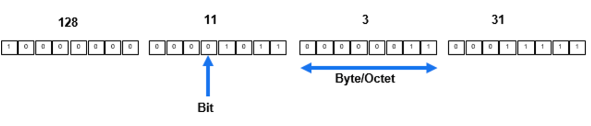
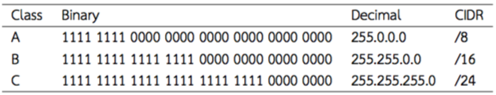
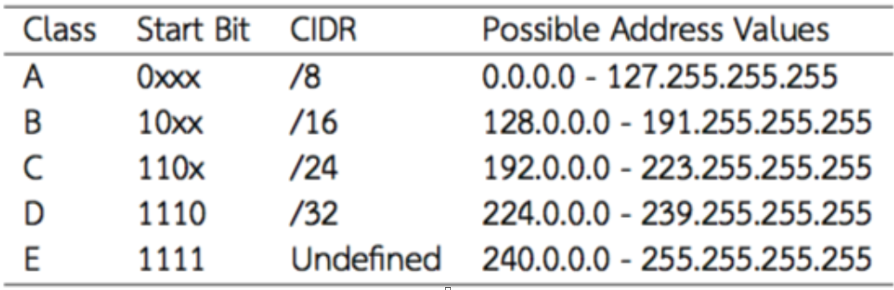

# Chapter 6 — IP Addressing and Router Configuration

## Learning Objectives

After completing this chapter, you will be able to:

1. Explain IPv4 addressing, notation, and special-purpose addresses; 2) design subnets using CIDR/VLSM; 3) describe router roles and interface requirements (including serial DCE/DTE); 4) configure router interfaces and verify L1/L2 readiness; 5) deploy and verify DHCP on IOS; 6) explain routing concepts (next-hop, network-specific, host-specific, default) and implement static routes. &#x20;

---

## 6.1 IP Address

### 6.1.1 IPv4 concept and notation

An IPv4 address is a 32-bit identifier written in dotted-decimal (e.g., `192.168.10.15`). Every host couples its address with a subnet mask (CIDR “/n”) to delineate network vs. host bits (e.g., `/23`). The slide deck introduces address/mask pairing and worked `/23` examples.&#x20;

**Theory deep-dive.**

 


* **Binary structure.** A `/n` mask fixes the leftmost *n* bits; remaining bits enumerate hosts.
* **Address classes (legacy).** While classful A/B/C ranges exist historically, modern design uses CIDR exclusively for efficiency and summarization.
* **Special addresses.** Network (all host bits `0`), broadcast (all host bits `1`), and loopback (`127.0.0.1`) support subnet identity, local broadcast, and local-stack testing, respectively.

### 6.1.2 Address roles on end hosts

A minimal end-host configuration includes **IP address**, **subnet mask**, **default gateway**, and **DNS server**. Slides emphasize these items when preparing devices for inter-subnet testing and DHCP delivery of options (mask, gateway, DNS). &#x20;

---

## 6.2 Subnet

### 6.2.1 Why subnet?

Subnetting partitions a larger block into multiple logical networks to improve address utilization, performance, and to bound broadcast scope. The slides provide concrete `/23` exercises to reason about host ranges and sizing.&#x20;

### 6.2.2 Masks and CIDR

CIDR uses “slash” notation to mark network bits (e.g., `/24`→256 total, `/26`→64 total, `/32`→single host). These values inform pool sizing and DHCP scope planning seen later in the chapter.&#x20;

 

 

**Worked example.**
Given `192.168.28.8/23`, the network spans `192.168.28.0`–`192.168.29.255`, with usable hosts from `.1` to `.254` in each /24 half. The slide calls out this `/23` case explicitly.&#x20;

### 6.2.3 Practical checklist

When planning a subnet: determine host count + 20–30 % growth; pick gateway IP; define DHCP scope; reserve static ranges for routers/servers; document VLAN ties if any. These considerations align with the later DHCP pool and exclusion steps.&#x20;

---

## 6.3 Router

### 6.3.1 Role and interfaces

Routers forward Layer-3 packets between distinct IP networks and expose interfaces such as GigabitEthernet and Serial. Slide guidance shows where to verify interface presence, addressing method (manual/DHCP), and admin/protocol states.&#x20;

### 6.3.2 Serial links: DCE/DTE reminder

In back-to-back serial topologies, **one side is DCE and must supply clocking**; the other is DTE. Slides explicitly require setting a **clock rate** on the DCE side and verifying DCE/DTE via interface output.  &#x20;

**Pitfall.** If the far end is unconfigured or shut, you can see *down/down* or *up/down* states even with correct local settings. The slide’s DCE example shows a configured IP and clock rate while the link remains down pending peer setup.&#x20;

### 6.3.3 Verifying L1/L2 health

Use **show ip interface brief** and per-interface detail to confirm admin state, line protocol, and errors before Layer-3 testing. The slide sequence stresses interface-level verification as a prerequisite. &#x20;

---

## 6.4 Router Configuration

### 6.4.1 Assigning IP addresses to router interfaces

Enter global config, select interface, assign IP/mask, and **no shutdown**. Slides illustrate the sequence and remind that interfaces are admin-down by default.&#x20;

**Example (Cisco IOS).**

```
R2(config)# interface g0/0
R2(config-if)# ip address 10.1.2.2 255.255.255.0
R2(config-if)# no shutdown
```

(Procedure matches the slide’s “IP configuration” steps.)&#x20;

### 6.4.2 End-device IP configuration for testing

Without a default gateway, hosts remain isolated to their local subnet. Slides demonstrate that PC0 can ping its local router IP, yet cannot reach a remote host until the gateway is set.&#x20;

---

## 6.5 DHCP Configuration

### 6.5.1 Purpose and workflow (DORA)

DHCP automates delivery of address/mask, default gateway, and DNS, reducing manual errors and conflicts—exactly as summarized in the slide “Introduction to DHCP.”&#x20;

### 6.5.2 Configuration steps (Cisco IOS)

**1) Create pool & options (name, network, default-router, dns-server).**&#x20;
**2) Exclude statics with `ip dhcp excluded-address` to protect fixed nodes (gateway/servers).** &#x20;
**3) Verify leases with DHCP binding and server statistics.**&#x20;

**Case framing.** The slide’s scenario shows a large `10.0.0.0/8` with specific reserved IPs and a broad dynamic range—illustrating exclusion and pool planning at scale.&#x20;

---

## 6.6 Routing Concepts and Static Configuration

### 6.6.1 Core route types (concept)

Slides distinguish **next-hop routes**, **network-specific routes**, and **host-specific (/32) routes**, forming the basis of forwarding choices.&#x20;

**Theory deep-dive.**

* **Longest-prefix match.** Routers select the most specific matching prefix; a default route (`0.0.0.0/0`) is used only when no longer match exists.
* **Forwarding vs. control planes.** The FIB/CEF uses resolved next hops (forwarding plane), while the RIB stores administrative entries (control plane).
* **Administrative distance (AD).** Should you mix static and dynamic routes, AD determines preference; static routes (AD 1) will override typical IGPs unless tuned.

### 6.6.2 Default gateways and end-to-end tests

After setting gateways on end hosts, **ping** and **traceroute** validate reachability across subnets; the slide activity explicitly has learners set default gateways on PC0/PC1 and retest.&#x20;

### 6.6.3 Static Routing (definition & when)

Static routes are administrator-defined, simple, predictable, and low overhead—best for small/stub networks or as backups. The slide introduces this and follows with a basic two-LAN topology. &#x20;

### 6.6.4 Static route syntax (IOS)

* **Next-hop form.** `ip route <DEST> <MASK> <NEXT-HOP>`
* **Exit-interface form.** `ip route <DEST> <MASK> <OUT-IF>`
* **Default route.** `ip route 0.0.0.0 0.0.0.0 <NEXT-HOP|OUT-IF>`
  (Forms align with the slide’s “Static Routing” segment and subsequent practice.)&#x20;

**Worked mini-lab (mirroring slides).**

* LANs: `10.0.1.0/24` ↔ `20.0.1.0/24`; Router has `G0/0=10.0.1.1/24`, `G0/1=20.0.1.1/24`. Confirm local pings; set PC gateways to their local router IPs; then add static routes on upstream routers per the multi-router steps. &#x20;

### 6.6.5 Verification and troubleshooting

Use **show ip route** to verify static (“S”) and connected (“C”) entries; **show ip interface brief** for L1/L2 status; **traceroute** to confirm actual next-hop selection. (These checks are emphasized around the interface and routing sequences in the slides.) &#x20;

