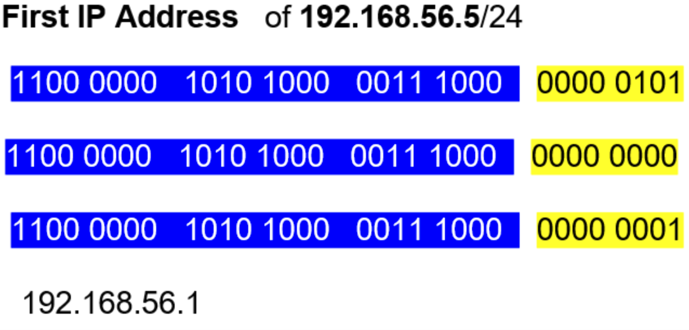
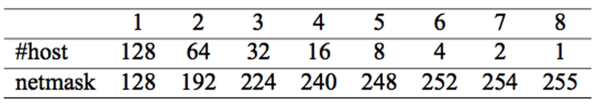

# Chapter 6 — IP Addressing and Router Configuration

## Learning Objectives

After completing this chapter, you will be able to:

1. Explain IPv4 addressing, notation, and special-purpose addresses; 2) design subnets using CIDR/VLSM; 3) describe router roles and interface requirements (including serial DCE/DTE); 4) configure router interfaces and verify L1/L2 readiness; 5) deploy and verify DHCP on IOS; 6) explain routing concepts (next-hop, network-specific, host-specific, default) and implement static routes. &#x20;

## 6.1 IP Address

### What you’re looking at

“Start at the top. That row of little squares is **one IPv4 address**.
IPv4 is **32 bits** long and we group those 32 bits into four chunks of **8 bits** called **octets**.

{width=50%}


* Each octet becomes a **decimal number** we can read easily.
* In the picture the four octets are labeled **128 • 11 • 3 • 31** — so the dotted-decimal form is **128.11.3.31**.
* Inside each octet the bits have weights (128, 64, 32, 16, 8, 4, 2, 1). If the bit is 1, we add its weight. That’s how the binary becomes the decimal number you see.”

**Quick check:**
“Which is larger: 00000011 or 00011100? Why? (because the set bits map to larger weights).”

**Key takeaways to say out loud**

* “IPv4 = 32 bits = 4 octets.”
* “We *write* it as four decimals, but the computer *uses* the bits.”
* “Later we’ll pair an address with a **subnet mask** to decide the network vs. host portion.”

### One big LAN 

“Now look at the bottom picture. This is a single Ethernet segment with many PCs.
Underneath it says **192.168.10.0/24** and *one large broadcast domain*.”

{width=50%}

Explain the notation:

* “**/24** means the first 24 bits are the **network**. That’s the same as a mask of **255.255.255.0**.”
* “In a **/24**, the **network address** is **192.168.10.0**, the **broadcast address** is **192.168.10.255**, and the **usable host range** is **192.168.10.1–192.168.10.254**.”

Tie to the little numbers above each PC:

* “Those ‘.2, .5, … .130, .131, .132, .133’ labels are just the **last octet**. All of those belong to the **same subnet**, so they can talk **directly**—no router needed.”

Why “one large broadcast domain” matters:

* “Every ARP request and every DHCP Discover is a **broadcast** that every device in this /24 hears. With 10 devices, that’s fine. With 500, performance and security suffer. That’s why we later **subnet** or use **VLANs** to split this big domain into smaller ones.”

### Short chalk-math & comprehension checks

* “Usable hosts in /24 = $2^{8} - 2 = 254$. Why minus 2? We reserve the all-zeros (**network**) and all-ones (**broadcast**) addresses.”
* Ask:

  1. “What’s the broadcast for 192.168.10.0/24?” → **192.168.10.255**
  2. “If a PC at 192.168.10.130 pings 192.168.10.133, does it need a default gateway?” → **No**, same subnet.
  3. “What happens to an ARP broadcast on this LAN?” → **Everyone** in the /24 sees it.

###  Common pitfalls to warn about

* “Don’t assign **.0** or **.255** in a /24 to hosts.”
* “Make sure the **mask** matches on both ends; 192.168.10.x/24 and 192.168.10.x/25 are **not** the same LAN.”
* “Wrong default gateway = you can reach local hosts but **not** other networks.”


Here’s a tight, teacher-ready script for this **CIDR** slide.

## CIDR

{width=50%}


* **Class / Start Bit**
  These patterns are the **first 4 bits of the first octet**:

  * **A = 0xxx** → first octet 0–127
  * **B = 10xx** → 128–191
  * **C = 110x** → 192–223
  * **D = 1110** → 224–239 (multicast)
  * **E = 1111** → 240–255 (experimental)

* **CIDR column** (historical defaults)

  * Class A → **/8** (255.0.0.0)
  * Class B → **/16** (255.255.0.0)
  * Class C → **/24** (255.255.255.0)
    These were the **default masks** in the classful era.
    **Modern CIDR** lets us choose **any** prefix length (/9, /20, /26, …) based on need.

* **Possible Address Values**
  Ranges by the first octet:

  * A: **0.0.0.0–127.255.255.255** (note: 0.0.0.0 is “this network,” **127/8** is loopback)
  * B: **128.0.0.0–191.255.255.255**
  * C: **192.0.0.0–223.255.255.255**
  * D: **224.0.0.0–239.255.255.255** (multicast, not host addressing)
  * E: **240.0.0.0–255.255.255.255** (reserved/experimental)

> **Instructor aside:** If you see “/32” next to Class D in some summaries, that’s not a usable mask for a multicast *range*—**/32** is a **host route** in routing tables. Class D has no “default mask” for host assignment.

## Why CIDR replaced classes

* Class A/B/C gave only **three block sizes**—massively wasteful.
* **CIDR = flexible prefixes** → **right-sized subnets**, better aggregation (route summarization), smaller routing tables.

**Fast math you’ll use on the job**
Usable hosts = $2^{(32-\text{prefix})} - 2$
(except /31 point-to-point and /32 host routes)

* **/24** → $2^{8}=256$ → **254** usable
* **/26** → $2^{6}=64$ → **62** usable
* **/23** → $2^{9}=512$ → **510** usable

## Quick mapping: first octet → class (mental check)

* 10.x.x.x → Class A private range (fits 0xxx)
* 172.16–172.31.x.x → Class B private (fits 10xx)
* 192.168.x.x → Class C private (fits 110x)

**But** with CIDR you might subnet 192.168.1.0 as **/25, /26, /27…**—not locked to /24.

 ### Chalk-and-talk example (1 minute)

“Your ISP gives 198.51.100.0/24, but you need two \~60-host LANs.”

* A /24 is 254 usable. Split into two **/25s**:

  * 198.51.100.0/25 → hosts .1–.126, broadcast .127
  * 198.51.100.128/25 → hosts .129–.254, broadcast .255
    “Each /25 has **126** usable—comfortably above 60.”


### Exit ticket (2 questions)

1. “How many usable hosts in **10.10.20.0/26**?” → **62**
2. “Which class is **150.10.0.0** by first octet, and what default mask *used to* apply?”
   → **Class B**, default **/16** (but we’ll pick a CIDR prefix to fit our design).


## Address Block

The left box lists a contiguous set of IPv4 addresses from **205.16.37.32** to **205.16.37.47**. The right box writes the same range in **binary**. Notice that the first 28 bits (205.16.37.\*) are identical, while only the **last 4 bits** of the final octet change from **0000** (decimal 32) up to **1111** (decimal 47). That’s the signature of a **/28 CIDR block** (mask **255.255.255.240**): 28 network bits fixed, 4 host bits varying. Because 4 host bits exist, the block contains **2⁴ = 16 addresses**. In any traditional LAN, the first address is the **network address** (**205.16.37.32/28**), the last is the **broadcast address** (**205.16.37.47/28**), and the **usable host range** is **.33–.46**.

{width=50%}

Two practical rules fall straight out of CIDR theory:

1. **Block size = 2^(32–prefix)** (here, 2^(32–28)=16).
2. **Alignment**: the first address of a block must be a multiple of the block size (32 is a multiple of 16, so 32–47 is a valid /28). To find boundaries quickly, **zero** all host bits for the first address and **set** all host bits to 1 for the last address. This binary view also explains **route summarization**: if you have two adjacent /28s whose “changing bit” is just one position higher, they merge into a /27, reducing routing-table entries—exactly how ISPs aggregate customer prefixes and how routers apply **longest-prefix match** when forwarding.

Why it matters operationally: planners choose block sizes to fit host counts (usable = size−2, except /31 point-to-point and /32 single host), DHCP scopes are carved from these ranges, ACLs and NAT rules reference the **network/broadcast** correctly, and static routes target the **network address + mask** (e.g., `205.16.37.32 255.255.255.240`) rather than an arbitrary IP in the block. Once you see those fixed network bits and the “wiggling” host bits in the final octet, the whole block—and its place in a larger, hierarchical address plan—becomes obvious.

## Netmask


 
A **netmask**—also called a **subnet mask**—tells a host which part of its IPv4 address identifies the **network** and which part identifies the **host**. In binary, a mask is a row of 1s followed by 0s; the 1-bits “lock in” the network portion, and the 0-bits leave room for host numbering. When we write a mask as **CIDR** (slash) notation, the number after the slash is simply the count of 1-bits. Thus `255.0.0.0` is `/8`, `255.255.0.0` is `/16`, and `255.255.255.0` is `/24`. Historically these aligned with the classful defaults A (/8), B (/16), and C (/24), as shown on the slide, but modern networks use CIDR to choose whatever prefix length best fits the design rather than being restricted to classes.

{width=50%}


The mask drives two essential calculations. First, **network address**: perform a bitwise AND between the IP and the mask. For example, with `192.168.10.37` and `255.255.255.0` (`/24`), the result is `192.168.10.0`. Second, **broadcast address**: copy the network bits and set all host bits to 1, yielding `192.168.10.255` for that `/24`. The **usable host range** lies strictly between those two: `192.168.10.1–192.168.10.254`. In general, a `/n` network contains `2^(32−n)` total addresses, of which `2^(32−n) − 2` are usable for hosts (the two removed are the network and broadcast), with two common exceptions: `/31` is used on point-to-point links (both addresses usable) and `/32` represents a single host or loopback.

Choosing the prefix length is a balance between address efficiency, containment of broadcasts, and growth. A `/24` gives 256 total addresses (254 usable) and is easy to read and summarize; a `/26` gives 64 total (62 usable) and halves the broadcast domain size; a `/16` gives 65,536 total and is best reserved for large, carefully managed segments. Because routers forward based on the **longest-prefix match**, more specific masks (e.g., `/26`) override broader ones (e.g., `/16`), enabling precise control of routing and tidy route summarization in larger designs.

Operationally, the mask must be consistent end-to-end within a subnet: every host and the gateway interface on that LAN must share the same prefix length. Mis-matched masks are a classic cause of “can ping some devices but not others” problems. When planning, record each VLAN or LAN with its gateway IP and mask (for example, “VLAN 20: `10.10.20.0/26`, GW `10.10.20.1`”) and reserve low or high host numbers for infrastructure. This disciplined use of netmasks is the backbone of scalable IPv4 addressing.

## IP Address Scheme


* **Netmask** — The subnet mask (e.g., 255.255.255.0 or /24) marks which bits of an IPv4 address are the **network** portion (1s) and which are the **host** portion (0s). When you AND an IP with its mask, you get the network address. CIDR notation “/n” simply means the mask has **n** leading 1-bits (e.g., /26 = 255.255.255.192).

* **Network Address** — The identifier of the subnet itself: it’s the address where all host bits are **0**. Devices don’t use it as a host IP; routers use it in routing tables to represent “this entire subnet.” Example: for 192.168.10.0/24, the network address is **192.168.10.0**.

* **Broadcast Address** — The address used to reach **all hosts** on the subnet at once: it’s the address where all host bits are **1**. Switches flood it within the VLAN; routers do not forward it across subnets. Example (192.168.10.0/24): **192.168.10.255**.

* **First Address** — The first **usable** host IP in the subnet: one greater than the network address. It’s typically assigned to a default gateway on small LANs but can be any host. Example (192.168.10.0/24): **192.168.10.1**.

* **Last Address** — The last **usable** host IP in the subnet: one less than the broadcast address. Example (192.168.10.0/24): **192.168.10.254**.

* **#host** — The count of **usable** host IPs in the subnet. With classical IPv4 subnets it’s $2^{H}-2$, where $H$ is the number of host bits (subtracting the network and broadcast). Examples: /24 → $2^{8}-2=254$ hosts; /26 → $2^{6}-2=62$ hosts. (Special cases exist like /31 for point-to-point links and /32 for a single host/loopback.)

### How to calculate the address

Find the address of `192.168.56.5/24` 

### 1) Mark the network/host split

* **/24** means **24 network bits** and **8 host bits**.
* In the diagrams, the **blue** bits are the network part (the first 24 bits, i.e., the first three octets), and the **yellow** bits are the host part (the last 8 bits, i.e., the 4th octet).

`192 . 168 . 56 . 5` → in binary
`11000000 . 10101000 . 00111000 . 00000101`
                            |—— host (8 bits)

### 2) Network address (all host bits = 0)

Copy the blue bits as-is and **force the yellow bits to 00000000**.

```
11000000 . 10101000 . 00111000 . 00000000
   192         168         56          0  → 192.168.56.0
```


{width=50%}


### 3) Broadcast address (all host bits = 1)

Copy the blue bits and **force the yellow bits to 11111111**.

```
11000000 . 10101000 . 00111000 . 11111111
   192         168         56        255  → 192.168.56.255
```

{width=50%}

### 4) First and last usable host

* **First host** = network + 1 → `192.168.56.1`
{width=50%}

* **Last host** = broadcast − 1 → `192.168.56.254`
  (The **third diagram** shows those last-octet bits as `11111110`.)


**Usable range:** `192.168.56.1 – 192.168.56.254`


### 5) How many hosts?

Host bits = 32 − 24 = **8** → `2^8 − 2 = 254` usable addresses
(the “−2” excludes network and broadcast).


### Quick “no-binary” shortcut (same result)

1. Convert prefix to mask. **/24 → 255.255.255.0**
2. **Block size** = `256 − last-mask-octet` = `256 − 0 = 256`
   So subnet boundaries are every 256 in the last octet: `… .0, .256 (wraps)`.
   Therefore the network that contains `.5` is `192.168.56.0`, the broadcast is `.255`, and the host range is `.1–.254`.

> For other prefixes:
> • /26 → mask `255.255.255.192`, block size `256 − 192 = 64`.
> Subnets: `.0, .64, .128, .192`. An address like `192.168.56.130/26` sits in the `192.168.56.128` subnet; broadcast `.191`; hosts `.129–.190`.

Use whichever method you prefer: **bit view** (as in your diagrams) or the **block-size shortcut**. They’re the same logic—set host bits to all 0s for the network and all 1s for the broadcast, with first/last hosts just inside that boundary.

### shortcut method

### 1) The tiny table (for the *interesting octet*)

When the prefix (/p) doesn’t end exactly on an octet boundary, it falls inside one octet—the *interesting octet*.
From the number of **host bits left in that octet**, pick the pair:




Equivalently: **h = 2^(8 – r)** and **mask = 256 – h**, where **r = p mod 8** is the number of network bits used in that octet.

### 2) Two one-line formulas

Let **a** be the decimal value of the interesting octet in the IP address, and **h** the block size from the table.

* **Network octet**:  $N = \big\lfloor \dfrac{a}{h} \big\rfloor \times h$
* **Broadcast octet**: $B = N + h - 1$

All octets **to the left** of the interesting octet stay the same as the IP.
All octets **to the right** are **0** for the network address and **255** for the broadcast.
First host = network + 1, last host = broadcast − 1.

### 3) Worked examples  

### Example A — 205.26.37.29/**28**

* /28 ⇒  8 + 8 + 8 + **4** bits in 4th octet ⇒ **r = 4**, so **h = 16**, mask octet **240** → **255.255.255.240**.
* Interesting octet = **29**.
  $N = \lfloor 29/16 \rfloor \times 16 = 1 \times 16 = \mathbf{16}$
  $B = 16 + 16 - 1 = \mathbf{31}$
* **Network** = 205.26.37.**16**
  **Broadcast** = 205.26.37.**31**
  **Usable hosts** = .17 – .30 (14 hosts)

### Example B — 205.26.**23**.29/**21**

* /21 ⇒ 8 + 8 + **5**  + 0 in 3rd octet ⇒ **r = 5**, so **h = 32**? Careful: with 5 network bits used, **host bits left in that octet = 3**, so **h = 8**, mask octet **248** → **255.255.248.0**.
* Interesting octet = **23** (the 3rd octet).
  $N = \lfloor 23/8 \rfloor \times 8 = 2 \times 8 = \mathbf{16}$
  $B = 16 + 8 - 1 = \mathbf{23}$
* **Network** = 205.26.**16**.0
  **Broadcast** = 205.26.**23**.255
  **Usable hosts** = 205.26.16.1 – 205.26.23.254 (2046 hosts)


### 4) Quick checklist you can say while teaching

1. **Find the interesting octet** (where /p lands).
2. **Compute r = p mod 8**, then take **h = 2^(8−r)** and **mask octet = 256−h** (or read both from the table).
3. **Divide that octet’s value by h**, take the **floor**, multiply back → **network octet**.
4. **Add h−1** → **broadcast octet**.
5. Set the **right-side octets** to 0 (network) / 255 (broadcast).
6. Hosts are **network+1 … broadcast−1**.

That’s the whole shortcut—fast enough to do at the whiteboard without touching binary.

## 6.2 Subnetting

### What it is.
Subnetting is the act of taking one IP network (a prefix) and dividing it into smaller, non-overlapping child networks called *subnets*. In IPv4 we do this by “borrowing” host bits to extend the network prefix (e.g., turning a /16 into many /21s or /24s). Each resulting subnet has its own **network address**, **broadcast address**, and pool of **usable host addresses**. Routers forward traffic between subnets; switches keep broadcasts inside a single subnet.

### Why subnet

1. **Control broadcast domains & improve performance.**
   Broadcasts (ARP, DHCP, etc.) stop at the subnet boundary. Smaller subnets = smaller broadcast domains = less unnecessary traffic and lower CPU load on endpoints.

2. **Address conservation & right-sizing.**
   With CIDR/VLSM you size each subnet to the host count you actually need (e.g., /27 for \~30 devices, /21 for \~2,000). That avoids wasting addresses.

3. **Security & policy boundaries.**
   Subnets let you apply ACLs, firewalls, and QoS per segment (e.g., finance cannot be reached directly from guest Wi-Fi).

4. **Operational clarity & fault isolation.**
   Problems are easier to localize when each building, floor, or department is its own subnet.

5. **Routing scalability.**
   Many small subnets can be summarized (aggregated) into a shorter prefix when advertised upstream, keeping routing tables compact.

### Reading the diagram (1,500 hosts per spoke)

Each spoke needs \~1,500 usable IPs. For a single subnet to hold ≥1,500 hosts:

$$
2^{h}-2 \ge 1500 \Rightarrow h=11 \ (\text{gives } 2046 \text{ hosts})
$$

So each LAN should be a **/21** (since /21 leaves 11 host bits). Netmask = **255.255.248.0**.

If you start from, say, **10.10.0.0/16**, carve six /21s (step size = 8 in the 3rd octet for a /21 across a /16):

* LAN A: **10.10.0.0/21**   (hosts .0.1 – .7.254, broadcast .7.255)
* LAN B: **10.10.8.0/21**   (hosts .8.1 – .15.254, broadcast .15.255)
* LAN C: **10.10.16.0/21**  (hosts .16.1 – .23.254, broadcast .23.255)
* LAN D: **10.10.24.0/21**  (hosts .24.1 – .31.254, broadcast .31.255)
* LAN E: **10.10.32.0/21**  (hosts .32.1 – .39.254, broadcast .39.255)
* LAN F: **10.10.40.0/21**  (hosts .40.1 – .47.254, broadcast .47.255)

Pick the first usable address in each as the default gateway (e.g., 10.10.0.1, 10.10.8.1, …).

> **Rule of thumb:**
> Choose a prefix length where the host capacity $2^{h}-2$ meets your requirement with some headroom; then allocate consecutive blocks so you can later summarize them (e.g., six /21s can be summarized as 10.10.0.0/**18** if they’re contiguous and aligned).

---

### One-minute IOS tie-in (example)

```cisco
! Router-on-a-stick gateways for two of the /21s
interface g0/0.10
 encapsulation dot1Q 10
 ip address 10.10.0.1 255.255.248.0
!
interface g0/0.20
 encapsulation dot1Q 20
 ip address 10.10.8.1 255.255.248.0
!
! Optional: summarize these six /21s upstream as 10.10.0.0/18
! (only if they are contiguous and aligned)
```


### To calculate the subset
 Here’s a clean, step-by-step walkthrough of the **subnetting example in your slides (192.168.28.8/23 split into 4 groups)** and how to read those diagrams.


### 1) What the original block means

* **192.168.28.8/23** belongs to the /23 network **192.168.28.0–192.168.29.255**.
  (/23 = 255.255.254.0 → 23 network bits, **9 host bits** total for the /23.)

You want **4 groups** → that’s $2^2$ groups, so you must **borrow 2 of the 9 host bits** to use as *subnet ID* bits.

 

### 2) New prefix and mask

* New prefix: **/23 + 2 = /25**
* New mask: **255.255.255.128** (block size 128 in the last octet)

This exactly matches the slide where two 1’s are added to the host portion and the mask changes to **…128**.

### 3) The four /25 subnets inside the /23

Borrowing 2 bits yields **4 subnets** (subnet IDs 00, 01, 10, 11).
Because the “interesting” octet is the **4th**, each /25 jumps by **128** in that octet:

1. **192.168.28.0/25**

   * Network: **192.168.28.0**
   * First host: **192.168.28.1**
   * Last host: **192.168.28.126**
   * Broadcast: **192.168.28.127**

2. **192.168.28.128/25**

   * Network: **192.168.28.128**
   * First host: **192.168.28.129**
   * Last host: **192.168.28.254**
   * Broadcast: **192.168.28.255**

3. **192.168.29.0/25**

   * Network: **192.168.29.0**
   * First host: **192.168.29.1**
   * Last host: **192.168.29.126**
   * Broadcast: **192.168.29.127**

4. **192.168.29.128/25**

   * Network: **192.168.29.128**
   * First host: **192.168.29.129**
   * Last host: **192.168.29.254**
   * Broadcast: **192.168.29.255**

Each /25 has **$2^{7}-2 = 126$ usable hosts** (you had 9 host bits; after borrowing 2, **7 host bits remain**).

 

### 4) Quick method you can reuse

1. Decide how many groups $G$ you need → pick **b** where $2^{b} \ge G$.
2. New prefix = old prefix + **b**.
3. Convert new prefix to a mask (or use the *block size* table).
4. The **block size** is $256 - \text{mask value in the interesting octet}$.
5. Enumerate networks by adding the block size in that octet, carrying into the third octet if needed.
6. For each subnet:

   * **Network** = first address in the block
   * **Broadcast** = last address in the block
   * **Usable hosts** = $\text{block size} - 2$ (or $2^{\text{host bits}} - 2$)
   * **First/last hosts** = network+1 / broadcast−1

That’s exactly what your two slides are illustrating: the first slide shows borrowing the 2 bits to reach **/25**, and the second slide lists the **four resulting networks** inside the original **/23**.
